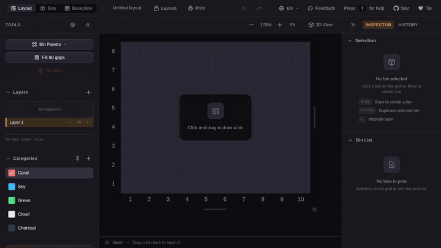

<div align="center">



# Gridfinity Layout Tool

**Plan and design [Gridfinity](https://gridfinitylayouttool.com/what-is-gridfinity) drawer organizer layouts for 3D printing — right in your browser.**

[**Open the app →**](https://gridfinitylayouttool.com) &nbsp;·&nbsp; [Guide](https://gridfinitylayouttool.com/guide) &nbsp;·&nbsp; [What is Gridfinity?](https://gridfinitylayouttool.com/what-is-gridfinity) &nbsp;·&nbsp; [Changelog](./CHANGELOG.md)

[](https://github.com/andymai/gridfinity-layout-tool/actions/workflows/ci.yml)
[](https://github.com/andymai/gridfinity-layout-tool/releases)
[](https://github.com/andymai/gridfinity-layout-tool/commits)
[](./LICENSE)
[](https://github.com/andymai/gridfinity-layout-tool/stargazers)

</div>

## Features

- **Layout Planner** — Drag-and-drop bin placement with multi-layer support
- **3D Preview** — Isometric visualization of your drawer layout
- **Bin Designer** — Parametric 3D bin generator with STL export
- **Print List** — Optimized print list with filament, time, and cost estimates
- **Inspiration Gallery** — Curated example layouts across workshop, kitchen, office, hobby, and personal themes
- **Cloud Sharing** — Share layouts via link with optional real-time collaboration
- **Installable PWA** — Works offline on desktop and mobile

## Built With

| Technology                                   | Purpose                                                |
| -------------------------------------------- | ------------------------------------------------------ |
| [React 19](https://react.dev)                | UI framework                                           |
| [TypeScript](https://www.typescriptlang.org) | Type safety                                            |
| [Zustand](https://github.com/pmndrs/zustand) | State management                                       |
| [Three.js](https://threejs.org)              | 3D visualization                                       |
| [brepjs](https://github.com/andymai/brepjs)  | Parametric 3D geometry & STL export (OpenCascade WASM) |
| [Tailwind CSS 4](https://tailwindcss.com)    | Styling                                                |
| [Vitest](https://vitest.dev)                 | Unit testing                                           |
| [Playwright](https://playwright.dev)         | End-to-end testing                                     |
| [Vercel](https://vercel.com)                 | Hosting & serverless API                               |

## Local Development

Requires **Node.js 20+** and **pnpm 10+**. Use `nvm use` to switch to the correct version (requires [nvm](https://github.com/nvm-sh/nvm)).

```bash
git clone https://github.com/andymai/gridfinity-layout-tool.git
cd gridfinity-layout-tool
nvm use
pnpm install
pnpm run dev           # Development server at localhost:5173
pnpm run build         # Production build
pnpm run test:coverage # Unit tests with coverage
pnpm run test:e2e      # Playwright end-to-end tests
```

## Contributing

This project is open source but not open contribution — see [CONTRIBUTING.md](./CONTRIBUTING.md) for bug reports, feature requests, and the pull request policy. Security issues: see [SECURITY.md](./SECURITY.md).

## License

[GNU Affero General Public License v3.0](./LICENSE) — see the LICENSE file for details.

---

<div align="center">

<a href="https://star-history.com/#andymai/gridfinity-layout-tool&Date">
  
</a>

</div>
