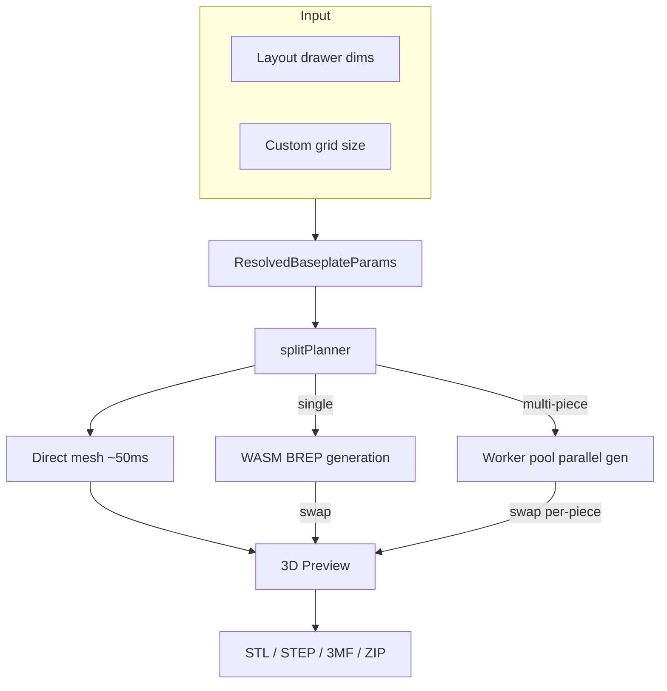

# Baseplate

Standalone page (`/baseplate`) for generating 3D-printable Gridfinity baseplates with automatic splitting for large layouts.



## Key Files

- `components/BaseplatePage/BaseplateQuickstartCard.tsx` — one-time first-run orientation card
  (desktop/tablet only) over the shared `QuickstartCard` shell; flags + edit auto-dismiss in
  `hooks/useBaseplateFirstRun.ts`, one-time post-export planner toast in
  `hooks/useBaseplatePlannerBridge.ts`
- `hooks/useBaseplateGeneration.ts` — three-tier lifecycle: synchronous direct-mesh preview (~11ms), optional Manifold draft refinement, async BREP swap once the WASM bridge is ready; epoch-based stale detection
- `hooks/useBaseplateExport.ts` — export pipeline: single-piece or parallel split with ZIP packaging. The unstacked split ZIP holds **one file per physical drawer slot**, named by grid label (`baseplate_A1.stl`, …), so importing the whole ZIP into a slicer drops in every piece with nothing to duplicate by hand. Identical shapes are still generated once (`groupPiecesByFingerprint`) and the single mesh buffer is reused for each slot — dedup is a generation optimization, not a user-visible artifact. When stack printing is on, bakes real stacked geometry per physical stack instead (see Stack printing)
- `components/BaseplateSelector.tsx` — header identity: the active design's name (click to rename) + a button opening the library. **No Save / Save As / New** — see "Design management" below
- `hooks/useBaseplateAutoSave.ts` — debounced write-back to the active library design; also the source of the header's save status. After the mesh settles it captures a preview thumbnail (`utils/thumbnail.ts`) into the library entry — on every edit, plus a one-time backfill when an opened design has none yet
- `utils/thumbnail.ts` — captures the live `BaseplatePreview` canvas at a canonical steep-isometric angle and downscales to a WebP data URL for the library cards. `BaseplatePreview` registers its renderer/scene/camera here (`setPreviewContext`) and needs `preserveDrawingBuffer` on its `<Canvas>` so the framebuffer stays readable
- `components/BaseplatePreview/StackedBaseplateMeshes.tsx` + `StackSeparationSlider.tsx` — flipped-tower preview + explode slider
- `utils/splitPlanner.ts` — 2D optimal tiling: partitions grid into print-bed-sized pieces, minimizing **build-plate loads** (see Key Concepts)
- `utils/bedPacking.ts` — `estimateBedLoads`: shelf First-Fit-Decreasing bin-packer (90° rotation) estimating how many bed loads a set of pieces needs
- `utils/splitReorder.ts` — display reordering of chunk sizes (largest-first, fractional pinning, palindromic layout) — split out of the planner to keep it focused on the search
- `utils/splitOverride.ts` — conversions between a stored custom split plan (chunk sizes) and the seam offsets the mini-map editor draws, plus `normalizeSplitOverride` (the validity gate `buildFullParams` applies)
- `utils/buildFullParams.ts` — resolves sync mode (drawer dims vs custom width/depth); strips connectors, magnet holes, and corner rounding when stack printing is on
- `utils/stackPrint.ts` — stack planning (groups → capped physical stacks) + `planPlateFlip`/`buildTowerLayers` (bottom plate upright, the rest flipped, all XY-aligned)
- `utils/stackPreview.ts` — lays the towers out for the 3D preview. Two modes: when every tower carries its tiling `col`/`row` (the "no stacks" case — each split piece is its own single-plate tower, no fingerprint dedup), towers sit on their real tiling grid in the same orientation as the assembled split view (row 0 at the front) so the preview reads in baseplate order; otherwise (deduped or genuinely stacked towers, which no longer map 1:1 to positions) they fall back to a centered, roughly-square grid. `TOWER_GAP_UNITS` (1) is the whole-unit clearance between adjacent towers — one grid unit (~42mm) reads as "separate printed pieces" while keeping every cell on the scene's integer footprint grid

## Key Concepts

- **Sync mode**: `syncWithLayout: true` reads drawer dims from layout store; `false` uses custom grid size
- **Split tiling**: baseplates exceeding print bed are partitioned into labeled pieces (A1, B2, etc.). The planner optimizes for the **fewest build-plate loads** (print jobs), not the fewest pieces: it scores each candidate grid `MAX_EXTRA_PIECES_PER_BED_LOAD * bedLoads + pieceCount` (`bedLoads` from `estimateBedLoads`'s shelf packing), so it will choose a finer split that packs more pieces per bed when that removes a load — but the per-load piece budget (`MAX_EXTRA_PIECES_PER_BED_LOAD`, currently 4) caps the trade so it won't fragment into tiny tiles. The packing-aware refinement only runs for small splits (`coarse.pieceCount <= PACKING_SEARCH_MAX_PIECES`); larger plates keep the fast min-piece tiling (their big pieces already tile beds tightly). `tiling.bedLoads` is surfaced in the panel ("Prints in N build-plate loads")
- **Custom split lines (`splitOverride`)**: a user-drawn plan replaces the planner's search. Stored per-layout as chunk sizes per axis (`{ cols, rows }` in grid units), edited via the seam ticks in the `SplitViewStrip` rulers.
  - Three things make it safe in the existing pipeline: it is **not** run through `reorderForDisplay` (that pass prettifies search output and would slide hand-placed seams), the padding-reduction hint is suppressed (it is advice about the automatic plan), and cuts may only land on **cell boundaries**, which keeps the half unit of a fractional plate on its `fractionalEdge` as the piece's `fractionalEdgeX/Y` tag assumes. Everything downstream recomputes from the resulting pieces exactly as for an automatic plan.
  - **Normalization contract**: the plan is meaningful only while its sums match the plate, so `buildFullParams` drops an orphaned one and falls back to automatic tiling. `normalizeSplitOverride` validates shape as well as sums, since the key is allowlisted server-side. Deliberately **absent from `meshCacheKey`** (it selects which pieces exist; each piece's params already carry what its mesh depends on) but IS a `selectGenerationTriggers` input.
  - **Bed fit**: `tiling.bedOverages` lists pieces exceeding the bed using `axisChunkMm`, the same budget the planner's feasibility check runs (exterior padding, `outlineOverhang`, male tongue protrusion), and like that check it does not credit a 90° rotation. The **enforcing** gate is `buildBaseplateExportPieces`, not the hook: that builder is the single choke point every export path runs through, and the whole-layout ZIP calls it directly, so `canExport` only greys out the baseplate page's own button. It throws `BaseplateBedOverageError` carrying the labels.
  - Seam ticks live in rulers flanking the map rather than lanes across it: two crossing sets of full-span hit targets contend at every intersection, which left half of one axis unclickable.
- **Three-tier preview**: `planPreviewDrafts` (in `utils/previewComplexity.ts`) picks the ladder for each edit. The procedural direct-mesh (no WASM, ~11ms) renders synchronously; the Manifold draft (`runManifoldDraftPreview`, a WASM round-trip running the real `generateBaseplate` at draft quality) refines it; the exact BREP replaces both. The two drafts **layer** — the procedural one always paints first, so the canvas never sits on the previous plate while a round-trip resolves. `MeshResult.source` records which path produced the visible mesh. A `finalizedEpochRef` guards the async draft so a late draft can't overwrite a fresher BREP result. Both drafts are skipped for a shaped plate (the procedural mesh draws rectangles only, and a Manifold draft would repeat the exact build's own coplanar outline clip) and when the last exact build came in under the `draftPolicy` gate
- **Graceful BREP failure**: if BREP errors after a direct-mesh preview is on screen, the preview stays visible and a non-blocking toast surfaces the failure — avoids the red error overlay swallowing a still-usable canvas
- **Epoch detection**: rapid param changes bump an epoch counter; stale in-flight results (direct or BREP) are discarded
- **Ephemeral store**: `baseplatePageStore` resets on unmount; persistent params live in layout store
- **Connector fit offset (`connectorFitOffset`, issue #2024)**: a signed mm value (±0.3, 0.05 step, default 0) the user dials in the panel's connector section to compensate for printer/filament variation. It only shifts the female groove clearance — the tongue/key stay nominal — and is clamped so effective clearance never goes negative (`effectiveClearance` in `@/shared/constants/connectors`, the single source of truth shared by the worker, cache keys, and print guide). Positive = looser, negative = tighter
- **All-edge seam slots (`connectorSlotsAllEdges`)**: cuts the female seam slot into a piece's **exterior** edges as well as its join seams, so each piece is a standard grid tile that can key onto a plate printed later. Scoped to the both-female styles (`dovetailKey`, `snapClip`, via `isSeatedConnectorStyle`): an integral tongue would protrude past the drawer-facing wall. Exterior edges **carrying padding are skipped**, since their wall sits `padding` mm outside the grid and a slot there would not line up with a neighbour.
  - `hasAllEdgeSlots`/`edgeCarriesSlot` (`@/shared/types/bin`) are the single source of truth for `buildConnectors`, `computePieceFingerprint` and the direct-mesh draft (`computeConnectorPositions`). The draft can stay on screen if BREP fails, so it must mark the same edges; its markers are a style-agnostic cylindrical stand-in, but an exterior one is always female.
  - Because an exterior edge then carries the same cavity a join edge does, the fingerprint stops keying on raw edge labels and falls back to the rounded-corner key, so with square corners a corner/edge/interior trio of one size dedupes into **one printable part**. No extra keys are needed: an exterior slot has no mating piece, so `countConnectorKeys` is unchanged.
  - `meshCacheKey` keys on the narrower `cutsExtraEdgeSlots` ("does this piece actually gain a slot?"), so an interior piece or one whose exterior edges are all padded keeps its cache entry. The fingerprint deliberately does NOT use that predicate: it must pick one keying scheme per plate, or a fully-slotted interior piece and a fully-slotted edge piece would key differently and never dedupe, which is the merge the option exists to enable.
- **`preferIdenticalPieces` (opt-in, gated behind `connectorNubs`)**: palindromic chunk sizes + doubled (M+F) dovetail connectors + canonical-edge fingerprinting let opposite-corner pieces share one generated mesh. Each placement gets a `placementRotationDeg` (0 or 180); the 3D preview rotates the canonical mesh around the piece center and the print guide annotates rotated piece files with "(rotate 180° to seat)"
- **Stack printing (`StackPrintParams`)**: `baseplateParams.stackPrint` (`{ enabled, gapMm, copies }`) prints a drawer's plates as vertical stacks. Each identical-piece group stacks to the quantity the drawer needs (`StackGroup.quantity`), split into multiple physical stacks once a tower exceeds the printer's build height (`stackHeightCap` from `settings.printSettings.maxPrintHeightMm`, applied in `planPhysicalStacks`). **`copies` (1-20, default 1)** multiplies the whole layout via `stackGroupsFromTiling(tiling, params, copies)`. It is pure replication, so deliberately **not** a `selectGenerationTriggers` input: the preview recomputes without a BREP rebuild. `stackGroupsFromTiling` is the single choke point feeding the preview and `useStackPrintStatus`; the export hook, the export banner and the print guide apply the same multiplier directly.
  - **Orientation**: the bottom plate prints upright, every plate above it flipped, separated by a `gapMm` air gap so the tower snaps apart. `buildTowerLayers` turns each flipped plate about the axis `planPlateFlip` picks. Both axes describe the same physical flip, so the choice goes to the axis mapping the plate onto itself: symmetric padding, no fractional cell in the extent, falling back to X (negating Y) plus a re-seat by the depth-axis padding asymmetry. The re-seat lands the slab back on the upright plate but drags the socket lattice with it, so an outer piece of a split drawer, padded on one side only, must turn about the other axis. A custom perimeter is never assumed symmetric and keeps the X turn.
  - **Separation is single-material** (an air gap). The multi-material technique people use is the slicer's support interface filling that gap, a slicer setting rather than modeled geometry, so no separator sheet is built; the print guide and the panel's "Clean separation (multi-material)" collapsible explain how to enable it.
  - Replication is mesh-level (`utils/stackPrint`/`stackExport`/`stackPreview`): the generator builds one plate, then flip/translate/replicate transforms produce the towers for preview and export. Toggling stacking IS a `selectGenerationTriggers` input, so the mesh regenerates with magnets, screws, the solid floor and snap clips stripped. The panel section is a plain `FeatureToggle`, not a `StickyGroupHeader` group, and the `singlePlate` warning clears once `copies >= 2`.
  - Reference models: [Stu142](https://printables.com/model/725407-gridfinity-stack-printing-baseplate), [Clough42](https://printables.com/model/995911-gridfinity-grids-stacked-for-printing), [gerolori generator](https://github.com/gerolori/gridfinity-baseplate-stack-generator).
- **Feature stripping under stacking**: a flipped tile must print support-free, so when `stackPrint.enabled` `buildFullParams` strips **snap clip connectors** (their blind pocket bridges when flipped; dovetail prisms flip cleanly), **magnet holes** (their retaining floors become ~10% bridge area when flipped, see `baseplateGenerator.scenario.overhangAudit.test.ts`), **screws** and the **solid floor**. **Corner rounding is kept**: the fingerprint keys rounded exterior corners, so corner tiles print as their own towers, and `planPlateFlip` breaks a padding tie toward the turn that keeps the rounding in place. A corner tile's lone rounded corner is congruent about neither axis, so its flipped copies carry it on the opposite side (a few mm of corner overhang at the bottom seam), which beats flattening a radius the user set. Done functionally, without mutating stored params, so settings return intact when stacking is off.
  - **Detached margins compose**: rails never enter the flipped towers, exporting as flat files alongside; the body stacks padding-free on detached sides via `bodyParamsForDetach`, which also lets edge tiles dedupe with interior ones. Only the margin seam connector is dropped when stacking strips a snapClip style, since undefined would read as the dovetail default.
  - **STEP never stacks** (a CAD interchange format has no slicer stacking notion), so `stackEnabled` is derived as `stackPrint.enabled && format !== 'step'` in both `BaseplatePage` and `BaseplatePanel` (reading `exportFileNameConfig.format`), and the STEP export path clears `stackPrint` before `buildFullParams` so the exported solid retains the stripped features end-to-end.
- **Stack tile dedup**: with connectors off and square corners, split pieces that differ only by edge classification (corner/edge/interior) are byte-identical, so `computePieceFingerprint` omits the `edges` key when neither connectors nor rounding are active; with rounding on, only the corner tiles (an `rc:` key) stay distinct. An evenly-tiled drawer (e.g. 16×16 on a 180mm bed → sixteen 4×4 tiles) then dedupes to **one group** and stacks into a couple of tall towers instead of printing 16 unique pieces. Padding is still keyed separately, so padded edge tiles stay distinct from interior ones.
- **Keyed margin seam (`detachMarginConnector` + `dovetailKey`)**: the body↔rail seam of a detached margin can be female on BOTH sides, spanned by the same seated key the split seams use, instead of the integral tongue the dovetail/puzzle styles put there. `isMarginSeamStyle` is the style gate (everything except `snapClip`, whose top-insert clip has no seated form at a body↔rail seam); `hasMarginSeamKeys` is the active predicate shared by the key count, placement and preview.
  - **Keyed seams anchor on cell BOUNDARIES, not the tongue's cell centers**: a boundary puts the key at a junction of two body cells, which is the four-foot layout `buildDovetailKey`'s socket relief is cut for. A center would need a differently-relieved second key part. The rail side is solid, so that relief is merely conservative there.
  - A 1-cell mating wall has no boundary and stays friction-fit on both halves, mirroring a 1-cell split seam. Because a rail exists independently of splitting, an UNSPLIT plate can need keys too, so the single-body export paths ship the key file and a `ConnectorKeyNote` guide section alongside the rails.
- **Per-axis pitch in seam-key placement**: `computeSeamJunctions` and the rail groove positions convert grid units with the pitch of the axis they run along — `gridUnitMm` on X, `gridUnitMmY` on Y. `seamConnector.cellUnits` counts cells along the RAIL's running axis (width cells for a front/back rail, depth cells for a left/right one), so converting both with the X pitch puts a left/right rail's grooves and keys where the body's aren't on a non-square grid. Guarded by non-square cases in `connectorKeys.test.ts`
- **Padding anchor pad**: `PaddingSchematic` frames four mm steppers around a central `PaddingAnchor` 3×3 pad. Each outer cell is a directional arrow (a single `ArrowLeftIcon` rotated in 45° steps via `ARROW_ROTATION`) pointing at the drawer corner/edge it anchors to; the center cell is a target glyph. Picking a cell redistributes total padding through `computeAnchoredPaddings`; editing any stepper flips the anchor to `custom`, surfaced as a caption
- **Whole-cell fitting (`wholeCellsOnly`)**: a cell the perimeter crosses normally keeps a socket sliced to the outline as long as a quarter survives (`MIN_CLIPPED_POCKET_AREA_FRACTION`). That socket holds nothing and leaves the boundary in broken wall fragments, so this option drops any cell not entirely inside and lets the solid slab carry the edge. Off by default, so no saved plate changes shape on regeneration.
  - **Normalization contract**: meaningful only against a perimeter (a rectangle has no crossed cell), so `buildFullParams` drops it without an `outline`, and `meshCacheKey` and `selectGenerationTriggers` fold it out for rectangular plates. Read with `=== true` rather than `?? false` everywhere: the key is allowlisted server-side without a type check, so a non-boolean from a shared or synced payload must not coalesce into truthiness.
  - Split pieces inherit it (like half-grid), or a split shaped plate reverts to sliced sockets per piece. The panel shows it for any curved or angled perimeter, including a corner radius past `plainRoundingLimit`, since those become a radius-cut outline in `buildFullParams` and slice sockets exactly as a drawer shape does.
- **Over-tile padding fill (`overTile` / `overTileHalfGrid` / `overTileHalfGridSolidLeftover`)**: fill the drawer-fit padding margin with functional grid instead of solid plastic. `overTile` clips one grid tile per edge into the margin (a sub-threshold sliver stays solid). `overTileHalfGrid` packs true 21mm (0.5-unit) functional half-sockets from the grid edge outward, then a sub-21mm leftover. `overTileHalfGridSolidLeftover` picks how that leftover renders: **Grid** (default) clips it as a partial tile, **Solid** leaves it flat so true half-grid cells read as distinct from unusable margin.
  - Geometry is the `solidLeftover` flag on `frameCells`/`marginPocketDepthMm` (`cellDecomposition.ts`), which drops the remainder cell/depth. Both the BREP body (`baseplateGenerator`) and the procedural draft (`baseplateDirectMesh`) pass it so preview and export agree, and `baseplateMargin` forwards it to detached rails.
  - **Normalization contract**: a flag is meaningful only when its parent is on, so `buildFullParams`, `useBaseplateGeneration` and `baseplateCacheKeys` drop `overTileHalfGrid` unless `overTile`, and `overTileHalfGridSolidLeftover` unless both. The panel stores `undefined` (not `false`) for the default Grid so identical geometry keeps one stored/cache identity.

## Design management

Mirrors the bin designer deliberately, so moving between the Bins and Baseplate
tabs doesn't mean relearning how designs are named, saved, and switched:

```
/designer   Untitled Bin   [Designs]     [Export]  ✓ Saved
/baseplate  Baseplate 1    [Baseplates]  [Export]  ✓ Saved
```

`useBaseplateLibraryInit` guarantees an active design and `useBaseplateAutoSave` keeps
it current, so there is nothing for a Save button to do. New and duplicate live
in `BaseplateLibraryModal`, matching where the designer keeps them
(`DesignListDialog`). There is **no unsaved-draft state** — if you find yourself
adding one back, you're re-introducing the Save / Save As / New cluster with it.

**`useBaseplateLibraryInit` deliberately diverges from `useDesignerInit`**: it creates a
design _from the layout's current params_ rather than adopting the most recently
used one. A `SavedDesign` is standalone, but `baseplateParams` live on the
`Layout` (`core/types.ts`) — adopting another design would silently overwrite
baseplate settings the layout already has. It only runs on `/baseplate`, so a
library entry appears when someone opens the tool, not for every layout they own.

## Gotchas

1. **Padding is position-aware** — only edge pieces carry padding; join edges always have 0mm
2. **Fractional edges** — 0.5-unit edges are absorbed into the outermost piece
3. **Worker pool is optional** — parallel generation falls back to sequential if pool unavailable
4. **Grid units vs mm** — stored params use grid units; multiply by `gridUnitMm` (42mm) for generation
5. **Default camera is top-down** — `BaseplatePreview` opens in top view (`CAMERA_PRESETS.top`); the reset button also returns to top view (not isometric)
6. **`preferIdenticalPieces` degrades silently with asymmetric padding/radii** — opposite-corner pieces only share a fingerprint when `paddingLeft == paddingRight`, `paddingFront == paddingBack`, and `cornerRadii` are 180°-symmetric. Otherwise the canonical mesh diverges and each piece is generated separately. This is invisible in the unstacked ZIP (which always emits one file per slot regardless), but it costs extra generation time and, under stack printing, produces more towers (each unique shape stacks on its own)
7. **WebGL context failure is terminal for the session, by design** — `BaseplatePreview`'s `<Canvas>` is wrapped in `WebGLErrorBoundary` (inside `PanelErrorBoundary`). When three.js can't acquire a GL context (slot exhaustion, GPU-process loss), the boundary renders `WebGLFallback` with **no Retry** and flips `detectWebGL()` to unavailable so subsequent renders skip the canvas — re-mounting would just re-throw. Recovery requires a page reload
8. **Snap-clip connector geometry has one source of truth** — `snapClipLevels(totalHeight, fitOffset)` in `@/shared/constants/connectors` resolves every Z-level and X-position for the `'snapClip'` style. The worker (pocket cut + `buildSnapClip`), the seated-clip preview (`ConnectorKeyMeshes`) and the bed/print math all call it, so they cannot drift. The clip is a single X-Z cross-section extruded along the seam; the barb is a fixed-size feature near the leg tip, so only the leg LENGTH scales with slab height. On a slab too thin to flex (`!viable`) the generator skips the pockets rather than ship a clip that snaps off. Geometry proven standalone with `brepjs-verify` (valid clip, watertight pockets, zero-interference seated fit).

   Because the socket mouth opens to the full cell at the slab top (`INSET_TOP = 0`), the clip's flush top bridge would poke into the open corners of the edge sockets flanking the seam, so `buildSnapClip` relieves those top-bridge corners against the neighbouring bin feet, above the barb zone only (`snapClipSocketInterference.test.ts`). `ConnectorKeyMeshes` draws the un-relieved profile, a known cosmetic gap. The seam-side retaining wall (`BEAR_WALL`) is deliberately THINNER than the flex slot: `GAP_HALF − BEAR_WALL` is the pinch room the barbs need to pass the throat, and filling the slot to `GAP_HALF − clearance` made the clip impossible to insert. `snapClipInsertion.test.ts` pins the deflection budget, so retune barb/wall/slot only against it.

9. **`'puzzle'` connector** (issue #2241) — a jigsaw tab (narrow neck → wider rounded head, ~1.0mm undercut/side) that locks the seam, drawn by `puzzleOutline` in `baseplateConnectors.ts`. Two non-obvious constraints: its head half-width (`PUZZLE_HEAD_HALF`) stays narrower than the bottom inter-cell wall, so a full-depth groove doesn't sever cells (no partial-height groove needed); and `nP` is clamped at 0 so a wide nozzle + max fit offset can't push the neck→head transition behind the wall and invert the profile. Shares `TONGUE_PROTRUSION` reach, so bed/bbox math is unchanged
10. **Shaped plates & padding** — the resolved `outline` on `ResolvedBaseplateParams` is PLATE-local mm, spanning the padded extent (`totalW × totalD`). A split piece is no exception: `pieceToBaseplateParams` frames its outline on the piece's own padded extent, so an `outlineOverhang` stays negative there exactly as on the whole plate. Framing it on the overhang-widened clip window instead put the perimeter that far inside the piece's slab, truncating the outer strip and displacing the shape against that piece's sockets.

    Corner-cut drawer shapes compose with padding: `buildFullParams` re-inscribes the stored cuts on the padded rectangle, but only after `cornerCutsMatchVertices` proves the authoring echo still reproduces the stored vertices (the echo is a round-trip hint, never trusted for geometry blindly). Painted/trace/pen shapes have no parametric resize but compose edge-by-edge via `padOutline`: arcs are flattened, then each boundary edge (including a concave notch's interior walls, a diagonal, or a curve) offsets outward along its normal by the padding rectangle's support in that direction. Only paddings large enough to fold the loop still zero padding. Corner radii beyond `plainRoundingLimit` (half a grid unit + min padding) convert to a radius-cut outline the same way, so cell classification trims or drops the sockets the arc consumes and the plain rounding path never sees a radius that could orphan a pocket.
