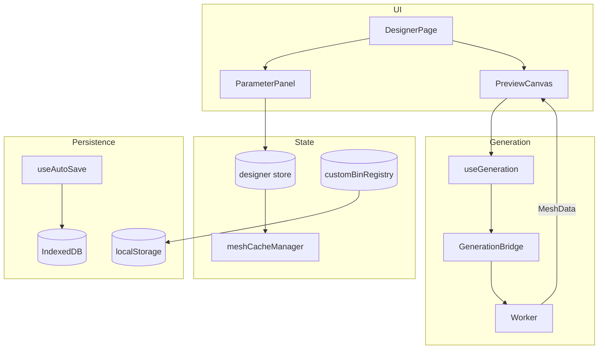

# Bin Designer

Parametric 3D Gridfinity bin generator with brepjs geometry engine.

## Key Files

- `components/DesignerPage/DesignerQuickstartCard.tsx` — one-time orientation card for first-visit
  /designer landers (desktop/tablet only). Dismissed by "Got it", Escape, or the first edit;
  state in `hooks/useDesignerFirstRun.ts`. `hooks/usePlannerBridge.ts` shows the one-time
  post-export toast pointing at the layout editor.
- **Cutout editor targets** (#3542) — one editor serves the bin's interior floor AND the lid's
  plate. `ui.cutoutTarget` (`'bin' | 'lid'`) is set when the editor opens and reset when it
  closes; every action in `cutoutSlice` resolves its array through `cutoutOwner`, which returns
  the OWNER (`params` or `params.lid`) rather than the array, so the same path serves reads and
  immer assignments and an action added later is retargetable by construction. What differs is
  the BOARD: on the lid it is the mating-cavity window from `@/shared/utils/lidCutoutPlan` (not
  the bin's overhang-expanded interior, and not the lid's outer plate), the bin's interior is
  drawn under it as a dashed `ReferenceOutline3D` for alignment, and cut depth plus both scoop
  fillets are hidden — a through-cutting host has no floor for a pocket to stop at. `lid.cutouts`
  is ABSENT rather than empty when there are none, because `communityParamsFingerprint` hashes the
  whole params object and keys the moderation tombstone, so an always-present field would re-hash
  every design already published (same reason `migrateSurfaceText` collapses empty text). Entry
  point is the Lid section, gated on `lidCutoutsAllowed`.
- `components/CutoutWorkspace` — dedicated 3D editor for floor/wall cutouts. Properties live in
  a docked, resizable/collapsible `InspectorDock` (width + collapsed state persisted via
  `inspectorDockStorage`), not a floating overlay. `InspectorContent` switches between
  single-select sections, multi-select shared fields (mixed values show a "—" placeholder),
  and an empty board-settings state, above a bin-level block (`BinSizeSection`,
  `BinFeaturesSection`) that stays put across every selection state so the board can be
  resized and the stacking lip cleared without leaving the editor; those two are self-wired
  to the designer store rather than prop-drilled. The design system's number-first `NumberField`
  (drag-scrub + type) replaces sliders, and hardware-size presets surface as quick-pick chips. The multi-select
  section leads with `AlignControls` (align/distribute, backed by the pure
  `panel/CutoutsSection/geometryAlign.ts`) and batch-edits position, size, rotation, cut depth,
  chamfer, scoop and colour.
- `components/panel/TypeSection/` — the design-wide typography controls: a preset picker over a
  disclosure holding the individual knobs (face, case, anchor, size mode, tracking, line scale,
  relief depth, edge profile), plus a specimen drawn from the REAL glyph outlines via
  `@/shared/utils/typePlan`. The style lives on `params.textDefaults`, so this one section governs
  wall text, the lid, label tabs, plates and cutout labels alike; per-surface refinements layer on
  top through `surfaceText.lidStyle` / `surfaceText.wallStyles`. The active preset is DERIVED from
  the fields (`matchTextPreset`), never stored, so the chip cannot claim a look the geometry does
  not have. New designs start on `TEXT_PRESETS.engineering` while `migrateParams` backfills the
  NEUTRAL defaults, so a design saved before the type system renders as it always did.
- `components/panel/ShapeSection/` — "Custom shape" toggle + paint-style half-bin grid editor
  (L/T/U presets, reset-to-rectangle link, O-shape-capable cellMask painting)
- `components/panel/WallsSection/` — wall thickness, pattern picker + scale, the "Patterned walls"
  spatial side selector (`wallPattern.sides`, #2966 — shares `panel/shared/SideSelector` with the
  cutout and handle sections; a slot-blocked wall renders disabled so the stored selection survives
  the slots; suppressed entirely with a reason when a kumiko pattern can't render on
  this bin at all, since `buildKumikoWallPatterns` bails on a polygon footprint or any
  slotted wall and the chips would be claiming walls that export solid), wall text, and the
  "Pattern divider walls" opt-in (`wallPattern.dividers`, #2811) that carries the same pattern and
  scale through the compartment dividers. Deselecting every wall is a valid "dividers only" config,
  not an error, so the panel explains it rather than forcing a minimum selection. Its availability/too-small copy comes from
  `utils/dividerPatternFit.ts`, a deliberately conservative params-only mirror of the worker's
  `dividerPatterns.ts` — it judges the band and each divider's span, never the feature keep-outs.
  On slotted bins it assesses the REMOVABLE pieces instead (free-standing, so no floor-slab term),
  and the panel notes that the pattern only shows on the exported pieces — `GhostDividerPieces`
  renders merged boxes with no CSG and cannot subtract the holes
- `components/panel/BaseSection/` — the body-type cards (standard / flat / tray-bottom / base-only / spacer) plus magnet/screw/lip/half-socket/lightweight/detachable-feet controls and the
  "Drainage holes" floor pattern (`floorPattern`, #2816), which perforates the floor slab AND the
  feet under it. Reuses `WallsSection`'s `PatternSelector` narrowed to `FLOOR_PATTERN_TYPES` — the
  kumiko lattices are perimeter-wrapped and have no meaning on a floor. Its too-small copy comes
  from `utils/floorPatternFit.ts`, which IMPORTS the window rule from
  `@/shared/generation/floorPatternMetrics` rather than mirroring it: that rule is what keeps holes
  off the baseplate-mating taper, so a drifted copy would mispredict exactly the bins the geometry
  refuses to pattern
- **Knife block** — a solid bin whose `knifeSlot` cutouts hold kitchen knives lying flat
  (in-drawer style): a stadium groove sized from the knife's measurements
  (`knifeSlotDimensions` in `types/knifeBlock.ts` — spine + clearance wide, heel + float deep,
  blade + margin long) whose open end breaches the perimeter wall so the bolster stops at the
  block face (`buildKnifeBreachChannels` in the worker's `cutoutBuilder.ts`, deliberately
  unclipped). The physical model: spine flush with the fill top, edge floating above the slot
  floor, handle carried by a rest. The rest is planned once in
  `@/shared/utils/knifeRestPlan.ts` (worker, preview, panel and layout all read it):
  `companion` builds a separate socketed solid with one circular-segment saddle groove per
  knife (`knifeRestBuilder.ts`, exported as the `knife-rest` piece), `integrated` drops the
  block's own rear section to the same saddle heights. Wall breaches register as
  `knifeSlot`-source lip gaps via `knifeSlotWallExits` (one source of truth for the lid rail
  plan and any future pattern clip), and in the layout the block and its companion place as a
  PAIR of bins sharing a `pairId` (`@/shared/utils/binPairs.ts` + the
  `useKnifeRestPairing` reconciler in design-linking) — moving, stashing, deleting and
  rotating act on the unit while the gap between them stays free grid space
- `components/panel/LidSection/` — click-lock lid toggle, fit pills, top-surface picker with its magnet / lip-only / separate-baseplate sub-toggles, thickness sliders
- `components/panel/SlideControls/` — channel placement (`recessed` under the stacking lip so the bin still stacks, or `flush` at the rim for the deepest interior, which needs the lip off and says so as a blocker with a one-click fix), which wall it opens through, the pull (none / finger notch / in-plane tab), and the click-shut detent. Sliding clearance is deliberately NOT here: it lives under Advanced with the other millimetre knobs, being the one number with a right answer per printer and none in general. Everything rendered comes from `slideLidPlanForParams`, so a readout cannot disagree with the geometry.
- `components/panel/HingeControls/` — which wall the hinge axis runs along, and what holds the lid SHUT (nothing / a snap rail on the opposite wall / magnet bosses on that wall). A hinge fixes one edge and says nothing about the other three, which is why the catch is its own choice. The readout is the point: the pin is a filament offcut the user cuts themselves, so the cut length is the one number nobody can measure off the model, and it is quoted again in the export dialog from the same `hingePinLengths` call, one per RUN (a cutout splitting the hinge wall leaves two barrels and needs two pins). Running fit lives under Advanced with the other millimetre knobs. Switching TO a hinge seeds a scallop grip on the opposite wall when the grip is still untouched, but never overwrites a configured one.
- `components/panel/LidGripControls/` — the chamfer / shadow-line / scallop cut at the lid↔bin seam, plus the opt-in bin lip dip. `grip.heightMm` is a knob on the shadow line and the scallop (`null` = the mode's own request; a chamfer has none, its 45° section being its depth). The readout reports depth, height, lid left ABOVE the cut and which dimension ran out, because the requested values are bounded by the design's own tray / magnet / skirt geometry and a shortened relief otherwise reads as a defect. The shadow line is unavailable on a stackable top, since it moves the face an upper bin registers against; `lidGripModeAllowed` is the rule, mirrored server-side.
- `components/panel/ColorsSection/` — multi-color zone editor: per-zone rows, picker, palette CRUD, eyedropper + swap entry points
- `components/panel/ColorsSection/AccentBandsEditor.tsx` — the top and bottom accent bands. These are the only PLANE-CUT zones: every other zone paints whatever geometry carries its `FeatureTag`, while a band recolors the outermost N mm of the body at one end and overrides each zone it covers (a bottom band paints the socket, a top band paints the lip). `accentCutPlanes` in `types/featureColors.ts` is the single resolver for both planes — it also owns the rule that a colliding pair tiles rather than overlaps — because the preview, the 3MF exporter and the eyedropper all read it
- `utils/accentBandUnits.ts` — mm ↔ whole-layer conversion for the band height sliders. The design always stores absolute mm; `settings.accentBandUnit` is an authoring preference resolved against `printSettings.layerHeightMm`, so changing a printer profile never repaints a saved design
- `utils/zoneResolver.ts` — pure raycast triangle → ColorZone mapping (reused across hit-test, preview, and 3MF export gating)
- `utils/zoneLabels.ts` — ColorZone → i18n key + flat `updateFeatureColors` patch helpers
- `hooks/useSwapZoneWithToast.ts` — wraps `pickSwapZone` with a localized success toast
- `components/preview/LidMesh/` — renders the lid mesh in the preview, with explode-aware
  positioning, opacity interpolation, and mutual hover highlight pairing with `BinMesh`. In
  multi-color mode it paints the lid with its zone color (`featureColors.lid`) to match the
  exporter, rather than the body color
- `components/preview/LidGuideLine/` — visual cue connecting bin and lid in exploded views. Hidden for a sliding lid, whose whole point is that it does NOT dock downward
- `components/preview/LidExplodeSlider/` — lifts the lid off the bin. A sliding lid translates along its entry axis instead; a hinged one carries DEGREES and stops where the lid does, because it cannot lift and an exploded view would hide the one thing worth checking, whether the nose clears the rim through the arc. Range and unit are props rather than a second component, since track, drag mapping and keyboard are identical whatever the number means. `lidGroupPosition` (`preview/LidMesh/lidAnchorZ.ts`) owns BOTH the seated placement and the explode direction, so no consumer needs to know which kind of lid it is.
- `components/preview/LidMesh/lidAnchorZ.ts` — `lidHingePose` poses a hinged lid as three nested groups, not one: a group turns about its own origin while the hinge axis is out at the wall, so collapsing them looks identical at 0° and swings the lid through the bin at anything else. There is deliberately NO pin rendered: a pin sits recessed inside a closed barrel, drawing 0 pixels shut and 334 of 2.4M fully open. The interleaved knuckles carry the joint; the cut length is quoted in the panel and the export dialog instead.
- `store/tagAppearance.ts` — device-local per-tag icon/color (localStorage `gridfinity-tag-appearance-v1`), keyed by lowercased tag; rendered by `TagGlyph` in every tag chip and edited via `TagManagerDialog` (Saved Designs ⋯ menu → "Manage tags…")
- `storage/DesignerStorage.ts` — IndexedDB persistence for saved designs (incl. optional `tags`; `updateDesignTags` replaces a design's tag set)
- `storage/defaultParamsStorage.ts` — user's custom "default for new bins" (localStorage). Stores a style-only `Partial<BinParams>` (per-design geometry stripped via `extractStyleDefaults`/`STYLE_DEFAULT_OMIT_KEYS`); `loadDefaultParams` re-completes it via `migrateParams`. Read at the single `defaultsForNewDesign()` chokepoint so `newDesign`/`resetToDefaults` both honor it
- `store/binDefaults.ts` — tiny reactive mirror of "is a custom default stored?" so every surface stays in sync (localStorage isn't reactive)
- `hooks/useBinDefaults.ts` — single source of behavior (`setCurrentAsDefault` / `resetToFactory` / `hasCustomDefault` + toasts) shared by all four discoverability surfaces: the Saved Designs ⋯ menu, the `SetDefaultFooter` (parameter-panel footer), the Settings → Defaults tab, and the command palette. The palette can't import this feature (cross-feature boundary), so `set-bin-default`/`reset-bin-default` commands dispatch window events that `useBinDefaultCommandBridge` (mounted by `DesignerPage`) translates into hook calls
- `utils/tags.ts` — `normalizeTags` (trim/strip-control-chars/dedupe/cap: 12 tags × 32 chars)
- `@/shared/printSettings/assembledHeight` — how tall the design stands seated on a baseplate with its lid on, as disjoint bottom-to-top bands summing to the total. **A socketed bin nests `SOCKET_HEIGHT` into the plate**, so a plain no-magnet, no-solid-floor plate contributes 0mm; only `baseplateFloorDepth` (magnet retaining floor + optional solid floor) lifts the bin. **A flat base has no socket, so it gets no plate band at all**: counting one would overstate clearance by the plate's full height. Feeds the sidebar rows (`panel/AssembledHeightBreakdown`) and the 3D height dimension (`preview/BinDimensions`) through `hooks/useAssembledHeight`, so drawing and readout cannot disagree. The lid's rise is derived from `lidAnchorZ`/`resolveLidPlateThickness` rather than measured, so it is correct before generation finishes; `generation/.../assembledHeight.scenario.test.ts` runs the real kernel to pin the derivation to the meshes. It lives in `shared/` because the layout's drawer-ceiling check, the bin inspector and the layers panel all need the answer and cannot import this feature, reaching it via `assembledRiseMm` on the custom-bin registry.

## Critical Concepts

The exported design JSON format is documented in `docs/schemas/bin-design.md`
(field reference, recipes, and the traps), and hand-written files can be checked
with `pnpm run validate:json`.

- **Epoch pattern**: `store.setParam()` increments epoch → triggers regeneration. Only properties the worker reads bump it, so cutout toggles split three ways. `locked` is editor state the worker never sees, so it calls `pushHistoryEntry(state, { affectsGeometry: false })` and undo works without a rebuild. `hidden` IS geometry: `buildCutoutCuts` filters hidden cutouts out of the cavity, group and label loops alike (a hidden group member stops contributing to its boolean), so hide, show and `showAllCutouts` all regenerate. `zIndex` is geometry only when the design has a group, since ordering's only geometric role is sequencing boolean ops inside one
- **Spacer / riser (`base.spacer`)**: a floorless bin used as a riser so bins of different heights finish flush. Deliberately NOT a new `BinStyle` but a base property, so it composes with wall features and doesn't ripple through the ~20 `style` consumers.
  - Derives `dimensions.lightweight = true` and asks `lightweightBaseBuilder` for the `'through'` open direction: **zShift 0**, so the cup opens at BOTH ends. The floor-opening slug punches the body floor over each cup, making the whole cell a through-hole.
  - **What holds a multi-cell spacer together is the inter-cell webbing** (each cup keeps its own wall, adjacent cups' walls meet) plus the perimeter. Remove it and interior feet come loose as separate solids, which the 3x3 scenario guards. Envelope, feet and lip are untouched, so stacking arithmetic is inherited: a 2u spacer under a 2u bin reaches the top of a 4u one.
  - **The one bin allowed down to 1u.** `DESIGNER_CONSTRAINTS.MIN_HEIGHT` is 2 because 1u leaves no usable cavity, which a floorless riser doesn't have. The floor lives in ONE place, `minHeightUnits(base)`, read by the stepper bound, `validateBinParams` and every base toggle; `api/lib/designerValidation.ts` mirrors it. It keys off the **effective** spacer (`base.spacer && style !== 'flat'`), since the flag is inert on a flat base, so keying off `base.spacer` alone would hand the relaxed floor to a `{ style: 'flat', spacer: true, height: 1 }` payload. `useBaseSection` routes every toggle through one `commit()` that re-applies the floor. It must cover more than the spacer card (`setBodyType`), since enabling the flat base auto-disables the spacer through `CONSTRAINT_RULES` and would strand a 1u bin below its own stepper's floor, reading the RESOLVED params (the engine's post-check can return params untouched when an enable is blocked). Layout placement is excluded: `CONSTRAINTS.MIN_BIN_HEIGHT` stays 2.
  - **Attachment hardware is suppressed** (`deriveDimensions` zeroes `withMagnet`/`withScrew`): a magnet pad inside a through-hole would be a free-standing pillar. Incompatibilities are declared in `CONSTRAINT_RULES` and deliberately **one-way** from the interior features (the `style.solid` precedent), so a spacer stays reachable from a fully-designed bin and clears the incompatible set on the way in. Only the flat base blocks it, mutually.
  - Every place that special-cases the shelled base takes the spacer too: `canBinUseDirectMesh`, the split floor-scarf, the generation timeout budget, split alignment, and the floor-pattern fit/estimate.
- **Underside lightweight relief (`base.lightweightMode`)**: the lite shells opened DOWNWARD, so each foot becomes a ring capped by the bin's own floor. The interior stays flat, so contents can't settle into recesses and floor-dependent features keep working. A mode on `base.lightweight`, **absent** when `interior` so `communityParamsFingerprint` is unchanged for published designs (the `base.tile` precedent).
  - Built as `zShift 0` with no floor opening, cutting a scaled copy of the socket profile. Offset is `UNDERSIDE_RELIEF_BORDER_MM` (3mm): the ring stands on the bed and carries a bridged floor. See `geometry-generation` for why a prism would breach the taper.
  - Gates read `liteFloorOpen`, not `dimensions.lightweight`. The relief keeps the scoop, floor pattern, top cutouts and the direct-mesh draft; floor inserts stay out of both modes (a recess in a floor with open air beneath holes it rather than thinning it).
  - Base-only bins are lightweight in this mode only. The floor pattern's cut stops at `cutZ0` (the cavity is already open, and a full-depth tool would take material off the ring's bed face), and the divider clip (`openFloorDrawings`) is skipped.
  - The mode selector nests inside the `FeatureToggle`. Safe only because a "Use underside relief" action renders beside the greyed toggle when `undersideReliefUnblocks`, and `showFloor` includes that flag so the control can't be unmounted with the feature it would unblock.
- **Lid-compatible bottom (`base.style: 'lid'`)**: a fully editable bin whose underside is lid mating geometry instead of a Gridfinity socket, so a shallow organiser caps the bin below it. `base.trayBottom` is a narrow subset of `LidConfig` sharing field names and units; the lid's top-face fields are omitted because a tray's top is its own interior.
  - `trayBottomInputs` synthesises a `lid` config and calls the real `resolveLidInputs`; `trayBottomStage` fuses `buildMatingShell` + `addClickRails` + `addLidRetentionMagnets` under the body.
  - **That reuse is only sound because the profiles coincide**: body outer is `w*grid - CLEARANCE` (0.5mm), lid outer is `w*grid - 2*LID_FIT_CLEARANCE`, and both corner radii are 3.75mm (`BOX_CORNER_RADIUS` vs `LID_CORNER_RADIUS - fitClearance`). `trayBottomStage.geometry.test.ts` keeps that honest if either constant moves.
  - `resolveLidInputs` is fed `base.stackingLip: true` regardless of the tray's own lip: the field means "does the thing I mate with have a lip", which is true by construction. `disabledRails` is forced empty, since the rail-conflict check reads the COVERED bin's features, which live in a different design.
  - `dimensions.baseOffsetZ` is the depth of whatever sits under the floor (`SOCKET_HEIGHT`, skirt depth, or 0); `translateStage`/`floorPatterns`/`meshImprint` read it rather than re-deriving `isFlat ? 0 : SOCKET_HEIGHT`.
  - Traps: `trayBottom` is **absent** from `DEFAULT_BIN_PARAMS` (fingerprint, as above); `shellStage` gated the socket on `isFlat` alone, so tray bins grew feet AND a skirt while passing every structural check, hence `dimensions.socketless` and the dimensional `sits on Z=0` test. `CLICK_RAIL_DROP_BELOW_WALL` ties skirt depth to the rail profile. `utils/matchingTray.ts` is the only link between a tray and the bin it caps.
- **Mesh cache**: 100MB budget, attached to history for instant undo
- **Custom bin registry**: Syncs to localStorage for Layout Planner palette
- **Ghost overlays**: Lightweight Three.js primitives render during `generationStatus === 'generating'` for instant visual feedback before BREP mesh completes. Components: `GhostDividers`, `GhostWireframe`, `GhostCompartmentPreview`, `GhostLabelTabs`, `GhostScoops`, `GhostCutouts`, `GhostWallCutouts`, `GhostSlotLines`, `GhostDividerPieces`
- **cellMask**: Non-rectangular footprint carried in `params.cellMask`. Always
  stored at **half-bin resolution** (`MASK_CELLS_PER_UNIT = 2`, so a `W × D`
  bin has a `2W × 2D` mask), row-major with **row 0 = bottom** (matches the
  generator's coordinate system; the UI inverts via `flex-col-reverse`).
  A fully-filled mask is normalised to `undefined` by `setCellMask` so the
  rectangle **fast-path** (shared by `isAllFilled` / `isPartialMask` /
  `drawRoundedRectangle` in the generator) stays active — custom shapes only
  pay the polygon cost when they actually differ from a rectangle.
  `validateMask` accepts enclosed empty cells (O-shape / ring topology); the
  generator builds those via `buildMaskHoleDrawings` and a 3D boolean cut,
  and the stacking-lip loft wraps each hole as well.
- **Shape editor state** (`ui.shapeEditorOpen` + `ui.halfGridMode`): normalised
  from the loaded params by `loadDesign` and `restoreHistoryEntry` via
  `paramsNeedHalfGridMode` (fractional dimensions OR `hasHalfBinDetail(mask)`),
  so reopening a design or undoing past a dimension change never leaves the
  UI toggles out of sync with the underlying shape.
- **Fractional foot edge** (`params.fractionalEdgeX` / `fractionalEdgeY`): for a
  bin with a fractional dimension (e.g. 2.5u), which side the half-unit foot
  column/row sits on — `'end'` (default) = right/back, `'start'` = left/front.
  Mirrors the baseplate's drawer-level option and lets a 2.5×2 bin place its
  half foot on either side **without** rotating the print (rotation would move
  the front-facing finger scoop to the back). Default `'end'` keeps existing
  geometry byte-identical (the socket cache key appends `frac:x:y` only when
  non-default). The setting is threaded through every cell iterator that must
  agree on foot placement — base sockets + their magnet/screw holes, the
  lightweight base, and lid magnets — so they never drift apart. **No effect with
  `base.halfSockets`** (every foot is already a uniform 0.5u cell, so there's no
  single half foot to move) — the `DimensionsSection` toggle hides in that mode.
  Overhang gap-fill feet keep the default decomposition since they don't mate
  with baseplate sockets. `migrateParams` backfills `'end'` for legacy designs;
  `handleSwapDimensions` swaps the two edges along with width/depth.
- **Foot lattice** (`base.footLatticeX` / `footLatticeY`, #3467): where an
  INTEGER axis's feet fall relative to the plate's cell boundaries. `'grid'`
  (default) is full cells; `'half'` is a 0.5u foot at each rim with full cells
  between, which is what seats a bin sitting half a unit off-grid on that axis —
  16 feet on a 3x3 against 36 for `base.halfSockets`. Exactly complementary to
  `fractionalEdgeX/Y` above: that owns fractional axes, this owns integer ones,
  and `computeMatchedFootLattice` skips an axis the other already answers. Inert
  under `base.halfSockets` (uniform 0.5u feet seat at either offset) and under a
  partial `cellMask` (authored against the standard grid). The socket cache key
  appends `lat:x:y` only when non-default, so existing designs stay
  byte-identical. `useFractionalEdgeMismatch` warns and offers "Match layout"
  when it disagrees with where the linked bin sits — a wrong lattice is a bin
  that will not drop into its plate, so unlike the edge there is no manual
  override. Verified by mating real solids in
  `generation/worker/generators/__kernel-tests__/binSeating.ts`.
- **Click-lock lid**: optional companion piece generated alongside the bin
  when `params.lid.enabled && params.base.stackingLip`. Source of truth lives
  in the worker (`generation/worker/generators/lidBuilder.ts` +
  `lidConstants.ts` + `lidOrchestrator.ts`); the result rides back as
  `lidMesh` on the same `MESH_RESULT` payload. The lid is rendered in
  preview with explode-aware Z and opacity (`LidMesh.tsx`); when exporting,
  STL/3MF emit it as a separate piece in the ZIP and STEP folds it into a
  compound assembly translated to its mated position. `LidSection` exposes
  the extra-height cavity boost (`extraHeightMm`, 0–100mm — a taller lid
  encloses items that poke up out of a short bin, e.g. toothpicks; 0 = the
  standard one-grid-unit lid), the top-surface picker and its sub-toggles
  (magnet pockets, lip-only stack top, separate baseplate), per-side
  click-rail snaps with a coverage slider (`LID_CLICK_RAIL_COVERAGE_OPTIONS`,
  50-100% in 5% steps — **5 rather than the requested 10 because
  `migrateClickRailCoverage` snaps every persisted value to the NEAREST listed
  option, so dropping 75 would silently re-render every design saved at
  three-quarter coverage as 70**; only 50/75/100 carry description copy, the
  rest render bare like `gripCoverageOptions`), and the floor-plate
  thickness (`topThicknessMm`, 0.8–5mm — a thicker top for a stiffer, less
  translucent lid on large bins; 0.8 = the historical plate). Wall thickness and
  fit clearance stay locked-down constants in `lidConstants.ts` (a single
  validated set — exposing them invited mis-prints); the plate is the exception
  because it mates with nothing. **Plate thickness is a floor, not a cap, and it
  consumes cavity depth** — resolve it via `resolveLidPlateThickness` /
  `resolveLidCavityExtraMm` in `types/lid.ts`, never a local `Math.max`, or the
  plate will eat the space the bin's lip needs (gotcha 10 in the generation
  README). A magnetic lid also gets `LID_MAGNETIC_EXTRA_CLEARANCE` (0.15mm/side,
  XY only) so the magnets aren't fighting a friction fit. Magnetic retention anchors its
  bosses to the cavity BOTTOM, so a deep cavity lengthens the pillar rather than
  lifting the magnets out of the bin's reach — the bin's pads land in the same
  place whatever the lid's depth knobs say. `retentionMagnet.edgeMagnets`
  (#2844) adds extra magnets along each long edge, between the corners, so a big
  lid doesn't sag in the middle where four corner magnets can't reach; they only
  materialise on edges long enough to space them clear of the corners (see
  `retentionMagnetPositions`), so the count is a per-edge ceiling and small lids
  keep the plain four-corner layout. Mid-edge pads anchor to a single wall with
  their own support-free 45° taper (`anchor: 'x' | 'y'`), unlike the two-wall
  corner gussets.
- **Nested cutout groups**: `Cutout.parentGroups` holds enclosing groups,
  outermost first, excluding the cutout's own `groupId`. A group id is EITHER a
  boolean group (some cutout's `groupId`, owns the op, all the generator sees)
  OR an arrange-only container (`parentGroups` only) — never both, which is why
  `cutoutBuilder` is untouched. `utils/cutoutHierarchy.ts` owns the tree; its
  `unitTag` is the one definition of "one thing" that selection, the shape list
  and arrange share. Invariants: `bin-designer` skill.
- **Cutout Pathfinder / `GroupOp`**: cutouts in the same `groupId` share an
  optional `groupOp` ∈ `'union' | 'subtract' | 'intersect' | 'exclude'`
  (missing = `'union'` so pre-Pathfinder designs are unchanged). The worker's
  `cutoutGroupOps.combineGroupSolids` fuses, carves, or XORs the group's
  member solids into a single cut tool; **Subtract uses the highest-zIndex
  member as the cutter** against the union of the rest (Illustrator "Minus
  Front"). The 2D editor preview mirrors the same semantics via
  `polygon-clipping` in `panel/CutoutsSection/booleanGeometry.ts`, so the
  live editor matches the exported mesh. **Exclude is computed as `union −
intersection`, not XOR** — they coincide for 2 members but diverge for
  3+ (a region in 2 of 3 members survives `union − intersection` but is
  stripped by symmetric-difference). Scoop fillets are restricted to union
  groups; the other ops can produce holes or disjoint topologies the
  adaptive fillet can't reason about. Empty results (e.g. Intersect of
  disjoint shapes) raise a toast so silent no-ops are debuggable.

- **Cutout shapes** (`CutoutShape`, seven members): beyond `rectangle` / `circle` /
  `path` (pen), `mesh` (below) and `knifeSlot` (knife block), the editor
  has two parametric primitives for bit/socket organizers — `polygon`
  (regular N-gon, `sides` 3–12, flat-top hex default) and `slot`
  (stadium/capsule = rounded-rect at half-short-side radius). A polygon's
  vertices are **derived to fill the `width × depth` box** (shared math in
  `@/shared/utils/cutoutPolygon`, used by both the worker and the 2D editor),
  so every bounds/resize/rotation/align helper is reused unchanged — only the
  outline generation, `booleanGeometry`, and the renderer branch on shape
  (polygon → `PolygonShapeMesh`; slot → SDF rounded box). Insert shapes
  (circle/polygon/slot) carry an optional `clearance` (mm) added to the cut at
  generation time so spec-sized parts fit; the 2D editor shows the nominal
  size. Polygons are sized **across-flats** (matches hex/Allen specs);
  per-shape sizing + hardware presets live in `CutoutShapeControls`.

- **Entry chamfer**: `chamferWidth` (mm) lofts a ~45° flare at the cut's top rim
  so parts self-center on insertion. The generator builds it via `loftWith`
  between the nominal profile and a `chamferWidth`-expanded top profile; it
  composes with scoop fillets and is clamped to `maxEntryChamfer(cutDepth)` (a
  `MIN_STRAIGHT_WALL` straight section must remain below the bevel). New
  insert-style holes seed a size-scaled default via `defaultEntryChamfer`
  (~10% of the tightest dimension, clamped to a tasteful 0.4–0.8mm). Available
  on `rectangle` / `circle` / `polygon` / `slot`. The editor exposes tolerance +
  chamfer as 0.2mm steppers that still accept off-grid fractional typing.

- **Label plate preview**: socket-mode plates render as REAL geometry, meshed by
  `labelPlateGenerator` and carried on the generation result beside `lidMesh`. Seats come
  from `planLabelPlateSeats`, which shares `planLabelTabLayout` with the tab builder —
  planned, not observed, because label tabs are a CACHED pipeline feature and a cache hit
  rebuilds nothing for a collector to watch. Each plate is meshed once in plate-local
  coords and drawn twice (seated + reference row) via `platePoses`. Capped at
  `MAX_PREVIEW_LABEL_PLATES`; the remainder is surfaced in the label panel rather than
  silently truncated. Preview only — export packs its own bed-sized sheet. A SHADOW BOARD's
  plates come from `planCutoutSocketsForParams` instead and seat in a flat surface, so they
  withdraw along +Z rather than sliding over a compartment, and a 90° socket carries a yaw.
  Both planners answer in the BODY frame, which `translateStage` then lifts by
  `baseOffsetZ`. The lift is applied once where seats become poses, so neither planner
  carries a copy of it.
- **Cutout label sockets**: a cutout's label has a mode, engrave (text cut into the fill)
  or socket (a click-in pocket for a standard swappable plate). The plan is where the work
  is: a cutout sits in free space beside arbitrary neighbours, and a pocket that strays over
  one loses its floor and interrupts the rib run, so the plate stops clicking in while every
  bounding-box, triangle-count and watertight assertion still passes. `planCutoutLabelSockets`
  holds the anchor fixed and gives up plate WIDTH, and grows its obstruction set with each
  accepted pocket so two cutouts anchored into the same gap cannot merge theirs into one
  cavity with no retention left. Arrays anchor to their FULL extent, unlike the engraved
  label: 0.4mm of glyph lands harmlessly over a sibling hole, a pocket does not.
- **Full-width label tabs (#2897)**: `label.span` swaps per-compartment tabs for one
  shelf per ROW. A row only gets one where a divider runs the full inner width behind it
  (`rowHasFullWidthWall`) — a shelf needs something to hang from. Captions live in
  `label.rowTexts`, NOT beside `compartments.compartmentTexts`: every array on
  `compartments` is compartment-indexed and gets dropped by `setCompartmentGrid` /
  renumbered by `normalizeIdsWithRemap`, whereas row captions are row-indexed and must
  survive both. Entries past the current row count are ignored, not trimmed.
  `planSpanningTabAtRow` runs against the REAL compartment config — never a synthetic
  grid — because the tilt guard reads `dividerOverrides` off whatever config it is handed
  and would silently pass on a fabricated one. Anything that changes which rows host a tab
  must go through `spanningTabEligible` — the single gate covering full-width wall, tilt,
  region depth and the both-edges collision. The worker, `GhostLabelTabs` (preview) and
  `planLabelPlates` (socket sheets) all call it; sharing only the wall check let the
  export ship plates for rows the worker rejected, i.e. plates with no socket to click
  into. `featureColors.hasTabText` reads `label.rowTexts` in span mode for the same reason.
  `compartmentTabEligible` is the same gate for the default per-compartment layout (tilt,
  compartment depth, both-edges collision) and has the same three callers. #2910 is what
  happens without it: the plate planner keyed off the compartment grid alone, so an
  `edges: 'both'` design — two sockets per compartment — shipped half the plates it needed.
  A spanning shelf runs wall to wall, so the column dividers it crosses must stop at its
  underside — `planSpanningDividerClips` (labelTabBuilder) derives those footprints from the
  same layout plan the shelves are built from. The clip has to be applied at BOTH divider
  sources: the shell itself when `compartmentsBakedIntoShell` (2D cavity drawings can't
  express a partial height, so `shellStage` cuts it before `featuresStage` fuses the shelf —
  the boolean stage runs every cut AFTER every fuse, so a cut target would eat the shelf) and
  `buildCompartmentWalls` on the additive path. Both spanning shapes need it: `label.span`,
  and the socket plan's bin-spanning fallback for columns too narrow to host a plate.
- **Label tab spans follow the divider, not the grid line (#3225)**: a `dividerOverride`
  translates a divider off `-innerW/2 + col * cellW`, so that expression is not the
  compartment edge. `compartmentTabXSpan` is the single source of truth, and the same three
  callers consume it: the worker shelf (`labelTabBuilder`), the socket plate fit
  (`planLabelSockets`) and the ghost overlay. The eligibility gates above only reject a
  TILTED anchor wall, so a straight shift passes them and the tab is built in the wrong
  place rather than dropped: it floats off its own wall, overhangs the neighbour, and its
  plate is sized for room the compartment does not have. A tilted SIDE divider clamps to
  whichever endpoint narrows the span, because the tab is an axis-aligned rectangle that
  has to clear the wall at every Y.
- **Cutout align/distribute**: `geometryAlign.ts` moves shapes by _delta_, never by
  assignment — `x`/`y` is the UNROTATED top-left while alignment is judged on the rotated
  silhouette (`getRotatedBounds`), and path cutouts store ABSOLUTE points that must travel
  with the origin. Locked cutouts anchor: they never move but still define the selection
  bounds, so "lock a reference hole, align the rest to it" works. This deliberately differs
  from flip/rotate in the context menu, which disable wholesale when anything is locked.
  Distribute runs per anchor-to-anchor SEGMENT (extremes + every locked shape between them),
  not once across the whole span — spacing the full run and merely skipping locked shapes
  would place the rest as if the anchor had moved to its even-spacing slot.
- **Center in bin takes an axis** (`CenterAxis`, `geometryAlignment.ts`): centering both
  axes discards a position placed deliberately, so `'x'` and `'y'` exist alongside
  `'both'`. The untouched axis is still returned at its current value, so no caller has to
  know which one moved, and a multi-shape selection still moves by one shared delta. The
  three entries are one list (`CENTER_ACTIONS`) so the workspace and panel context menus
  cannot drift apart; both toolbars are gated at 2+ selected, which makes the context menu
  the only route for a single shape.
- **Lock covers transforms only**: `Cutout.locked` means "cannot be moved, resized, or
  rotated". Batch edits to cut depth, chamfer and colour still apply to locked shapes; X/Y,
  W/H and rotation skip them.
- **Parametric arrays**: a cutout can carry a `CutoutArrayConfig` (`array`)
  replicating it across a `grid`, `staggered` or `radial` pattern from a single
  **master**. Placement math lives in `@/shared/utils/cutoutArray`
  (`arrayInstances` for offsets, `expandCutoutArray` for concrete `Cutout[]`),
  shared by the worker and the 2D editor so both derive identical positions.
  Instance 0 is always the master (a real cut, keeping its id/placement); derived
  instances get ids `${master.id}::a${i}`. Totals cap at `MAX_ARRAY_INSTANCES`,
  and the editor clamps counts, pitch and radius via `arrayFieldBounds`.

  - **Pitch is bounded by the bin, never by the master's own box.** Two instances
    overlap only when they overlap on BOTH axes, so a staggered array whose
    half-pitch X offset already clears the master may nest arbitrarily close in Y.
    A per-axis floor cannot see that, and read off the box it also refused a
    deliberate overlap, which is how two shapes are made to cut into each other as
    one opening. `arrayInstancesOverlap` asks the two-axis question and the editor
    warns the cuts will merge; `clearPitchX/Y` say where that begins.
  - Restricted to **ungrouped, non-path** cutouts. `flattenCutoutArray` /
    `applyFlattenArray` bake instances into independent cutouts, and **a flatten
    declines whole or completes whole**: its first step strips the master's repeat
    config, so a run that filled the lid part way through would leave neither the
    array nor the instances it stood for. `applyFlattenArray` takes
    `remainingCutoutCapacity` and returns `'no-room'` before touching anything.
  - **The UI calls this "Repeat"** (`binDesigner.cutouts.repeat.*`) but the data
    field is `array`: renaming it would change every stored design and
    `communityParamsFingerprint`. The section opens on preset chips
    (`repeatPresets.ts`), each checked against `arrayFieldBounds` so a chip that
    would be clamped is disabled. When `canArray` refuses, the section stays and
    states the reason with an Ungroup action (`repeatBlockedReason`). Controls
    (`CutoutArrayControls`, `+/-` steppers) appear in the workspace and the sidebar.

  **`@/shared/utils/cutoutRepeatDetect` runs the inverse direction**: it recovers
  the master + config from hand-placed instances, fitting centers to a lattice
  within `REPEAT_POSITION_TOLERANCE` (0.5mm, the editor's position step) and
  reporting `maxDriftMm` so the offer states what moves before it moves. Geometry
  fields must match exactly; `rotation` is checked per-mode, because a
  `rotateToCenter` ring gives every instance a different one. **Differing engraved
  labels block the offer entirely** — `expandCutoutArray` spreads the master's
  fields over every instance, so merging would silently delete cut text. Colour
  may differ (it is applied at paint time) and is called out in the message.
  `mergeCutoutsIntoArray` writes the config and removes the absorbed cutouts in
  **one** `pushHistoryEntry`, so a single undo restores them all.

  Consumed by `useRepeatSuggestion` (inspector row, plus a canvas chip when the
  dock is collapsed — the hook takes an `enabled` flag, because the hidden
  presentation would otherwise record an impression for a view nobody saw), the
  context menu, and `Ctrl+Shift+D`. `Ctrl+D` is step-and-repeat: after a copy is
  moved deliberately, the next duplicate reuses that placement delta, measured
  from the clone's own source so moving the newest copy re-aims the chain
  (`useCutoutClipboard`).

### Mesh imprint cutouts (STL import)

`shape: 'mesh'` cutouts carve a contoured pocket from an uploaded STL. The compressed mesh lives in `BinParams.meshAssets` (content shared across duplicates/arrays; store GCs an asset when its last referencing cutout is deleted — see `cutoutSlice`). Import flow: `panel/CutoutsSection/stlImport/` (`useStlImport` → worker `IMPORT_MESH` → orientation dialog → `addMeshCutout`). The 2D editor renders the stored silhouette (`renderer/MeshFootprintMesh`) shape-locked: move/rotate/array yes; resize, point-edit, scoops, pathfinder groups no. Fit controls (clearance/chamfer) apply. Payload cap is 2MB only when `meshAssets` is non-empty (server mirror in `api/lib/designerValidation.ts`).

### Imported bin designs (STL → design, `stl_bin_import` flag — graduated)

Distinct from mesh imprints: here the uploaded STL **is** the design — a whole
Gridfinity bin (e.g. downloaded from Printables) saved as an `importedMesh`
item kind (`kind` + `envelope` + `structure`, no `params`). The structure
(`ImportedMeshStructure` in `@/shared/types/item`) holds the GMA1-compressed
`MeshAsset`, the claimed `heightUnits`, the measured `volumeMm3` (filament
estimates), and the source file name.

- **Import flow**: `DesignImportView` accepts `.stl` when the flag is on and
  routes to `components/ImportBinDialog/` (`useImportBinDesign` →
  `bridge.importMesh` → orientation preview → `detectGridFromSize` →
  eager `saveDesign` + `customBinRegistry` upsert + `loadDesign`).
- **Grid detection** (`utils/meshGridDetection.ts`): W/D snap to 0.5-unit
  steps against `W·gridUnit − TOLERANCE`; height tests both lipless (`H·7`)
  and lipped (`H·7 + 4.4`) reads so a lipped 3U bin (25.4mm) reads as 3U.
  Deviation > 2mm/axis flags the off-grid warning. The claimed footprint only
  affects layout planning — **the mesh is never rescaled**.
- **Panel**: `panel/ImportedMeshSection/ImportedMeshPanel.tsx` (read-mostly:
  stats, footprint steppers, STL/3MF export — STEP is impossible, no BREP).
- **Persistence**: `useAutoSave` is bin-params-only, so
  `hooks/useImportedDesignAutoSave.ts` covers footprint edits (load → merge →
  save, preserving the captured thumbnail) and the one-time thumbnail capture
  after first generation.
- **Registry**: `CustomBinRef.kind?: ItemKind` (absent = bin) lets the
  planner/link dialog identify imported entries; `designFootprint()` in
  `utils/designKind.ts` reads dimensions for any kind.
- **Scope (v1)**: local-only — cloud sync deliberately skips non-bin kinds
  (`sync/designAdapter.ts` filters with `isBinDesign`); the layout grid/3D
  view renders the standard box + link badge, not the real mesh.

## Gotchas

1. **Compartment cells must form ONE CONNECTED region, not a rectangle** — `isContiguousSelection()` is the invariant (`mergeCells` and `validateCompartmentGrid` enforce it); two islands under one id would print as two pockets sharing a label. A merged L/S/T/U is valid geometry, since divider walls fall out of the boundaries between differing ids. Anything that positions itself from `getCompartmentBounds` must gate on `isRectangularCompartment()` — scoop ramps, label tabs and divider tilt already do, because on an L the bounding box crosses the notch into a neighbour. Bento's `mergeBackground` mode applies the same idea to leftover grid: connected runs collapse to one pocket, marked in `backgroundIds` so a multi-cell region nobody drew still reads as background. A stashed shape keeps its footprint in `StashedCompartment.cells`, row-major with row 0 at the FRONT of the bin — omitted means the plain `w × h` rectangle, which is what keeps a rectangular entry serializing byte-identically to before the field existed (and its `communityParamsFingerprint` stable). Every path that copies a compartment — move, clone, stash, restore, migration — has to carry `cells` and its row order across, or a merged L comes back as a rectangle or mirrored front-to-back
2. **Min compartment size is 5mm** - smaller cells skip wall generation
3. **Auto-save only for saved designs** - "Untitled" bins don't persist
4. **Half-cells get no magnet holes** - only full 1×1 unit cells
5. **Solid style skips shell** - `buildBinBox`'s `solid` flag bypasses `.shell()`, so wallThickness is irrelevant
6. **Label tabs skip solid bins** - both generation and ghost overlay guard against `style === 'solid'`. Tabs default to `edges: 'back'` (legacy); `'front'` and `'both'` enable tuck-under ledges (#1898). `inset` (mm) slides the tab inward from its anchor wall for shorter coverage. In `'both'` mode the front tab silently drops when `2·depth + 2·inset > compartmentDepth` and the panel surfaces an inline warning.
   - **Swappable-label socket mode**: `label.mode: 'socket'` replaces printed-in
     text with a click-in pocket for standard interchange label plates (dims in
     `@/shared/constants/labelPlates`, Cullenect v2-compatible). Fit math is shared
     with the worker via `@/shared/utils/labelSocketPlan`, so UI warnings and cut
     geometry cannot drift.
     - Tabs honour the width % like text mode does. `alignment` moves the tab AND
       positions the pocket inside it, which is why the alignment control stays
       visible at 100% width in socket mode: a per-compartment plate override can
       leave the pocket far narrower than its shelf. The depth floor rises to 14mm,
       and `compartments.labelPlateWidths` (per-compartment ID, remapped in lockstep
       like `compartmentTexts`) overrides the auto largest-fit plate width.
     - Plates export from the panel (`LabelPlatesControls` + `useLabelPlateExport` →
       `EXPORT_LABEL_PLATES`): one plate **per SOCKET, not per compartment**, since
       `edges: 'both'` gives a compartment one on each wall. Text depth snaps to whole
       layer heights for filament-swap two-colour printing, with a pre-export 3D
       preview parsed from the STL path. `LabelFitSampleButton` +
       `useLabelFitSampleExport` → `EXPORT_LABEL_FIT_SAMPLE` sweeps socket clearance
       across a −0.10…+0.10mm ladder so the winning coupon's embossed value maps
       directly onto `plateFitOffset`.
     - Plates can carry a hardware icon (`compartments.labelIcons`, remapped in
       lockstep like `compartmentTexts`; allowlist `LABEL_PLATE_ICONS`) left of the
       text. Icon geometry is SVG path data in `@/shared/constants/labelIconPaths`,
       extruded by `labelPlateIcons.ts` and previewed by `LabelIconPicker` from the
       SAME strings, so the grid cannot show a silhouette the plate will not print.
       Contributor contract in `docs/label-icons.md`.
     - `label.socketStyle` (absent = `clickIn`) selects the pocket profile:
       `slideChannel` swaps the ribs for overhanging lips with a mouth through the
       tab's compartment-facing edge and a park detent, using a thicker shelf
       (`LABEL_SOCKET_SLIDE_SHELF_THICKNESS_MM`) and the same standard plates. On
       lipped bins the click-in shelf sinks `LABEL_SOCKET_STACK_RELIEF_MM` (0.8mm)
       below the interior ceiling, since a stacked bin's foot seats only 0.25mm above
       that plane, so a plate standing proud would lift it. The relief is sized for
       the worst case (a plate perched on the ribs AND carrying max-depth text);
       click-in pockets are cut `LABEL_SOCKET_CLICK_POCKET_RELIEF_MM` deeper than the
       plate so a seated one is recessed rather than flush. `resolveLabelShelfTopMm`
       keeps worker, panel and ghost preview on the same plane and **caps an explicit
       `label.height` at the relieved plane** wherever the relief applies.
   - **Per-compartment label text has ONE editor and a picker.**
     `compartments.compartmentTexts` (keyed by compartment id) feeds the engraving
     (`labelTabBuilder`) and `LabelTextList`, the always-expanded list leading
     `LabelTabsSection`. The `CompartmentEditor` "Label text" mode
     (`useCompartmentLabeling`, **standard style + >1 compartment only**) carries no
     field of its own: clicking a cell moves focus to that compartment's row.
     - Mode and selection live in the store (`ui.compartmentLabelMode`,
       `ui.labelFocusCompartmentId`), not local state, because the grid and the list
       sit in different panel sections with no common ancestor. **Reset `ui`
       alongside `params` in tests**, or the selection leaks between cases. Both call
       `setCompartmentText`.
     - Labels render **always-visible** on grid cells (truncated, full text via
       `title`) so they are legible without hover, which does not exist on touch.
       Typing a label when tabs are off shows an inline "Enable label tabs" prompt;
       the text persists regardless of whether tabs are enabled or generate.
     - `LabelTextList` shows EVERY row with filled ones dimmed rather than filtered
       away: the row number's only meaning is that it matches the grid, so hiding
       rows breaks the mapping on exactly the large grids where it matters. It also
       surfaces two things the geometry will not: how many tabs print blank, and
       which captions the builder dropped for overflowing their host
       (`generation.mesh.labelTextOverflow`, generation gotcha 7). Clearing goes
       through `clearLabelText`, one history entry so one undo restores it.
     - In socket mode each row also carries that compartment's plate width and icon,
       so per-compartment choices are one row rather than two lists keyed the same
       way; the fit knobs (socket style, `plateFitOffset`, the calibration card) fold
       into a collapsed "Plate fit" group since they calibrate a printer, not a
       label. `useLabelPlateCounts` returns a `DesignLabelInfo` per linked design:
       the plate set plus `tabsWithoutText`, a DESIGN-level fact rather than a
       per-tab blank count, because counting individual blanks needs the worker's tab
       plan and a guess would over-report.
7. **cellMask dimensions must track width × depth** - `cols` must equal
   `Math.round(width × MASK_CELLS_PER_UNIT)` and `rows` the depth equivalent.
   `paramSlice.setCellMask` rejects mismatched masks outright. When the bin
   is resized, `reshapeOrClearMask` (in `paramSlice`) grows/crops the stored
   mask to the new dimensions — if the result would be empty or invalid it
   falls back to `undefined` (rectangle fast-path).
8. **Custom shapes disable most features** - `FeatureGate` (`inert`
   - visual de-emphasis) blocks pattern/cutouts/handle/compartments/label
     tabs/scoop on `isPartialMask(cellMask)`. Wall thickness and stacking
     lip still work for any footprint.
9. **Lid requires a stacking lip** — `params.lid.enabled` is gated on
   `params.base.stackingLip` at every layer (orchestrator, export handler,
   `useLidSection`). The mating cavity wraps the lip; without a lip there is
   nothing for the lid to clip onto, so the lid is silently skipped.
   `lid.enabled` stays persisted through all of it, so the skip is invisible
   in the params — any surface that lets the lip be cleared owes the user that
   warning. The Lid section carries it in the main panel; the cutout editor's
   `BinFeaturesSection` repeats it, because that panel is off screen there.
10. **Two-piece export** — when `hasLid`, the `EXPORT_COMBINED` flow emits the
    lid as its own labeled piece for STL/3MF (main thread ZIPs them) and
    folds it into the STEP compound. The STEP path must `translate()` the
    lid solid by `totalHeight - lidAnchorZ(...)`; the lid is built in
    lid-local coordinates (Z=0 = lid floor top).
11. **`lidAnchorZ` is duplicated across the worker boundary** — the canonical
    formula lives in `generation/worker/generators/lidConstants.ts`; the
    main-thread copy in `LidMesh.tsx` mirrors it because the worker module
    isn't importable here. **Update both in lockstep** — silent drift causes
    the preview to misalign vs. the exported geometry.
12. **SVG import unit contract** — `svgImport/svgParser.ts` treats user units
    as mm 1:1 unless the SVG declares a physical `width`/`height`
    (mm/cm/in/pt/pc/Q) **and** carries an explicit `viewBox`. Without a real
    viewBox the fallback parses width/height with `parseFloat` (drops unit
    suffixes), so scaling is skipped to avoid producing wildly wrong sizes.
    Genuinely non-square aspect ratios (sx/sy diverge > 0.5%) also fall back
    to identity — a single uniform scalar would distort circles and rotated
    shapes. Path bounds use `getPathBounds` (flattened bezier) so curves that
    bow outward beyond their anchors aren't clipped.
13. **Physical-units print bed is dual-axis** — the section uses the shared
    `PrintBedInput`, so width and depth round-trip independently when the
    link toggle is off. The linked state is encoded by
    `settings.defaultPrintBedDepth === undefined` (`undefined` = "follow
    width", not "0" or "missing"). `usePhysicalUnitsSection.handlePrintBedChange`
    must call the setter with `depth: undefined` when relinking — otherwise
    a stale depth lingers in localStorage and the bed silently stays
    non-square on the next load.
14. **`BinMesh` multi↔single material switch needs distinct keys** — the
    multi-color branch passes `material` as a `<mesh>` **prop** (array of
    `MeshStandardMaterial`), the single-color branch declares the material as
    a `<meshStandardMaterial>` **child**. Without keys, R3F (9.x) reuses the
    same `THREE.Mesh` across the toggle and the post-order commit clobbers
    the freshly attached child material: child-attach runs first, then the
    parent's prop-diff resets the removed `material` prop to a memoized
    `new Mesh()` default (`MeshBasicMaterial`) via `diffProps`. The
    user-visible symptom is a mesh with no emissive glow whose color picker
    no longer takes. Don't remove the `key="multi-color"` /
    `key="single-color"` props — and if you add a third branch (e.g. a new
    material strategy) give it its own key too.
15. **Split connectors have two independent joints** — two sibling toggles in
    `SplitOptionsSection`, gated separately (neither is a child of the other):
    - **Alignment connectors** (`splitConnectors.enabled`) — a 45° floor scarf lap.
    - **Wall connectors** (`splitConnectors.wallConnector`, a `WallConnectorStyle`:
      `'none'` | `'key'`, **default `'none'`**, #1869) — a connector on the
      **exterior perimeter walls only**. The `'key'` style is a straight
      (non-undercut) tongue/groove so the halves **press together horizontally**
      — an undercut dovetail would force a vertical drop-in, impossible past the
      partial-height groove and the stacking lip. The protruding tongue has a 45°
      chamfered underside (self-supporting), and the key is **anchored a fixed skin
      behind the outer face** so the groove can't breach the exterior wall (see
      `wallKeyGeometry`). Stops below the rim so the lip is untouched.

    Either toggle works with the other off — the call site in `splitBinBuilder.ts`
    runs the connector pass when _either_ is on, and `addConnectors` self-gates each
    feature. **Thicker walls add no extra material:** the key is reinforced by an
    inward pilaster _only when the wall is too thin to host it_. Because `perpInset`
    is anchored to a fixed outer skin (not the wall thickness), a thicker wall
    envelops the key and `addKeyConnectors` drops the pilaster entirely.
    **Adding a connector type:** extend `WallConnectorStyle`, add a `case` to the
    exhaustive `addWallConnectors` switch in
    `generation/worker/generators/splitConnectorBuilder.ts` (the compiler flags it
    until handled), reuse `perimeterWalls()` for placement, and add it to the UI.

16. **Design tags sync as a `name`-sibling, not inside `params`** — `tags` rides
    alongside `name` in the design envelope (`{ name, params, tags }`), so it
    never passes through the BinParams share validator. `saveDesign` normalizes
    and persists it; an omitted `tags` on update **preserves** the stored set,
    while an explicit `[]` **clears** it. The sync adapter applies LWW (a remote
    array — even empty — wins; a legacy payload with no `tags` key falls back to
    local). `normalizeTags` (client) and `sanitizeTags` (server) **must** stay
    identical — same 12×32 caps **and** the same control-char stripping — or a
    tag the client keeps but the server rewrites would flicker on the next pull.
17. **Draft preview is best-effort and supersedable** — the `manifold_preview`
    path (graduated, always on) has `useGeneration` render a fast Manifold draft (`setDraftResult`,
    `generation.isDraft = true`) on each edit, then the exact occt-wasm result
    supersedes it. A monotonic token drops a draft once a newer edit starts or the
    exact for its edit has landed (covers the exact-resolves-before-draft race).
    Drafts skip the undo/redo mesh cache — history holds exact geometry only.
18. **Diagonal dividers are an advanced opt-in gating the panel, not the canvas** —
    the `DividerTiltSubsection` list/inspector renders only while
    `settings.angledDividersEnabled` is on (default `false`, persisted); off, the
    section shows a teaser instead. The on-grid `DividerHitTargets` overlay in
    `CompartmentEditor` renders regardless: committed tilts must draw truthfully,
    and clicking a divider before opting in flips the setting on and selects it
    (`handleDividerSelect`) — the canvas is the discovery affordance. The gate is
    **UI-only**: `compartments.dividerOverrides` and the worker geometry path are
    untouched, so a saved design with tilts still renders and exports them while
    the toggle is off — only editing is hidden (#2044). Toggling off clears the
    in-flight selection/hover/preview so the canvas overlay drops cleanly. The
    same subsection hosts **Lean** (`DividerOverride.rakeDeg`), the rotation in
    ELEVATION that the Angle control is in plan. Panel labels speak display
    numbers (`getCompartmentReadingOrder`), never compartment IDs.
    18b. **A leaning divider is one plane through two parallel lines** — the top
    line at `{offsetStart, offsetEnd}` and a foot line at those offsets plus
    `dividerHeight * tan(rakeDeg)` (`dividerFootDrift`, the one statement of that
    conversion). Everything falls out of that. The two controls **compose**,
    because both describe the same plane. The clamp needs no new machinery: run
    the existing `clampOffsets` on the foot line, so `getLeanLimits` is
    `atan((offsetMax - max(offsets)) / height)` and a divider already shifted
    toward its neighbour leans less far. The limit is **floored to a whole
    degree** — the control steps in degrees, so a limit of 24.2 only ever
    surfaces as a clamped value nobody asked for sitting beside a readout that
    rounded it to 24, and flooring also keeps the clamp strictly inside the
    envelope where rounding would not. The pivot is the divider's **own top**,
    not the bin rim, so a divider shortened by `dividerHeight` leans about its
    truncated top; keeping it there is what leaves the rim footprint alone,
    which the click-rail, label-shelf and lip-gap plans all read. The panel
    reports the clear perpendicular opening (`pitch * cos(lean) - thickness`)
    and the foot travel, because neither is readable off a plan view and the
    compartment-size readout beside it measures the grid line the divider has
    left. The 2D canvas draws the top edge solid, the foot dashed and shades the
    swept band between them (`overlayLeanBandPoints`) — the plan view cannot
    show a lean any other way, and without it a leaning divider draws
    identically to a straight one in the view the user edits in.
19. **WebGL context failure is terminal for the session, by design** — the
    `PreviewCanvas` `<Canvas>` is wrapped in `WebGLErrorBoundary` (inside
    `PanelErrorBoundary`). When three.js can't acquire a GL context (slot
    exhaustion, GPU-process loss), the boundary renders `WebGLFallback` with
    **no Retry** and flips `detectWebGL()` to unavailable so subsequent renders
    skip the canvas — re-mounting would just re-throw, which previously produced
    rapid error bursts. Recovery requires a page reload. Non-WebGL render errors
    still bubble to `PanelErrorBoundary`'s generic retry UI.
20. **Resizing can strand cutouts off-board** — the cutout workspace inspector
    now hosts the bin Width/Depth/Height controls (`BinSizeSection` wrapping the
    shared `DimensionsSection`), so the bin can be resized mid-edit. Cutouts are
    stored in **absolute interior-mm and are never auto-rescaled**, so shrinking
    the footprint can leave a cutout past the new edge; the mesh builder then
    silently clips the overhang (`cutoutBuilder.clipToInterior`). `offBoardCutouts`
    treats a cutout as its set of **expanded array instances** (`expandCutoutArray`,
    just the cutout itself when there's no array) and flags it if **any** instance
    falls outside, measuring each footprint with `getCutoutBounds` from `maskFit`
    (true vertex bounds, rotation-aware for paths — the same primitive placement
    validation uses). A **masked** (custom-shape) bin defers to `cutoutFitsInMask`
    so an instance over an unfilled cell is caught, not just rectangle overhang.
    A **lid** board is a third shape (`lidWindowFit`): the window is a ROUNDED
    rectangle, and a magnetic lid's retention bosses are keep-out discs the
    worker subtracts from every hole (`buildClipBoundary`). Both live in one
    region, because a shape tucked into a rounded corner and a shape lying over a
    boss are the same defect (material the cut will not reach) and get the same
    cue. `KeepoutCircles3D` draws the bosses as scenery so the constraint is
    visible while you place a shape, not just after it is flagged.
    `OffBoardFrames3D` frames each out-of-bounds _instance_ in red; the
    inspector's one-click "Bring back in" translates the **master** (instances
    move with it): for a plain bin it pulls the instances' union inside the
    rectangle (oversized pins the min corner to the origin); for a masked bin it
    searches the nearest cell-aligned placement where every instance fits the
    polygon; for a lid it tries the span fit, the four minimal axis moves that
    clear each boss, and inward nudges off a rounded corner. All three leave the
    cutout flagged when nothing fits (translation can't fit an arbitrary concave
    region — honest rather than a silent false-fix). The banner says what will
    happen ("will be clipped") rather than why, since one message now covers
    three causes.
21. **A masked board is concave, so a bounding box can't decide containment** —
    an axis-aligned box proves a fit but never a miss once the board has a
    notch: an L-shaped cutout nested in an L-shaped bin has a box spanning the
    notch. `cutoutFitsInMask` therefore uses `rectFitsInMask` as a **fast
    accept** only, falling back to clipping the real silhouette
    (`cutoutOutline.getCutoutOutline`) against the filled region with
    `polygon-clipping`. Rings are deliberately **conservative supersets** —
    curved spans sample a _circumscribing_ polygon — so an accepted placement
    never clips in the generated mesh. `mesh` cutouts need their stored
    silhouette, which is why `meshAssets` is threaded to every mask check;
    without it a mesh imprint falls back to its footprint rectangle. Any new
    caller building a _candidate_ cutout from a drag patch must move path
    vertices with x/y (`translateCutoutPreview`), or the outline is validated
    where the cutout used to be.

22. **Wall taper is stored rim-anchored but authored base-anchored** — the taper lives on `OverhangConfig.taper` (per-side inset from the rim, chamfer or fillet, shared band height). **What is stored is not what the panel shows**: `OverhangConfig.overhang` is the width at the rim and `taper` the inset back down, while `OverhangSection` presents the drawer-measurable view (`base` fills the flat gap, `flare` adds width above it), deriving `base = overhang - taper` on read and writing back `overhang = base + flare`, `taper = flare`. Any new control must write **both** fields in one `paramSlice.updateOverhang` call or it silently moves the base the user set. `resolveOverhang` reads `params.overhang.taper`; only an _enabled_ taper is subtracted, which is why toggling either way rewrites the four overhang sides. Flare does not require overhang on a side: `resolveTaper`'s `clamp(taper, overhang)` reads as "the base never drops below nominal". Composes with overhang feet, which `buildOverhangFeet` frames from `overhangBaseSides` rather than the stored rim values, as must anything else sitting under the bin.

23. **`Cutout.rotation` is clockwise-positive, every trig helper is counter-clockwise** — `CutoutShapeMesh` renders at `rotationZ = -rotation` and `cutoutBuilder` extrudes at `rotate(shape, -rotation)`, while `rotatePoint` / `rotateAroundCenter` / `booleanGeometry`'s `rotatePair` are standard CCW. **Anything rotating a selection as a group must negate exactly one of the two** (the position swing or the per-member angle), or member centers travel one way while each member spins the other and the group shears. `handlers/groupRotateHandler` subtracts the drag delta because positions rotate CCW with the cursor; `pathfinderHelpers.buildGroupRotationUpdates` and the R key add to the rotation and rotate positions by `-deg`. A sign error is invisible at 180° and on rectangles at 90°, so test at an odd angle with asymmetric shapes. `booleanGeometry` must build outlines with the renderer's clockwise sense, or every rotated member gets a mirrored Pathfinder result.

## Version History

Named, restorable checkpoints for one design (`storage/DesignVersionService.ts`,
`store/versionStore.ts`, `components/VersionHistory/`). Distinct from undo/redo,
which is unnamed, capped at `MAX_HISTORY`, and gone on reload.

- **Capture is manual.** Layouts snapshot on a timer
  (`core/storage/SnapshotService`); a design version is written only on request,
  or as the automatic `pre-restore` copy taken before a restore.
- **`restoreVersion` is not `loadDesign`.** `loadDesign` clears history because it
  switches designs. `restoreVersion` pushes a history entry and keeps
  `currentDesignId`, so a restore is undoable like any other edit.
- **The stored body is a `DesignVersionContent`, not a `BinParams`.** `toolRack`,
  `importedMesh` and `assembly` designs carry `envelope`/`structure` and no params,
  so a params-shaped record would store nothing for them.
- **Eviction drops `pre-restore` captures before anything named**, and never a
  pinned version. It is always announced: a version the user named is never
  removed silently. A design whose versions are all pinned exceeds the cap rather
  than refusing the save.
- **Thumbnails are reused, not re-rendered.** A version copies the design's stored
  thumbnail rather than driving the 3D scene, and is dropped by the cascade in
  `deleteDesign`.

### Branching

`branchFromVersion` (`storage/DesignerStorage.ts`) creates an independent
`SavedDesign` seeded from a stored version, tagged with `parentDesignId` +
`parentVersionId`.

- **Content comes from the VERSION, not the parent's current state.** Branching
  from "0.2 mm, works" must reproduce that, not whatever the parent has drifted
  to since.
- **`parentDesignId` is not `lineage`.** `lineage` describes a community remix by
  another author and carries their names; this points at a `DesignId` in the same
  local library.
- **The branch starts with no thumbnail.** The parent's renders the state the
  branch was taken away from, so the regenerator draws the branch's own geometry
  instead of shipping a misleading preview.
- **`saveDesign` falls back to the stored parent link** when a write omits it.
  Autosave omits it on every write after the first, and without the fallback the
  first edit would detach the branch.
- **`groupByLineage` (`components/DesignListDialog/designLineage.ts`) resolves to
  the ROOT ancestor, not the immediate parent.** Nesting is one level deep, so a
  branch of a branch whose parent is itself nested would belong to no rendered
  row and disappear from the list entirely. A design whose parent is filtered out
  or deleted is promoted to the top level for the same reason.
- **Deleting a design does not delete its branches** (they are independent
  designs), so the toast says how many survived: the indent implies otherwise.

### Variants

A variant is a design kept in step with another except for values it claims
(`utils/applyOverrides.ts`, `storage/DesignerStorage.ts`,
`components/panel/VariantSection/`).

- **`params` on a variant is a MATERIALIZED cache** of
  `applyOverrides(parent.params, overrides)`; `overrides` is the truth about what
  the user owns. Resolving lazily was not an option: ~106 sites read a design's
  params directly and each expects a complete `BinParams`. Materializing keeps
  export, publish, thumbnails, generation and sync ignorant of variants.
- **Propagation is a recompute, not a merge.** `updateDesignParams` rewrites
  every variant of the design it just saved, discarding whatever their stored
  params held for fields the overrides do not name. That is the model working.
- **Every surface editing those params is locked in a variant** (`VariantLock`):
  the parameter panel AND the cutout/bento workspaces, which live in a different
  subtree — guarding only the panel left the cutout editor free to make edits
  that propagation then discarded. `inert` alone leaves controls looking
  ordinary, so the lock also dims them and names the parent.
- **Overrides carry their VALUES, not just which fields are claimed,** so a
  variant can be rebuilt from the parent alone.
- **Cutout size overrides go through `resizeAroundCenter`.** A corner-anchored
  resize would turn a size override into a position change and slide the pocket
  off the center the parent placed it on.
- **An override naming a deleted cutout is kept, reported and skipped** — the
  upstream deletion may itself be undone. Forgetting them is an explicit action.
- **Divergence shows live, not as a notification.** A claimed field differing
  from the parent's current value offers "Take parent's" in place; a one-shot
  notice can be missed, and the question is what differs _now_.
- **`variantOf` is the live link; `parentDesignId` only places it in the family
  tree.** Detaching drops the first and keeps the second, and is written straight
  to the store because `saveDesign` falls back to the stored value for both.

## Thumbnail Pipeline

Two paths produce design thumbnails, written to IndexedDB and surfaced in the design-list modal:

1. **Live-canvas capture** (`utils/thumbnail.ts` → `captureThumbnailAtPreset`) — used by `useAutoSave` and `useThumbnailCapture`. Reuses the main `PreviewCanvas`'s WebGL context: saves camera state, moves to the isometric preset, renders one frame, captures via `drawImage`, restores. Requires the designer to be mounted.
2. **Offscreen regenerator** (`utils/thumbnailRegenerator.ts`) — used by `useThumbnailRegeneration` (modal-open fallback) and `useBackgroundThumbnailRegen` (boot scan). Creates its own `THREE.WebGLRenderer`, acquires the shared bridge, generates mesh, renders one frame, disposes everything. Works without the designer being mounted.

**Boot-time scan** (`hooks/useBackgroundThumbnailRegen.ts`, mounted in `App.tsx`) runs once per page load to regenerate stale thumbnails before the user opens the modal. It schedules itself on `requestIdleCallback`, waits for sync to settle for authenticated sessions, pauses while the designer's `generationStatus === 'generating'` or the tab is hidden, and acquires the bridge once for the whole batch. Emits a single `bin_designer_bg_thumbnail_regen` PostHog event on completion. The modal-open hook stays as an in-session safety net for designs that appear after the boot scan (imports, freshly created bins).

Both paths feed the same `THUMBNAIL_VERSION` invariant: any thumbnail saved is stamped with the current version. The modal hook re-flags any design whose stored version trails the current constant, so bumping `THUMBNAIL_VERSION` (in `types/index.ts`) forces an organic regeneration on next modal open.

**Bump policy:** increment `THUMBNAIL_VERSION` whenever the _rendered output_ changes meaningfully — bug fixes that produce a different image, lighting changes, camera framing changes, lid/edge handling changes. Don't bump for code-internal refactors that produce byte-identical output.

**Indexed-mesh contract:** the worker emits an indexed mesh (deduplicated vertices + `Uint32Array` indices). Both render paths MUST call `geometry.setIndex(new THREE.BufferAttribute(indices, 1))` — without it Three.js draws random triangles between consecutive vertices and produces visually-corrupted "spaghetti" thumbnails. The shared `useMeshGeometry` hook handles this for the live canvas; the offscreen regenerator handles it inline.

**Not every `Mesh` in the scene is model geometry.** `exportPreviewGlb` (the community publish path) walks the live preview scene, and the designer's annotation overlays (drei's fat `<Line>` for the dimension drawings, troika's `<Text>` for their labels and the bin name) are `Mesh` subclasses too. Their shape lives in per-instance attributes plus a custom shader, not in `position`, so merging one into a plain `BufferGeometry` keeps only its base quad and bakes it in the model's own colour: stray white squares and slivers floating around the published model. The filter is structural (`isInstancedBufferGeometry`) rather than a name check on those two libraries, so anything else built the same way is excluded too. Note the export runs against the designer's real scene, chrome and all, so the `hideChrome` dev route does not exercise this, which is why the regression test drives `exportPreviewGlb` directly.

## Example Gallery (inspiration)

A curated, browsable catalog of example bin designs users import as a **new** saved design (copy semantics — never mutates current work). It lives inside this feature (not a separate slice) because it needs designer internals (`saveDesign`, `setActiveDesignId`, thumbnail capture) that cross-feature import rules forbid reaching from another feature.

Cards show a static thumbnail; the detail view loads a live, rotatable 3D preview from a pre-generated mesh — no in-browser geometry kernel call needed to inspect an example.

### Key files

- `components/ExampleGallery/` — tab content (`ExampleGalleryContent.tsx`, chrome-free; the dialog shell and Examples/Community tab bar live in `src/shell/Modals/DesignGalleryModal/`), `ExampleCard`, `ExamplePreviewOverlay`, `TechniqueFilterPills`, the live `Example3DViewer.tsx` (loads the bundled Draco GLB into a Three.js canvas), and the pure `useExampleGalleryFilters.ts` (`filterExamples` — search + technique only).
- `data/examples/` — one file per technique group + `showcase.ts`, `heroes.ts`, and `palette.ts`, aggregated in `index.ts` (`EXAMPLE_DESIGNS`). Each preset spreads `DEFAULT_BIN_PARAMS` and overrides only the technique fields.
- `data/examples/palette.ts` — the cohesive gallery color system: `PALETTE` (named swatches) + `coloredFeatures()`, which builds a `FeatureColorConfig` so showcase/hero presets carry consistent per-zone colors (`colored: true`).
- `data/examples/meshes/*.glb` — committed Draco-compressed GLB previews (one per example), resolved via `meshUrl(id)`. The decoder is self-hosted in `public/draco/` so the viewer needs no CDN.
- `data/examples/catalog.test.ts` — integrity guard (unique ids, `validateBinParams` per preset, metrics==params, thumbnail-bundled, mesh-bundled, i18n keys resolve).
- `utils/exampleToDesign.ts` — `saveDesign` (fresh id) + `setActiveDesignId`; relies on `saveDesign`'s `put` event to sync the custom-bin registry.
- `types/exampleGallery.ts` — `ExampleDesign`, `ExampleTechnique`, `TECHNIQUE_CONFIG` (techniques include `wallPattern` for honeycomb/ventilated walls).
- `components/DevThumbnailRoute/` + `scripts/gen-example-thumbnails.ts` — dev-only render route (gated on `import.meta.env.DEV`) + Playwright generator (`pnpm gen:example-thumbnails`).

### Concepts & gotchas

1. **Open-state in a core store** — `@/core/store/binExampleGallery` (open/close/toggle). The shell's `DesignGalleryModal` is mounted once in `App.tsx` (always-present shell, so it works on every route), opened from two entry points: the "Browse examples" card in the bin designer's `ParameterPanel` sidebar (below Physical Units) and the `open-bin-examples` command-palette command (which can't import this feature, so it flips the core flag).
2. **Thumbnails and meshes need a browser** — thumbnails use `THREE.WebGLRenderer` and meshes come from the brepjs worker, so neither can be generated in node. Regenerate via the dev route + Playwright script after changing presets. The dev route renders with `PreviewCanvas`'s `hideChrome` prop (no grid/labels) for clean output. GLB previews are Draco-compressed; the preview meshes must be merged per-material before Draco encoding to keep file sizes small.
3. **Inspirational, not practical** — the catalog is a tight, hand-picked set that showcases the designer's full range (wall patterns, lids, handles, engraving, custom shapes), not a library of starting points. The `heroes.ts` group shows the richest multi-technique builds tinted via `palette.ts`.
4. **i18n** — example name/description and technique labels are keys under `binExamples.*` in `en.ts` (en.json is generated; the other locales are translated and key-parity-enforced).

## Integration

- `?placeBin=WxDxH&placeDesignId=...` URL params place a bin at the first free spot in the Layout Planner, linked to the design when the registry resolves the id (`navigateToPlaceInLayout` / `usePlaceBinFromURL`)
- Uses `generation` feature for WASM tessellation
- `utils/publishNudge.ts` — the one-shot "share this?" offer after an export. An export is the moment a design is finished enough to be worth sharing, which is why the offer rides it. It fires once per browser ever, skips a design that is already published, and stands down entirely when `recordExportAndShouldPromptSupport()` claims the success view: two asks on one action is one ask too many. A browser with no usable storage reads as already-offered, so a lost dismissal cannot turn into a prompt on every export.
