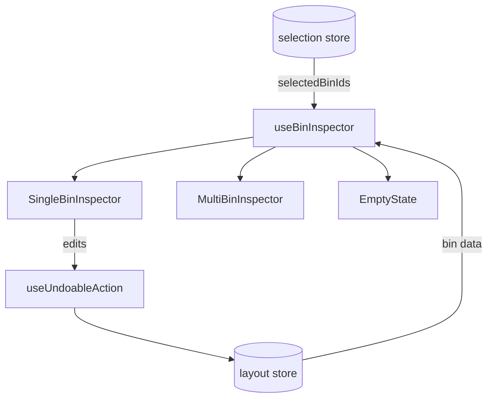

# Bin Inspector

Selected bin details panel with edit capabilities.

## Key Files

- `components/Inspector/SingleBinInspector.tsx` — single bin edit panel
- `components/Inspector/MultiBinInspector.tsx` — multi-select summary
- `components/Inspector/BinLabelField.tsx` — smart label combobox (see below)
- `components/Inspector/CustomPropertiesEditor.tsx` — custom key-value property editor
- `labelSuggest/` — pure, on-device ranking engine for label suggestions
- `hooks/useLabelSuggestions.ts` — memoized adapter feeding the engine from the active layout
- `components/Inspector/SplitWarning.tsx` — print bed size warning indicator
- `components/Inspector/EmptyState.tsx` — no selection state
- `hooks/useBinInspector.ts` — selection resolution and bin data. Also exposes `applySuggestedSize` (single-`updateBin` resize for one-step undo) and `canApplySuggestedSize` (fit check), both built on a shared `resolveSuggestedRect` so the size-suggestion gate can't disagree with the actual mutation.

## Label autocomplete

`BinLabelField` replaces the plain label input with a predictive combobox
(design-system `Combobox`). Suggestions come from `labelSuggest/getLabelSuggestions`,
a pure function of the current layout — fully on-device, no network. It blends five
signals: numeric **sequence** continuation (`M3`/`M4` → `M5`), reuse of an existing
label, co-occurrence with **edge-adjacent or same-category** neighbors, vocabulary
**domain** affinity, and text match (prefix / substring / cross-language alias /
typo-tolerant fuzzy). Meaning-based matches come from `labelVocabulary/semantics.ts`:
typing an umbrella word (`fasteners`, `werkzeug`) expands to that whole domain, and a
term expands to related items (`screwdriver` → screw/bolt) — both surfaced with the
`similar` reason even when no letters line up. The top prediction is offered as inline **ghost text**
(Tab/→ to accept) on desktop; ghost is disabled on touch. Each row carries a muted
reason tag. Accepts fire a hashed `label_suggestion_accepted` PostHog event (no raw
text) for future model training. Ordering weights + the ghost confidence floor live
in `labelSuggest/getLabelSuggestions.ts`.

### Trained prior (optional)

`labelSuggest/model.ts` blends a learned, hash-keyed prior on top of the heuristics:
global **popularity** and neighbor **co-occurrence** (`modelScore`). It's built from
aggregate telemetry by `scripts/train-label-suggester/train.py` and committed as
`labelSuggest/labelSuggester.model.json` (lazy-loaded via `loadModel.ts` /
`useLabelSuggesterModel`). Because only one-way label hashes are stored, the client
looks up hashes it computes itself (candidate text + the current bin's neighbors) — it
never reverses one. The committed placeholder has `sampleCount: 0` and is **inert**;
run the trainer against prod Redis to activate it. The prior is deliberately gentle —
it nudges ranking but never outranks a literal text match.

## Size suggestion (Labs)

`SingleBinInspector` renders the `bin-recommender` `BinSizeSuggestion` under the label field, gated on the `bin_recommender` Labs flag (the lazy chunk isn't fetched when off). It wires `onApply={applySuggestedSize}` and `canFit={canApplySuggestedSize}`.

## Constraints

| Field        | Limit                                   |
| ------------ | --------------------------------------- |
| Label        | 24 chars                                |
| Notes        | 256 chars                               |
| Custom props | 50 max, key: 32 chars, value: 256 chars |

## Gotchas

1. **Multi-select shows summary only** - can't edit dimensions of multiple bins
2. **Reserved property keys** - bin field names (`id`, `layerId`, `x`, `y`, `width`, `depth`, `height`, `clearanceHeight`, `category`, `label`, etc.) blocked from custom props
3. **Height validation** - must fit in layer + drawer height
4. **Rotation with relocation** - bins can be rotated in place or auto-repositioned to nearest valid spot if blocked
