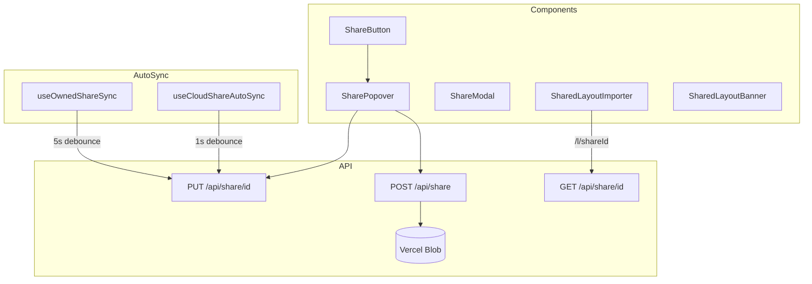

# Cloud Share

Persistent cloud sharing via Vercel Blob with permission control.

## Key Files

- `components/ShareButton/` — icon-only header share button + `SharePopover` cloud sharing controls
- `components/ShareModal.tsx` — link/file/JSON share dialog (opened per-layout from the layout manager; loads non-active layouts from storage)
- `components/SharedLayoutImporter.tsx` — import from `/l/shareId` URL
- `components/SharedLayoutBanner.tsx` — banner for shared layouts
- `hooks/useCloudShare.ts` — share CRUD operations
- `hooks/useOwnedShareSync.ts` — auto-sync owned shares (5s debounce)
- `hooks/useCloudShareAutoSync.ts` — auto-sync in collab mode (1s debounce)
- `utils/cloudShare.ts` — fingerprinting and date formatting utilities

## Permission Model

| Permission | Access                      |
| ---------- | --------------------------- |
| `view`     | Read-only, anyone with link |
| `edit`     | Collaborative editing       |

Delete token: random secret, hashed server-side, required for mutations.

## Gotchas

1. **Share ID = Layout UUID** - URL uses layout's own ID
2. **Shares are permanent** - no expiration, only explicit delete
3. **Staging bins never sync** - filtered from fingerprint
4. **Owner can't see own share in "Shared with me"**

## Limits

- Size: 500KB max
- Bins: 2500 max
- Rate: 100/min (create, update, view, delete)
