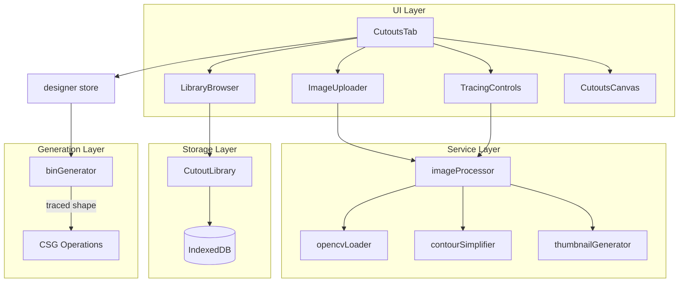

# Cutouts

Photo-based tool cutouts for the bin designer. Users can photograph tools, trace their outlines automatically, and create custom bin cavities.

## Architecture



## Key Files

### Services (`services/`)

| File                    | Purpose                                       |
| ----------------------- | --------------------------------------------- |
| `opencvLoader.ts`       | Lazy-load OpenCV.js with progress tracking    |
| `imageProcessor.ts`     | Trace contours from images using OpenCV       |
| `contourSimplifier.ts`  | Douglas-Peucker algorithm for point reduction |
| `thumbnailGenerator.ts` | Create ~10KB preview thumbnails               |

### Types (`types/`)

| Type                 | Purpose                                         |
| -------------------- | ----------------------------------------------- |
| `TracedContour`      | Normalized 0-1 contour points + bounding box    |
| `CutoutTemplate`     | Saved template with contour + images + metadata |
| `ProcessingOptions`  | Threshold, blur, min area, simplification       |
| `OpenCVLoadProgress` | Loading stage + progress percentage             |

## Data Flow

1. **Upload** → User uploads photo (PNG/JPG)
2. **Process** → OpenCV converts to grayscale → blur → threshold → find contours
3. **Simplify** → Douglas-Peucker reduces points to ≤500
4. **Normalize** → Points scaled to 0-1 coordinates
5. **Save** → Store contour + images + dimensions in IndexedDB
6. **Place** → Add to bin as `Insert` with `shape: 'traced'`
7. **Generate** → `binGenerator` creates CSG cutout geometry

## Constants

| Constant             | Value | Purpose                   |
| -------------------- | ----- | ------------------------- |
| MAX_CUTOUT_TEMPLATES | 100   | Library limit             |
| MAX_CONTOUR_POINTS   | 500   | Points per contour        |
| MAX_IMAGE_SIZE_BYTES | 10MB  | Upload limit              |
| THUMBNAIL_MAX_SIZE   | 200px | Thumbnail dimension       |
| DEFAULT_CLEARANCE_MM | 0.5mm | Fit tolerance around tool |

## OpenCV Loading

OpenCV.js (~8MB) is loaded lazily:

- **Development/Test**: Uses mock CV object
- **Production**: Loads `/opencv.js` via script tag

```typescript
import { loadOpenCV, isOpenCVReady } from '@/features/cutouts';

// Load with progress callback
const result = await loadOpenCV((progress) => {
  console.log(`${progress.stage}: ${progress.progress}%`);
});

if (result.ok && isOpenCVReady()) {
  // Ready to process images
}
```

## Contour Tracing

```typescript
import { traceImageContour, DEFAULT_PROCESSING_OPTIONS } from '@/features/cutouts';

const imageData = ctx.getImageData(0, 0, width, height);
const result = await traceImageContour(imageData, {
  ...DEFAULT_PROCESSING_OPTIONS,
  threshold: 150, // Adjust for image contrast
});

if (result.ok) {
  const { points, boundingBox, area } = result.value;
  // points: NormalizedPoint[] in 0-1 coordinates
}
```

## Sample Asset

A pre-bundled wrench cutout is available for onboarding:

```typescript
import { sampleWrench } from '@/features/cutouts';

// Use as starting template
const template = {
  ...sampleWrench,
  id: generateId(),
  createdAt: new Date().toISOString(),
  updatedAt: new Date().toISOString(),
};
```

## Gotchas

1. **OpenCV must load before processing** — Check `isOpenCVReady()` first
2. **Contours are normalized 0-1** — Scale by width/height in mm when placing
3. **Max 500 points** — Simplifier auto-reduces complex shapes
4. **Images stored as base64** — Original (~200KB) + thumbnail (~10KB)
5. **Position origin is top-left** — Of the contour's bounding box

## Integration

### Designer Store

Cutouts are added as `Insert` objects:

```typescript
addInsert({
  id: generateId(),
  templateId: cutoutTemplate.id,
  shape: 'traced',
  x: 10,
  y: 10,
  width: cutoutTemplate.widthMm,
  depth: cutoutTemplate.heightMm,
  cutDepth: 5,
  rotation: 0,
  clearanceMm: 0.5,
  contourPoints: cutoutTemplate.contour.points,
});
```

### Generation

The `binGenerator` handles `'traced'` shape in `buildInsertCuts()`:

1. Scale points from 0-1 to absolute mm
2. Apply clearance offset
3. Apply rotation transformation
4. Build path with brepjs `draw()`
5. Extrude to cutDepth
