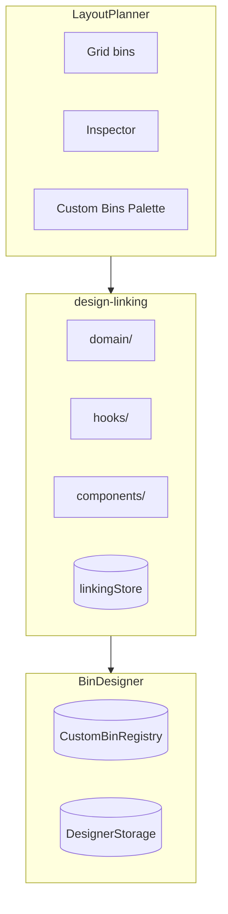

# Design Linking

Bidirectional integration between the Bin Designer and Layout Planner, enabling bins in layouts to be linked to saved designs.

## Key Files

- `domain/mergeBins.ts` — converts a set of layout bins into one divided `BinParams`

## Data Model

- **One-to-many**: Multiple bins can link to one design via `bin.linkedDesignId`
- **Sync scope**: Only dimensions (width, depth, height)
- **Ownership**: Layout owns the bin, Designer owns the design

## Key Flows

| Flow               | Steps                                                                        |
| ------------------ | ---------------------------------------------------------------------------- |
| Edit linked design | Select bin → "Edit Design" → Designer opens → auto-save → return             |
| Create from bin    | Select unlinked bin → "Create Design" → name dialog → Designer → save + link |
| Link existing      | Select unlinked bin → "Link Existing" → pick compatible design → linked      |
| Sync dimensions    | Design changed → "Sync" → eligible bins update, ineligible bins unlink       |

## Make Bento

`planMergedBin` maps the selected bins onto a `CompartmentConfig`: both are
rectangles tiling a uniform grid.

- **Non-destructive by default.** The merge writes a new saved design and
  leaves the layout alone. Opting into "replace bins" swaps the sources for one
  bin over the footprint carrying `linkedDesignId`, in a single `batch()` so a
  half-applied replace cannot leave the drawer holding neither.
- **A trapped bin blocks.** The piece is built from the bounding box, so a bin
  left out of the selection but standing inside it would be printed through.
  `warnings.trappedBinIds` reports them and the dialog refuses to commit until
  they are added or stashed.
- **Never emits a `cellMask`.** A masked bin exports with no dividers and no
  label tabs at all (`featuresStage` filters both builders out), so a ragged
  selection squares off to its bounding box and the uncovered cells become
  their own compartments. The dialog states the count before merging.
  `compartmentBuilder.scenario.polygonGap.test.ts` locks the limitation in.
- **Cell size is the GCD of every bin edge on that axis, both edges.** Using
  only each bin's near edge collapses the grid whenever a narrow bin shares an
  origin with a wide one. The coarsest workable grid is what keeps ordinary
  layouts under `MAX_COMPARTMENT_GRID` (12).
- **Single layer only.** `bin.height` is measured from the layer's own base
  plane, so `max(height)` across layers would be meaningless.
- **The selection is the only source.** `useBento` reads the selected bins and
  narrows them to the active layer. Entry points are the multi-bin inspector on
  desktop and the multi-bin context menu on mobile.
- **The preview's vertical axis is flipped.** `cells` is row-major with row 0
  at the BOTTOM; SVG's y grows downward. `compartmentRects` is split out from
  the component so that flip has its own test, since a mirrored preview is
  invisible on a symmetric layout.
- **Two bins minimum, enforced in `planMergedBin`.** One bin would emit a
  single-compartment copy of itself, and a UI-only guard leaves every entry
  point free to skip it.

## Gotchas

1. **Sync checks fit** — bins that no longer fit after dimension change are unlinked with notification
2. **A rotated design still fits** (#3040) — the fit test is `dimensionsFitAllowingRotation`, not `dimensionsMatch`: a bin whose footprint is the design's transpose is a match, because `isRotatedPlacement` in the isometric preview already draws that mesh turned 90°. Compare strictly here and swapping a design's width/depth reports every linked bin as mismatched, then offers to unlink the ones the rotated footprint can't be resized into. `compareDimensions.matched` follows the same rule; its `differences` stay per-axis because they drive the dialog read-out.
3. **Declining a sync has to be remembered** (#3040) — `useDesignSavedListener` re-reconciles every linked design on **mount**, so a prompt the user cancelled re-opens on every return from the designer. Cancel records `designId → syncDeclineKey(dims)` in the linking store and the reconciliation skips that pair; the key includes the dimensions, so a further edit asks again. Session-scoped, deliberately not persisted.
4. **A size-locked bin opts out of the cascade** (#3229) — both listeners route their sync candidates through `partitionSyncableByLock` before eligibility. A locked bin is excluded from the auto-sync _and_ from the confirmation dialog, and the toast reports how many kept their size; offering it in the dialog would only stage a write `bin.update` rejects.
5. **Registry is lightweight** — `CustomBinRegistry` in localStorage holds refs, full designs in IndexedDB
6. **Linkable kinds** — `LinkDesignDialog` admits parametric bins AND `importedMesh` designs (footprint read via `designFootprint()` from the bin-designer barrel, since non-bin kinds have no `params`); tool racks stay excluded. Never filter candidates with `params !== undefined` — that silently drops imported bins. Imported entries render with a kind badge; they are resize-inert (`useBinResizedListener` early-returns on paramsless designs — the mesh is immutable).
