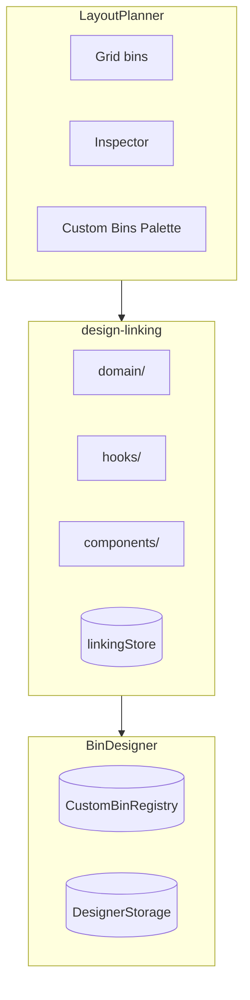

# Design Linking

Bidirectional integration between the Bin Designer and Layout Planner, enabling bins in layouts to be linked to saved designs.

## Key Files

- `domain/linkingRules.ts` — validation and eligibility checks
- `domain/syncOperations.ts` — dimension extraction and update creation
- `domain/linkageQueries.ts` — query bins/designs by link status
- `domain/mergeBins.ts` — converts a set of layout bins into one divided `BinParams`
- `hooks/useBinLinking.ts` — link/unlink/create actions
- `hooks/useMergeBins.ts` — merge scope, save + navigate
- `hooks/useLinkedDesign.ts` — resolve linked design for a bin
- `hooks/useLinkedBins.ts` — find all bins linked to a design
- `hooks/useQuickExport.ts` — STL export for linked designs (internal)
- `hooks/useBinResizedListener.ts` — listens for bin resize events, triggers sync logic
- `hooks/useDesignSavedListener.ts` — listens for design save events, auto-syncs linked bins
- `components/LinkedDesignSection.tsx` — inspector UI for link status
- `components/DesignLinkingDialogs/` — dialog orchestrator
- `components/Dialogs/` — CreateDesignDialog, SyncDimensionsDialog, DeleteDesignWarningDialog, LinkDesignDialog
- `store/linkingStore.ts` — transient UI state

## Data Model

- **One-to-many**: Multiple bins can link to one design via `bin.linkedDesignId`
- **Sync scope**: Only dimensions (width, depth, height)
- **Ownership**: Layout owns the bin, Designer owns the design

## Key Flows

| Flow               | Steps                                                                        |
| ------------------ | ---------------------------------------------------------------------------- |
| Edit linked design | Select bin → "Edit Design" → Designer opens → auto-save → return             |
| Create from bin    | Select unlinked bin → "Create Design" → name dialog → Designer → save + link |
| Link existing      | Select unlinked bin → "Link Existing" → pick compatible design → linked      |
| Sync dimensions    | Design changed → "Sync" → eligible bins update, ineligible bins unlink       |

## Merging Bins Into One Insert

`planMergedBin` maps a layer's bins onto a `CompartmentConfig`: both are
rectangles tiling a uniform grid. Behind the `merge_bins_to_design` labs flag.

- **Non-destructive.** The layout is never modified; the merge only writes a
  new saved design. There is deliberately no CQRS command and no undo entry.
- **Never emits a `cellMask`.** A masked bin exports with no dividers and no
  label tabs at all (`featuresStage` filters both builders out), so a ragged
  selection squares off to its bounding box and the uncovered cells become
  their own compartments. The dialog states the count before merging.
  `compartmentBuilder.scenario.polygonGap.test.ts` locks the limitation in.
- **Cell size is the GCD of every bin edge on that axis, both edges.** Using
  only each bin's near edge collapses the grid whenever a narrow bin shares an
  origin with a wide one. The coarsest workable grid is what keeps ordinary
  layouts under `MAX_COMPARTMENT_GRID` (12).
- **Single layer only.** `bin.height` is measured from the layer's own base
  plane, so `max(height)` across layers would be meaningless.
- **Scope is an argument, never inferred.** `useMergeBins('layer' | 'selection')`.
  A global "selection, else layer" rule let one stray selected bin hijack the
  whole-layer entry point, which then reported "Combine 1 bins".
- **Two bins minimum, enforced in `planMergedBin`.** One bin would emit a
  single-compartment copy of itself. Guarding only in the UI left the header
  and the dialog able to skip it.

## Gotchas

1. **Sync checks fit** — bins that no longer fit after dimension change are unlinked with notification
2. **A rotated design still fits** (#3040) — the fit test is `dimensionsFitAllowingRotation`, not `dimensionsMatch`: a bin whose footprint is the design's transpose is a match, because `isRotatedPlacement` in the isometric preview already draws that mesh turned 90°. Compare strictly here and swapping a design's width/depth reports every linked bin as mismatched, then offers to unlink the ones the rotated footprint can't be resized into. `compareDimensions.matched` follows the same rule; its `differences` stay per-axis because they drive the dialog read-out.
3. **Declining a sync has to be remembered** (#3040) — `useDesignSavedListener` re-reconciles every linked design on **mount**, so a prompt the user cancelled re-opens on every return from the designer. Cancel records `designId → syncDeclineKey(dims)` in the linking store and the reconciliation skips that pair; the key includes the dimensions, so a further edit asks again. Session-scoped, deliberately not persisted.
4. **A size-locked bin opts out of the cascade** (#3229) — both listeners route their sync candidates through `partitionSyncableByLock` before eligibility. A locked bin is excluded from the auto-sync _and_ from the confirmation dialog, and the toast reports how many kept their size; offering it in the dialog would only stage a write `bin.update` rejects.
5. **Registry is lightweight** — `CustomBinRegistry` in localStorage holds refs, full designs in IndexedDB
6. **Linkable kinds** — `LinkDesignDialog` admits parametric bins AND `importedMesh` designs (footprint read via `designFootprint()` from the bin-designer barrel, since non-bin kinds have no `params`); tool racks stay excluded. Never filter candidates with `params !== undefined` — that silently drops imported bins. Imported entries render with a kind badge; they are resize-inert (`useBinResizedListener` early-returns on paramsless designs — the mesh is immutable).
