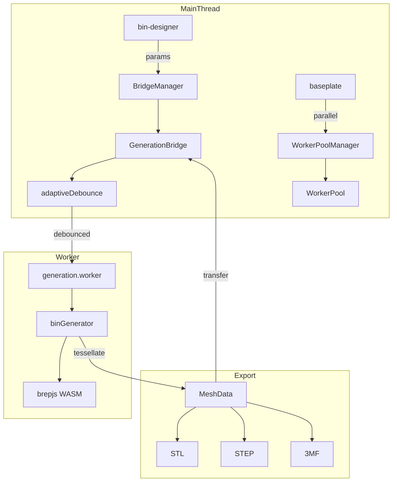

# Generation

brepjs-based 3D geometry engine running in Web Worker.

## Key Files

- `bridge/GenerationBridge.ts` — main thread API, manages worker lifecycle
- `bridge/BridgeManager.ts` — multi-bridge lifecycle management with reference counting
- `bridge/WorkerPool.ts` — parallel worker pool for concurrent generation (split baseplates)
- `bridge/WorkerPoolManager.ts` — shared pool acquisition with reference counting
- `bridge/poolReadiness.ts` — bounded wait for an in-flight pool acquisition (see gotcha below)
- `bridge/adaptiveDebounce.ts` — dynamic debounce based on generation speed
- `bridge/bridgeRef.ts` — singleton bridge reference management
- `bridge/types.ts` — worker message protocol types
- `worker/generation.worker.ts` — Web Worker entry point
- `worker/generators/binGenerator.ts` — pipeline orchestrator + split/export functions
- `worker/generators/pipeline/` — composable generation stages (see Pipeline Stages below)
- `worker/generators/socketBuilder.ts` — gridfinity socket generation
- `worker/generators/boxBuilder.ts` — shell box generation
- `worker/generators/compartmentBuilder.ts` — compartment divider walls
- `worker/generators/insertBuilder.ts` — insert cavity cuts
- `worker/generators/cutoutBuilder.ts` — solid-mode cutout cuts
- `worker/generators/labelTabBuilder.ts` — label tab shelves + gussets; in swappable-label socket mode (#2666) the shelf thickens and gets a click-in plate pocket + retention ribs per `@/shared/constants/labelPlates`, with a bin-spanning fallback when no compartment fits a standard plate (plan math shared with the UI via `@/shared/utils/labelSocketPlan`). The shelf top comes from `resolveLabelShelfTopMm` — on lipped bins the click-in shelf sinks `LABEL_SOCKET_STACK_RELIEF_MM` below the interior ceiling (and caps an explicit `label.height` there) so no plate can lift a stacked bin's foot, which seats only 0.25mm above that plane; click-in pockets cut to `LABEL_SOCKET_CLICK_POCKET_DEPTH_MM` so a seated plate is recessed, not flush. Engraved tab text shares ONE font size per row/anchor group (`resolveUniformTabTextSize`) — under `inkBox` the fitted size depends on the string, so per-tab fitting leaves a row of visibly mismatched labels. Consequence: a compartment's glyph size depends on the strings and tab widths of the tabs BESIDE it, and the narrowest text-bearing tab in that row governs the row. Scoped per row rather than per bin so a narrow compartment can't shrink labels on an unrelated row
- `worker/generators/textBuilder.ts` — engraved/embossed/through-cut text solids; auto-fits font size to the host (see Gotchas re: linear sizing) and resolves the stencil-font swap for through-cut. `verticalFit` picks which vertical box the fit AND the centering measure against: `lineBox` is the font's constant ascender..descender band (only ~54% inked by an all-caps run, so it renders text at roughly half the height the host holds); `inkBox` measures the glyphs actually drawn. Label plates, label tabs, wall text and lid text all use `inkBox`; cutout labels and the calibration coupons stay on `lineBox`. A caller that plans a rect from the fit must take its vertical extent from `measureInkExtents`, not `textMetrics` — at an `inkBox` size the line box overruns the band it was fitted to
- `worker/generators/labelPlateBuilder.ts` — printable swappable label plates (#2666): interchange-spec body + latch groove + v1-compat channels from `@/shared/constants/labelPlates`, layer-snapped emboss/deboss text sized to the glyph ink box (`verticalFit: 'inkBox'`) rather than the font's ascender..descender band, with ONE size shared across a set built together (`buildLabelPlates`) so a bin's plates read as a set instead of each filling its own band. The v1 channels hollow the plate below `LABEL_PLATE_V1_CAVITY_TOP_MM` with the middle one at x=0, under the text, so `labelPlateV1ChannelsFitText` drops them whenever a debossed glyph would leave less than `LABEL_PLATE_V1_ROOF_MIN_MM` of roof — which at the pinned plate geometry means every debossed plate, since the snapped depth floor is one layer. Text wins, since every socket cut here is v2 and the channels only buy legacy-socket compatibility; exported via `EXPORT_LABEL_PLATES` (disjoint fuseAll → STL/STEP, connectorSample pattern; TEXT-tagged faceGroups ride the STL result for two-color 3MF paint_color via `bin-designer/utils/labelPlateColors.ts`)
- `worker/generators/labelPlateIcons.ts` — hardware icon silhouettes for plates (gflabel-style, ids in `LABEL_PLATE_ICONS`), embossed/debossed like text. Geometry comes from the SVG path data in `@/shared/constants/labelIconPaths` via `svgDrawing.drawingFromSvgPath`, so the picker preview and the printed silhouette read the same strings. Sized by `measureIconBox`/`fitIcon` from each silhouette's OWN bounding box to `TEXT_BAND_MM`, width-capped at `ICON_MAX_WIDTH_MM` — a shared ±5 design frame is only 52–68% inked vertically by the side-view fasteners but 100% by a washer, so frame-relative sizing rendered them at unequal visual weight. The plate layout reads the returned width to place the text, so a wide silhouette shifts the run rather than overlapping it.
  - Traps: boundary-crossing 2D `drawingCut`s and `customCorner` on these outlines corrupted the plate boolean — stick to simple closed outlines + fully-interior holes. **Bores are cut in 3D, after extrusion**, never from the 2D outline: brepjs's 2D boolean silently returns the subject unchanged when the outline is a single closed curve and the cutter is strictly interior with no intersections, which is how the washer shipped as a solid disc (`drawingCut(drawCircle(5), drawCircle(2.6))` measured π·5², not the annulus). Its bounding box is identical and the plate still gains volume, so only the icon solid's own volume catches it — hence the analytic volume assertions in `labelPlateIcons.test.ts`. Do not reintroduce holes as extra subpaths of `outline` either: the SVG importer flattens subpaths into one Blueprint and lets the face builder infer containment, which honors winding for polygon loops but unions arc loops regardless
- `worker/generators/labelFitSample.ts` — label-socket fit-calibration card (#2666): five 1U-socket coupons across a −0.10…+0.10mm fit-offset ladder (cut with `labelTabBuilder`'s `cutLabelSocket`, so the fit transfers 1:1 to bins) + one nominal blank plate; exported via `EXPORT_LABEL_FIT_SAMPLE`
- `worker/generators/cutoutLabelSocketBuilder.ts`: the same click-in socket cut into a SHADOW BOARD's fill surface, where a cutout's label asks for a swappable plate instead of an engraving. Delivered as a **single composed negative** (pocket minus ribs) rather than a pocket cut plus fused ribs: `booleanStage` fuses before it cuts, so ribs handed over as fuse targets are carved straight back out by the pocket that follows and the plate finds nothing to click behind. One tool per socket, so a boolean that throws costs that socket alone. Built horizontal at the origin and turned as a whole for a 90° socket, so the two orientations cannot describe different geometry. Placement comes from `@/shared/utils/cutoutLabelSocketPlan` (the same plan the panel warns from, the preview seats plates against and the plate export enumerates), and the pocket dimensions and rib band are the constants the compartment shelf cuts with, so a plate printed for one seats in the other. Appended to the solid branch's cut targets in `featuresStage` AFTER `clipToInterior`: the pocket is bounded by its own clear-space test, and the cavity clip's box would shear off the `COPLANAR_MARGIN` that keeps its mouth off a coincident face.
- `worker/generators/lidGripRelief.ts` — lid grip relief (#3272): the chamfer / shadow-line / scallop cut at the lid↔bin seam that gives a fingernail somewhere to go. Cuts UPWARD from `anchorZ` over a centered span per enabled wall, depth and height both clamped by `resolveLidGripDepth`/`resolveLidGripHeightPlan` in `types/lid.ts` (shared with the panel so the readout and the geometry agree). The height is the user's `grip.heightMm` when set (`null` = the mode's own request, and a chamfer ignores it, since its 45° section is its depth); `LID_GRIP_TOP_SKIN_MM` is the solid lid reserved above the cut, and the lid prints upside down, so that skin is a layer-line load path rather than cosmetic. All cutters go through ONE `cutAll`, so four relieved walls cost ~the same as one. `gripPlacements` is the single derivation of where a span sits — `splitRailsAroundGrip` and `pipeline/stages/lidGripDipStage.ts` both read it rather than repeating the math. Traps: the relief never touches a click rail (rail tops sit at `wallBottomZ`, BELOW `anchorZ`), so interrupting one is an opt-in trade gated on `grip.binDip`, not a clearance fix; and a breached mating cavity leaves the lid watertight, so the scenario tests probe inside the volume rather than trusting bounding boxes
- `worker/generators/lidCutoutBuilder.ts` — through-cuts in the lid's plate (#3542): a dispensing slot, a vent, a cable pass. Reuses `cutoutBuilder`'s shape builders (`buildUngroupedCutout`/`buildGroupedCutouts`/`buildArrayUngroupedCutouts`) by handing them the lid's own top plane and origin, which is safe because those take their whole frame in their arguments — so the pen tool, pathfinder group ops, insertion clearance and the entry chamfer all reach the lid with no second implementation. Three things the HOST decides rather than the shape: depth is always the full remaining plate (`cutout.cutDepth` is overridden, because `exportLid` flips the lid 180° to print and a partial pocket in the top face becomes a downward-facing ceiling pocket); tools clip to the mating cavity's footprint rather than the plate's (a hole further out sits over the mating shell's wall and takes the top off the thing that grips the bin's lip); and every retention boss is subtracted from every tool, so a slot across a corner loses the disc instead of the lid losing its magnet. Runs AFTER the tray recess (so a tray lid's hole starts at the recessed floor) and BEFORE the text. Gated exactly as lid text is via `lidCutoutsAllowed`, and refuses `shape: 'mesh'` — an imprint is subtracted post-tessellation in the BIN's mesh frame, so no lid solid could describe one. Traps: a cut that silently failed leaves a watertight, correctly-sized lid, so `lidCutouts.scenario.test.ts` MEASURES the solid length a ray crosses inside the plate band (`plateSolidMm`) instead of asking `isSolidThrough` — a boolean over that band reads false for a plate that is 88% intact, and the first draft of the suite passed against 0.1mm scratches; and the boss protection is stated as a delta against the same lid with no cutouts, since an absolute check passes on a boss that was thin there anyway
- `worker/generators/slideLidPlate.ts` + `worker/generators/slideLidChannel.ts` + `worker/generators/pipeline/stages/slideLidChannelStage.ts` — the sliding lid: a flat plate captive in a half-dovetail channel fused to two opposite inner walls, entered through a third. Both halves come from ONE `resolveSlideLidPlan` call (`@/shared/utils/slideLidPlan`), so the plate and the track it runs in cannot disagree about where the bearing surfaces are, and everything is built in that plan's CANONICAL frame (travel along +X, `z = 0` at the plate's top plane) then rotated onto the chosen entry wall — one section-building path and one rotation instead of four hand-written orientations. The joint's faces are chosen so neither part needs support: the retainer's underside RISES inboard at 45° so its first layer sits on the wall rather than floating over the channel (sloping it the intuitive dovetail way puts the first material in mid-air), the shelf's gusset is that argument upside-down, and the plate prints flat so its matching chamfer is a top edge. Traps: the entry notch cuts clear THROUGH the rim AND the lip — stopping just past the wall top leaves exactly the lip band bridging the whole opening with nothing under it, the worst overhang on the part; the detent is a bump on the shelf AND a pocket in the plate, because a shut plate covers the channel so its only free boundary is the leading edge, and that edge moves AWAY from anything behind it as the lid opens (a ramp alone measured zero shared volume at every position); and the stage runs AFTER `lidInteriorReliefStage`, since the relief cuts the plate's travel envelope and would take the track back off if the bars fused first
- `worker/generators/lidTextBuilder.ts` — lid-top surface text (#2695): engraves/embosses/through-cuts `surfaceText.lidText` into the lid's top face (or the tray floor when the tray recess is active) via `textBuilder`. `resolveTextHostFace` picks the frame (gotcha 7): the plain top and tray floor sit in the perimeter frame, but the lip-only stack floor (#2930) is grid-anchored, so its fit box and centre come from `cellsX × gridUnitMm` rather than `lidOuterW`/`outerOffset`. Gated off in `resolveLidInputs` for a FULL stack grid (no flat face left) and polygon lids (rectangular auto-fit); engrave depth is clamped so the cut can't pierce the floor plate
- `worker/generators/scoopRampBuilder.ts` — scoop ramp geometry. Against an outer wall of a lipped bin the ramp is offset inward by `computeLipOffset` so its exit is flush with the lip's inner face, and below `wallHeight` a vertical chute at that offset carries the exit up to the lip base. Trap (#3426, #3434): the top ~3.15mm of the wall is the band a seated lid's click rail drops into (`LID_CLICK_RAIL_BAND_BELOW_WALL_TOP`), and a ramp that reaches it buries the rail — its ARC runs inboard fast, 12.8mm at the rail's lowest point on a 2x2x4 scooped to the top. **The offset and the chute are not the problem**: measured against a plain bin's 0.64mm snap baseline they cost 0.07mm, while the ramp reaching the top costs 0.39mm. `autoScoopCeiling` therefore holds an AUTO scoop a band below the wall top — the height was previously forced UP to `wallHeight` on a lipped bin, which bought nothing (the chute already made the exit flush) and cost a third of the compartment's depth — and `checkLidCompatibility` raises `scoopFillsLip` only for a typed radius that still reaches the band. `lidScoopClearance.scenario.test.ts` mates the two solids and measures it, since both meshes stay watertight either way
- `worker/generators/wallCutoutBuilder.ts` — wall U-notch cutouts
- `worker/generators/handleBuilder.ts` — handle hole through-cuts in bin walls
- `worker/generators/wallTextLayout.ts` — wall surface-text placement solver (#2695): auto-fits each wall's `surfaceText.walls` string into the largest clear region (avoiding cutout/handle AABBs + `CUTOUT_BORDER_WIDTH`), vertically aligned per `wallAlign`. Shared by `wallTextBuilder` (geometry) AND `wallPatternBuilder` (pattern clearing behind the same rect) — change placement here, never in the consumers. Skips polygon/solid bins and slot-occupied walls
- `worker/generators/wallTextBuilder.ts` — outer-wall text geometry (#2695): builds glyph solids flat via `textBuilder`, stands them up against each wall (rotate 90° about X, per-side yaw, translate to the outer face). Registered as TWO FeatureBuilders (cut for engrave/through-cut, fuse for emboss) since a builder has one static boolean target. Engrave leaves ≥0.4mm wall behind glyphs; emboss relief is capped at 1.5mm so adjacent grid bins can't collide
- `worker/generators/wallPatternBuilder.ts` — per-wall hex pattern compounds with two-layer caching (uncut base + clipped result) and optional cutout/handle/ramp clipping. Polygon bins consume per-edge descriptors from `wallPatterns.collectPolygonWallSegments`: one descriptor per axis-aligned outer edge, with an `allowClip` flag that binds cutout/handle clipping only to the outermost edge per cardinal (matching `findPolygonEdgeForSide`). Divider ramp/junction zones are unconditionally empty on polygon bins — dividers are filtered out at `featuresStage`.
- `bridge/generationTimeout.ts` — complexity-aware per-request timeout (30-90 s based on pattern, cutouts, height)
- `worker/generators/featureBuilder.ts` — barrel re-export of all builder modules
- `worker/generators/dividerBuilder.ts` — divider piece generation
- `worker/generators/dividerExport.ts` — standalone divider STL export
- `worker/generators/utils/stlMeshFallback.ts` — `exportSolidToStl`: OCCT-primary STL writer with a mesh-based fallback for topologies OCCT's `StlAPI.Write` rejects but `mesh()` triangulates (the `STL_EXPORT_FAILED` class, #1760/#1850). Used by bin/divider/lid exporters; OCCT stays primary so success is byte-identical and 3MF faceGroups stay aligned
- `worker/generators/dividerPatterns.ts` — divider-pattern placement data (#2811): which compartment dividers carry the wall pattern, the band each offers, and the keep-out rectangles where it must stay solid. Pure — keep-outs come from projecting each intruder's world footprint (scoop ramps, label tabs) onto the divider centerline, so a tilted divider needs no special case. The band is **re-fitted to the divider's own height** rather than clipped from the wall band, so a shortened divider keeps whole elements instead of a sliced top row
- `worker/generators/dividerPatternBuilder.ts` — divider pattern geometry (#2811). Exposes `resolvePanelFactory`, the shared panel builder both divider paths use (caching, keep-out handling, stamp/kumiko dispatch) so the integrated and removable paths differ only in the rigid transform that places the panel. Every panel is built in the divider's LOCAL frame (u along X, band along Z, thickness along Y) and placed with one rotate+translate, so two dividers of equal span share a cache entry whatever their position or tilt. Stamp patterns honour keep-outs by dropping whole ELEMENTS (no boolean, no half-hex knife edge); the continuous kumiko lattice is cut by keep-out boxes instead. Kumiko divider panels resolve their lattice against the OUTER perimeter (`resolveKumikoPerimeter`) so triangles come out exactly the size the walls carry, then take a u-window of it — legal because the lattice is u-periodic. **Cut depth is `thickness + 2`, deliberately not the outer walls' `wallThickness * 4`**: the narrowest legal compartment is only `2 x thickness` wide, so a deep prism would reach across and perforate the next divider
- `worker/generators/dividerPiecePatterns.ts` — keep-out planning for the wall pattern on REMOVABLE divider pieces (#2811 follow-up). Pure. A removable piece is free-standing, so its bottom keep-out is the skirt alone (no floor slab to clear), and it carries joinery the bin body doesn't: tab engagement buried in each wall slot, cross-lap notches, and face grooves. Every obstruction is cleared over the FULL band height, not just its own extent — a notch already removes half the height at that column, a receptacle leaves only a 40% web, and a snap score only breaks cleanly if the web behind it is continuous
- `worker/generators/dividerPiecePatternBuilder.ts` — applies those panels to the flat pieces. The only difference from the in-bin path is the frame: pieces print lying down (length X, installed height Y, thickness Z) while the panel factory emits panels standing up (span X, band Z, thickness Y), so the panel is rotated -90° about X. Wired into `dividerBuilder` at each piece-construction site, where the notch/groove data already lives, rather than re-deriving the piece plan
- `worker/generators/floorPatterns.ts` — floor pattern placement (#2816): one WINDOW per socket cell, inset by `floorWindowInset` so a drainage hole exits through the foot's flat underside and never through the baseplate-mating taper, plus the keep-outs for everything that already owns the base (magnet/screw pockets) or stands on the floor (divider footings, scoop ramps). Pure. Windows come from `socketBuilder.filledSocketCells`, so a cell with no foot (empty mask region, sub-threshold fractional fringe, the overhang region) gets no holes; a flat base has no socket and takes one interior-wide window instead
- `worker/generators/floorPatternWindow.ts` — just the window rule (brepjs-free, re-exported to the main bundle via `@/shared/generation/floorPatternMetrics` so the panel's fit note and the print estimate share it rather than mirroring it)
- `worker/generators/floorPatternBuilder.ts` — floor pattern geometry (#2816). Reuses `dividerPatternBuilder`'s `resolvePanelFactory` verbatim and only changes the frame: the factory emits a panel standing up (span X, band Z, thickness Y), the floor needs it lying down, so each panel is rotated -90° about X. Its tools go into `deferredCutTargets` as well as `patternCutTargets` — see the socket note under Pipeline Stages
- `worker/generators/wallPatterns.ts` — hexgrid/slot patterns. Which walls get a descriptor is the intersection of the slot-free gate and the user's per-side selection (`wallPattern.sides`, #2966, resolved via `@/shared/utils/wallPatternSides` — a missing side means ON so pre-#2966 designs still pattern all four). On polygon bins the filter is by cardinal, so every outer edge mapped to a deselected cardinal goes solid
- `worker/generators/slotBuilder.ts` — wall slot cutout geometry
- `worker/generators/splitConnectorBuilder.ts` — split-piece joints: floor scarf lap + optional press-together wall-locking keys (#1869)
- `worker/generators/baseplateGenerator.ts` — baseplate BREP generation
- `worker/generators/baseplateScrews.ts`: mount-down screw holes (#3425). `resolveScrewHoles` snaps a plan's floor targets to real `magnetPositionsForCell` results (pure, so the draft mesh shares it), `buildScrewCutters` builds the BREP cutters, `screwAwareHoleRadius` is what the lightweight pass must be sized with. Placement policy itself lives in `@/shared/generation/screwHolePlan`
- `worker/generators/baseplateDirectMesh.ts` — direct mesh generation orchestrator for baseplate preview (procedural, no BREP)
- `worker/generators/binDirectMesh.ts` — direct mesh generation for the bin preview (`generateBinDirect`: hollow body + stacking lip + tapered feet) plus `canBinUseDirectMesh`, the allowlist that gates which bins the procedural path may render (procedural, no BREP)
- `worker/generators/directMeshBuilder.ts` — `MeshBuilder` class + `faceNormal`, `tangentVectors`, segment-count constants
- `worker/generators/directMeshShapes.ts` — 2D primitives shared across emitters: rounded rectangles, circles, point-in-polygon
- `worker/generators/directMeshWalls.ts` — pocket walls (with optional floor) and outer perimeter walls (`addOuterWalls` takes a `zBot` so the bin body can start at the socket interface)
- `worker/generators/directMeshFaces.ts` — top/bottom slab face = padding ring + per-cell corner gussets; closed bottom for magnet variants
- `worker/generators/directMeshMagnets.ts` — magnet hole emitter (cancel + cylinder + floor pattern)
- `worker/generators/directMeshConnectors.ts` — connector nub (male) and connector hole (female) emitters
- `worker/generators/featureTags.ts` — feature tagging system for BREP objects
- `worker/generators/generatorConstants.ts` — Gridfinity spec constants
- `worker/generators/cellDecomposition.ts` — grid cell decomposition utilities
- `worker/generators/meshUtils.ts` — mesh conversion, progress, cancellation helpers
- `worker/generators/connectorUtils.ts` — legacy connector position computation
- `worker/generators/generatorTypes.ts` — barrel re-export of constants/utilities
- `worker/generators/hexGrid.ts` — hex grid layout calculations
- `worker/generators/shapeCache.ts` — LRU caches for BREP solids. Includes a per-cell-size **cell-socket template** cache: a uniform socket grid lofts one cell once and clones it per position (intrinsic-keyed, placement-invariant), turning a cold build from N lofts into 1 loft + (N−1) clones — the bin-side mirror of the baseplate `pocketTemplateCache`
- `worker/generators/socketMeshCache.ts` — LRU cache for the deferred socket's tessellated mesh (triangles + edge lines), keyed by socket geometry identity + tolerance; reused across edits that don't change the base
- `worker/generators/patterns/` — pattern system (honeycomb, registry)
- `worker/generators/scenarios/` — test scenario data by category. Each module is run TWICE, by one `binGenerator.scenario.<domain>.test.ts` (generation) and one `binGenerator.export.<domain>.test.ts` (export integrity, via `__kernel-tests__/exportIntegrityRunner.ts`). **The one-file-per-domain split is a CI requirement, not tidiness**: Vitest parallelizes across files but never within one, and `--shard` divides by file path, so a whole-catalog file pins a single worker and its duration becomes the floor for the entire CI run — the export matrix in that form cost 14 minutes and set the critical path on its own. `binGenerator.scenarioCoverage.test.ts` enforces that both files exist for every module
- `export/stlExporter.ts` — STL file export
- `export/threemfExporter.ts` — 3MF file export (see [3MF multi-color compatibility](#3mf-multi-color-compatibility) for the slicer interop notes)
- `export/validation.ts` — shared mesh data validation

## Pipeline Stages

Composable stages in `pipeline/stages/`, orchestrated by `pipeline/runner.ts`:

1. **Shell** (`shellStage`) — box body + lip (cached by shellKey) is `ctx.solid`; the base socket is built separately. **Preview** keeps the socket in `ctx.deferredSolid` (skips the socket↔body fuse — ~80% of cold-shell time); **export** fuses it into `ctx.solid` for a watertight model.
2. **Features** (`featuresStage`) — compartments, inserts, slots, labels, scoops, wall cutouts, patterns (cut the body only; the socket is never feature-cut)
3. **Boolean** (`booleanStage`) — batch fuse additive + cut subtractive via `fuseAllBisect` / `cutAllBisect` (n-way batch first, recursive bisect on failure). `deferredCutTargets` are additionally cut from `deferredSolid` — the ONLY feature that booleans the base socket, because the floor pattern's holes have to pass through it. Cutting the body alone would leave a blind pocket in the preview and, once the socket is fused for export, in the exported model too. A carved socket drops its `deferredSolidKey` so it can't be served from the socket mesh cache, which is keyed on socket geometry alone and cannot see the divider/scoop keep-outs that shape the carve
4. **Translate** (`translateStage`) — Z-offset for socket-based bins (applied to `solid` **and** `deferredSolid` so they stay aligned)
5. **Slide channel** (`slideLidChannelStage`) — fuses the sliding lid's shelves, retainers and detent bumps onto the bin, then cuts the entry window. After the interior relief for the reason `lidRetentionStage` is: the channel is interface, not contents. Within the stage the bars fuse BEFORE the notch cuts, or a bar reaching into the entry wall re-fills the window
6. **Tessellate** (`tessellateStage`) — dynamic quality mesh + edge extraction; meshes `deferredSolid` separately and concatenates via `mergeShapeMeshes` (visually identical to the fused shell — socket meets the body only at a hidden interface). The socket mesh is cached by geometry identity (`socketMeshCache`, keyed via `deferredSolidKey`) so non-dimension edits skip re-tessellating the base.
7. **Mesh imprint** (`meshImprintStage`) — subtracts imported STL tools (mesh cutouts, `shape: 'mesh'`) from the tessellated mesh via raw manifold-3d. Requires the async `prepareMeshImprints()` pre-pass (worker handlers await it — the pipeline itself is synchronous); `faceGroups` tags ride through the boolean as Manifold runs, tool-carved faces get the cutout's color tag, and normals/edges are rebuilt (crease-aware) afterwards. The pocket keeps the tool's relief BELOW its lowest top-shoulder (`minTopShoulder`) and fills the silhouette flat above it — a removable top-insertion pocket can only mirror the tool's underside + silhouette, so a top-face recess is necessarily flattened (orient the distinctive face down to imprint it). Filling above the shoulder is what keeps every pocket a single connected solid; a `decompose()` keep-largest guard backstops any residual island. GOTCHA: exports for mesh-bearing designs must serialize the imprinted `MeshData` (`buildSTLBufferFromIndexed`), never `exportSolidToStl` — the BREP solid has no pockets. STEP is unavailable for these designs.

## Bridge result cache

`bridge/resultCache.ts` sits in front of the worker on the main thread: a
byte-budgeted LRU of completed `GenerationResult`s keyed by
`paramsFingerprint`, one per request kind (bin / baseplate / item). It answers
the round trip a parametric editor makes constantly — toggle a feature on and
back off, drag a slider home, step a value up then down — without the worker
seeing a message. Keep it keyed on the fingerprint, not on recency: a
single-entry version of this was a debounce guard rather than a cache, because
the return leg had already evicted the result it was about to ask for.

Serving an entry twice is safe because the worker clones every buffer before
transfer and nothing on the main thread transfers them onward. A hit does mean
`lastSolid` no longer describes what was just returned, which was already true
of any hit — `exportBin` re-checks the identity fingerprint (see gotcha 16)
rather than trusting recency.

## Cross-session mesh cache

All the caches above are **in-memory only** — they vanish on reload. `src/shared/generation/meshPersistence.ts` (main thread) additionally persists the final bin-designer preview `MeshData` to IndexedDB, keyed by a hash of `BinParams` + `MESH_CACHE_VERSION` + the active kernel and its `KERNEL_MESH_REVISION`, so reopening a saved custom bin paints last session's exact mesh instantly (as a pre-draft in `useGeneration`) while the worker warms up and regenerates. Preview-only — exports always regenerate the watertight fused shell. **Bump `KERNEL_MESH_REVISION[kernel]` on a kernel upgrade (brepjs/occt-wasm, brepkit-wasm) and `MESH_CACHE_VERSION` on a tessellation or kernel-independent geometry change** (see the geometry-generation skill).

## Worker Protocol

| Message         | Purpose                                             |
| --------------- | --------------------------------------------------- |
| INIT            | Load WASM (~11MB, 2-4s)                             |
| GENERATE        | Tessellation + progress → MESH_RESULT               |
| EXPORT          | STL/STEP export (uses cached solid or regenerate)   |
| EXPORT_DIVIDERS | Export unique divider pieces as STL                 |
| EXPORT_SPLIT    | Cut an oversized bin into bed-sized STL/STEP pieces |
| CANCEL          | Abort current request                               |

Requests tagged with `requestId`; cancelled requests ignored.

**Responses:** INIT_READY, PROGRESS, MESH_RESULT, EXPORT_RESULT, DIVIDERS_EXPORT_RESULT, SPLIT_EXPORT_RESULT, ERROR

## Item Kinds (`worker/items/`)

Non-bin item kinds (`toolRack`, `importedMesh`) generate via `GENERATE_ITEM` /
`EXPORT_ITEM`: `generateItemHandler` dispatches through
`getItemGenerator(item.structure.kind)` (`generatorRegistry.ts`, populated by
`registerGenerators.ts` at worker start).

- **`prepare?` pre-pass**: `ItemGeneratorModule.prepare` is an optional async
  hook awaited by the handler **before** the strictly synchronous
  `runGeneration` — for module loads or asset decodes (same contract as
  `prepareMeshImprints`). A prepare failure responds `ERROR` keyed to the
  request; nothing downstream would, and the bridge would otherwise hang
  until its generation timeout hard-resets the worker.
- **`importedMeshItem.ts`**: the stored GMA1 asset IS the geometry. `prepare`
  decodes it into a small content-keyed cache, `generate` re-frames the
  cached arrays into the preview convention (XY-centered, Z=0 bottom; stored
  frame is bbox-min-at-origin) with empty normals/edges (`useMeshGeometry`
  recomputes both), `export` serializes STL via `buildSTLBufferFromIndexed`
  and throws for STEP (a mesh has no BREP solid). Cache cleared on CLEANUP
  (`clearImportedMeshCache`).
- **GOTCHA — descriptors in the worker**: `registerDescriptors()` never runs
  in the worker bundle (it is a main-thread module). Worker code must import
  descriptors directly (e.g. `importedMeshDescriptor`), never via
  `getItemDescriptor()` — the registry lookup throws at runtime, and a unit
  test that imports `@/shared/items/registerDescriptors` will mask it.

## Manifold Draft Preview (`manifold_preview`, graduated)

A second `GenerationBridge('manifold')` runs the Manifold mesh-CSG kernel at pinned draft quality in its own worker, acquired via `BridgeManager.acquirePreview()` / `releasePreview()` (ref-counted, idle-kept, independent of the exact bridge; init failure is non-fatal). Consumers render a fast coarse draft on the leading edge of an edit, then the exact occt-wasm result supersedes it. `worker/wasmInstantiator.ts:loadManifold()` dynamically imports `manifold-3d` + its WASM (`?url` for the Vite worker) and registers the kernel via brepjs `initFromManifold`. `KernelName` gains `'manifold'`. Graduated out of Labs (always on) — the flag id remains as the runtime gate (`isFeatureEnabled('manifold_preview')`, now always true) and a draft init failure degrades gracefully to the exact-only path; exports always use the exact kernel.

### Synchronous direct-mesh draft (bin + baseplate)

Ahead of the Manifold draft there is an even faster tier: a **synchronous, brepjs-free** procedural mesh built on the main thread (no worker, no WASM round-trip). The baseplate uses `generateBaseplateDirect`; the bin uses `generateBinDirect` (both re-exported from `@/shared/generation/directMesh`). `useGeneration` paints it on the leading edge of an edit before the worker even starts, then the exact B-rep supersedes it — and when the direct mesh paints, the slower Manifold draft is **suppressed** (via `directShownTokenRef`) so a simple bin swaps once (direct→exact), not twice.

The bin path is gated by `canBinUseDirectMesh` — an **allowlist** that returns true only for bins the procedural emitters render faithfully (rectangular footprint; `standard` / `magnet` / `screw` / `magnet_and_screw` base; lip optional). Magnet/screw bases ride the direct path because their only difference from standard is holes on the foot **underside**, which the preview camera never sees — the draft shows solid feet and the exact mesh fills the holes on the swap (the baseplate draft handles its own magnet holes the same way; the bin's `DoubleSide` material rules out a cancel-disc "punch", and faithful underside holes would need polygon-with-holes triangulation for an invisible feature). `flat` (no socket) and `weighted` (internal cavity) genuinely differ and fall back. **Gotcha:** any new bin feature that changes the camera-visible shape (a body/footprint change, a cut, an interior structure) — or a new `base.style` — MUST be added to this gate, or its draft will silently omit the feature. The caller also try/catches `generateBinDirect`, so a missed case degrades to "no instant draft," never a wrong mesh. The export path always uses the exact kernel.

## Patterns System

Pattern calculators in `worker/generators/patterns/` use a registry-based architecture:

- **Honeycomb** — hexagonal grid for wall cutouts (configurable radius, web thickness)
- **Registry** — `PATTERN_REGISTRY` maps pattern names to calculators
- **Grid Utils** — staggered grid layout calculations

Add new patterns by implementing `PatternCalculator` interface and registering in `registry.ts`.

Three calculator strategies exist: `stamp` (repeated shape at staggered centers — honeycomb,
round, diamond, triangle, slots), `motif` (tiled 2D unit cell — builder-supported seam, nothing
shipped), and `wrapped-lattice` (kumiko). Wrapped-lattice patterns are authored in unrolled
perimeter coordinates (`patterns/kumiko/segmentLattice.ts` — pure math, u-periodic triangular
jigumi + per-vertex fillings) and built by `kumikoWrapBuilder.ts` as one continuous lattice
around all four walls: flat spans as slab-minus-strut-prism cuts, corner arcs as annular wedges
minus strut solids — vertical/horizontal revolves, rising diagonals as helix sweeps, falling
diagonals as chord-box chains, because occt-wasm's `makeHelixWire` has no handedness input and
a left-handed helix is unreachable (see `__kernel-tests__/helixHandedness.test.ts`). Exact
kernels only — Manifold drafts render the phase-aligned flat panels with solid corners and the
OCCT result replaces them. The lattice column count is
quantized to an EVEN number so the ±30° diagonals reconnect across the u = 0 seam, and all slab
clipping is periodicity-aware (`clipSegmentToURangePeriodic`). Kumiko composes with
cutouts/handles/text/divider junctions through the same clip machinery as stamp patterns
(`computeWallClipContext` / `computeWallClips` in `wallPatternBuilder.ts`). Polygon (cellMask)
and slotted bins render solid walls for kumiko in this iteration. Per-side selection (#2966) is a
slab filter: a flat needs its own wall selected, a corner needs BOTH its walls, or the arc's struts
would run into solid wall — the lattice itself still spans the whole perimeter, so deselecting a
wall never shifts the columns on the walls that stay patterned.

## Gotchas

1. **Half-cells decompose separately** — 1.5 width = [1.0, 0.5] cells
2. **Magnet holes only in full cells** — half cells remain solid
3. **Features fail silently** — tiny cells → feature skipped
4. **WASM objects are ephemeral** — brepjs GC invalidates refs unpredictably
5. **Wall pattern border rule** — any feature that cuts through a wall (cutouts, handles, future features) MUST have corresponding border clipping in `wallPatternBuilder.ts`. Without it, hex prisms overlap the cut region, producing jagged edges. Use `CUTOUT_BORDER_WIDTH` (1.5mm) for the expansion. See `wallPatternBuilder.ts` for the cutout, handle and wall-text clipping implementations as reference — wall text is the newest instance, and takes its clip rect from `wallTextLayout`'s `textW`/`textH`/`centerZ` so geometry and clip can't drift. **Since #2811 the rule has two further surfaces**: any feature that lands on a compartment DIVIDER (scoop ramps, label tab shelves and gussets, interior cutouts, another divider crossing it) needs a matching keep-out in `dividerPatterns.ts`, or `wallPattern.dividers` perforates the exact spot that feature bonds to. The same applies to a slotted bin's removable pieces, whose joinery is planned in `dividerPiecePatterns.ts`.
6. **Text auto-fit assumes linear metrics** — `textBuilder.ts` `fitFontSize` computes the font size from a single reference measurement because `textMetrics` scales _exactly_ linearly with `fontSize` in the pinned brepjs build (advance width + vertical metrics scale by `fontSize / unitsPerEm`; no hinting in this path). A `fitFontSizeBisect` fallback covers any non-linearity, but **re-verify this assumption on brepjs bumps** — if a future build introduces hinting, the one-shot estimate could mis-size before the fallback catches it.
7. **Overlong text is DROPPED, not shrunk, and the mesh keeps no record** — `buildTextSolid` returns null when a run cannot reach `minFontSize`, and both group-fit passes (`resolveUniformTabTextSize`, `resolveUniformPlateTextSize`) deliberately exclude that run so one long caption can't shrink its neighbours. The part then prints blank with nothing to observe after the fact, which is why `labelTextFit.ts` reports the drop as `MeshData.labelTextOverflow` instead of leaving the UI to infer it. That reporter runs OUTSIDE the cached feature pipeline (like `generateLabelPlates`), so it can never move a triangle — and it measures each caption against its real host: the tab shelf in text mode, the icon-aware plate band in socket mode. **Any new text host must report its own drops too**, or the caption silently vanishes exactly as it used to.

8. **Lid overhang uses two coordinate families** — when a bin has an overhang the lid grows to match (see `lidInputs.ts` `resolveLidInputs`), but its features split into two frames. _Perimeter-anchored_ geometry (outer outline, mating shell, floor, click rails, retention magnets) follows the overhang-expanded/shifted body via `outerOffsetX/Y` on `LidInputs` — most of it routes through `buildOutlineDrawing` (perimeter) or the shifted rail placements, and the retention magnets take the same expansion through `retentionMagnetPositions` (#3048). _Grid-anchored_ features (stack-grid pockets, the lip-only stack pocket, the stack magnet holes, and lid text when it lands on the lip-only floor) stay pinned to the nominal socket grid at the origin, because overhang leaves the base sockets at nominal footprint so a stacked bin still mates on the standard gridfinity grid. The deciding question is **what the feature mates with**: retention magnets hug this lid's own lip, which overhang moves, so they move with it; stack sockets mate with a different bin's base, so they must not. Getting that backwards for the retention magnets is #3048 — the magnets sat `overhang`mm inboard of the corner, and the bin's corner gusset could no longer reach the interior wall it welds into. Note that grid-anchored geometry can't reuse `buildOutlineDrawing` even at a negative inset — that outline is both shifted _and_ grown by the overhang; `lidStackGrid.ts` `buildStackLipCutter` sizes itself from `cellsX × gridUnitMm` instead. **Any new lid feature must pick the right frame**: add the offset for perimeter-following geometry, omit it for anything that must align to the socket grid. Overhang is suppressed for polygon (`cellMask`) lids, mirroring `boxBuilder`.
9. **Wall pattern floor skirt** — the bottom keep-out in `wallPatterns.ts` is `wallThickness + BOTTOM_SOLID_SKIRT` (1.5mm), NOT `max(const, wallThickness)`. The `wallThickness` term clears the interior floor slab; the skirt is the solid band the lowest hex row anchors to. Without it the lowest webs print as unanchored fins off the wall-floor seam and snap (#2317). `printEstimates.ts` `computeHoneycombWallReduction` re-declares these constants inline (module boundary forbids the import) — **keep it in lockstep**.
10. **Wall key tongue/groove must stay matched** — in `splitConnectorBuilder.ts` the male tongue (`inflate=0`) and the female groove (`inflate=clearance`) are both built by `buildKey` from the _same_ `keyHeight` and `WallKeyGeometry`, so the groove is exactly the tongue grown by the fit clearance. `fitWallKeyToHeight` clamps the protrusion to the available `keyHeight` (so the tongue's 45° self-supporting tip ramp always finishes below the lead-in notch) and skips keys on bins too short to host a ≥2-perimeter, nozzle-scaled protrusion — the clamp is a pure function of `keyHeight`/nozzle, which is why both halves clamp identically and stay matched. **Raising `WALL_KEY_PROTRUSION`/`WALL_KEY_HALF_WIDTH` deepens the groove inward (`pilasterPerpDepth`), growing the reinforcing pilaster onto more wall thicknesses; verify the new size still leaves a positive outer skin and passes `binGenerator.scenario` watertightness.**

11. **Lid floor plate consumes cavity depth** — the plate is built downward from the top face (`Z ∈ [-plateThickness, 0]`) while the bin's stacking lip enters the cavity from below and tops out at `anchorZ` (~-2.09mm on a stock lid). So every millimetre of plate steals a millimetre the lip needs, and past `|anchorZ|` the plate fills the lip's space outright — the lid becomes a solid block with a thin skirt that still passes `assertStructurallyValid` (a broken lid is a perfectly valid manifold). `resolveLidPlateThickness`/`resolveLidCavityExtraMm` in `@/shared/types/bin` keep the anchor moving in lockstep, preserving a constant 1.293mm plate-to-anchor gap. **Any new reason to thicken the plate must go through `resolveLidPlateThickness`, never a local `Math.max`** — and the same pair must be used by every `lidAnchorZ` caller (worker, `exportHandler`, `thumbnailRegenerator`, `LidMesh`, `StackPlateMesh`) or the preview and export will place the lid at different heights. Guarded by the `floor plate never intrudes into the lip cavity` cases in `lidGenerator.scenario.test.ts`.

12. **Lid/bin magnet seat planes** — the lid's boss and the bin's gusset pad are built by different passes and must meet across exactly one `LID_MAGNET_SEAT_GAP` (0.2mm). Both derive from `retentionSeatPlanes()` — the Z counterpart of `retentionMagnetPositions` for XY — so neither side can drift. **The boss is anchored to the cavity BOTTOM, not to the floor plate** — `interfaceZ = -(LID_TOP_THICKNESS_BASE + magnetDepth) - cavityExtraMm` — so a deeper cavity grows a longer pillar instead of carrying the magnet up out of the bin's reach. Anchoring it to the floor (the original form) meant `extraHeightMm` lifted the mating plane clear of the rim and the bin grew gusset pads floating above its own lip. The bin side is therefore invariant to every lid-side depth knob; a test pins that. **The plane both sides seat on is `dimensions.lipTopZ`** — the four places that express the seating transform (`exportHandler`, `lidRetentionStage`, `LidMesh`, `thumbnailRegenerator`) read it rather than restating it, because a restatement is what #3431 was: `baseOffsetZ + totalHeight` double-counts the Gridfinity socket while missing both the lip and the collar, which put the pads 0.7mm proud on a socketed bin and 0.5mm INSIDE the lid's bosses. No mesh assertion sees it — both solids stay watertight and correctly sized — so the guard is `lidMagnetSeating.scenario.test.ts`, which seats the two and measures the gap between the magnet faces. A test written in terms of `retentionSeatPlanes` cannot: every helper on both sides derives from it, so it can only prove self-consistency.

13. **Floor pattern holes must stay off the foot taper** — the socket's tapered flank is what mates with a baseplate, so a drainage hole may only exit through the foot's FLAT underside, which starts `INSET_BOT` (2.95mm) in from the cell edge. `floorWindowInset` holds `FLOOR_PATTERN_BORDER + max(INSET_BOT, wallThickness)` on every edge of every cell, which is also why the pattern reads as one cluster per foot rather than a continuous field. A scenario asserts the foot-underside outline is unchanged with the pattern on and off; any change to the socket profile has to move that inset in lockstep.

14. **Interior corners are arcs, not rectangle corners** — the cavity's corner is an arc of `BOX_CORNER_RADIUS - wallThickness`, concentric with the outer wall's `BOX_CORNER_RADIUS` arc. A feature that anchors itself at the _rectangular_ intersection of the two interior wall planes therefore sits `sqrt(2)` times its wall overlap out along the diagonal, and punches straight through the outer shell once that exceeds `BOX_CORNER_RADIUS` — for the lid's corner gusset pad that was every wall below ~1.5mm, i.e. every stock thickness (#2929). **Anything welded into a corner must follow the cavity arc**, offset outward by whatever overlap it needs; tangency to both wall lines keeps the bite uniform. A bounding-box assertion cannot see this — the protrusion is diagonal and stays inside the axis-aligned box — so test it as distance outside the rounded-rect profile (`maxProfileProtrusion` in `lidRetentionMagnets.scenario.test.ts`). Features anchored mid-span on a flat wall are unaffected; their reach is bounded by `wallThickness` directly.

15. **Wall taper is an `outer − cavity` loft** — the curved-bin taper (#2933, `taperedOuter.ts`) angles the outer wall inward at the base _within the overhang region_, so the base stays ≥ nominal and the base feet never protrude. It builds the hollow body as `outer_loft − cavity_loft` and deliberately avoids `shell()`, unreliable on the non-prismatic solid. Both lofts are **ruled**, so the invariant is not "sample the same profile" but "sample it at the same z-nodes" — anywhere one loft has a node the other lacks, an exact value meets a chord, and since a concave fillet bulges outside its own chord the cavity ends up wider than the wall it sits in. That is why the floor plane (`wallThickness`, where the cavity loft starts) is in the shared node set: without it the cavity cut a slot clean through the wall on a tall band (~1.9mm past a 1.2mm wall at `bandHeight` 30). Note `assertWatertight` cannot see that class of defect — a breached wall is still a closed surface — so the guard is a mesh Euler-characteristic comparison. It folds into `overhangKey`, so existing body/shell caches stay correct. Overhang feet compose with it, but only because `buildOverhangFeet` frames them from `overhangBaseSides` (overhang − taper) rather than the stored rim values; anything else placed under the bin has to do the same. **Scope is rectangular bins** — hollow (single- or multi-compartment) and, since #3033, solid/cutout ones. A solid bin is the outer loft with nothing removed, and a lowered fill surface (`cutoutTopOffset`) is a recess CUT from that loft rather than shell+fill+fuse. Its cutout pockets are the reason the taper cannot just be switched on: `clipToInterior` clipped tools to a rim-sized prism, but the stored overhang is rim-anchored, so a pocket flush with the interior edge has only `wallThickness - flare` of material at the floor — negative for any flare wider than the wall. It now clips to `buildTaperedInnerEnvelope`, which holds `wallThickness` at every height and is identical to the old prism above the band. Build it with **zero** offsets: `featuresStage` translates the finished tools by the asymmetric-overhang offset afterwards, so baking it in shifts the clip twice. Note the Euler-characteristic guard above does NOT transfer to solid bins — their pockets are already open at the top, so a side breach is a notch, not a handle; `binGenerator.scenario.taperSolidCutouts.test.ts` samples the solid with a ray-parity point test instead. Multi-compartment bins go through the multi-cavity path, which starts from `buildTaperedLofts().outer` instead of the prism and clips each compartment to `.cavity` before cutting (#3017) — an unclipped rim-sized prism does not merely thin the wall below the band, it spans the full thickness and cuts a slot straight through. Compartments that fit inside `.narrowestInner` skip the clip; without that skip a 12x12 grid ran past its timeout, though most of the cost is the cut against a non-prismatic body rather than the clip itself (12.5s flat → 29.7s tapered on a 4x4u bin, hence `TAPER_MULTI_COMPARTMENT_BONUS_MS`). Re-verify `binGenerator.scenario.taper.test.ts` on brepjs bumps.

16. **`lastSolid` is identified by params, not just by quality** — `shapeCache` holds one solid, and `exportBin` may only reuse it when it is both export-quality _and_ built from the same params (`isLastSolidReusableFor(paramsFingerprint(params))`). The quality flag alone was the original guard, which is safe only while a worker serves one design at a time: the bin designer always previews the open design first, so the cached solid happened to be the right one. A whole-layout export runs many designs through each pooled worker back to back with no preview in between, so every design after the first exported its predecessor's geometry under its own filename (#3074) — a wrong file that is perfectly valid and passes every watertightness check. **Any new producer of `lastSolid` must pass the fingerprint of what it built**; omitting it is safe (the next export regenerates) but silently costs a rebuild. `paramsFingerprint` lives in `@/shared/generation/paramsFingerprint` precisely so the bridge's dedup cache and the worker's identity check cannot drift apart.

17. **A missing pool is not the same as a failed pool** — split generation falls back to running every piece sequentially on the single bridge when `poolRef.current` is null. That fallback is for an acquisition that FAILED, but the pool is acquired in the background and never awaited, so the ref is null for the whole FIRST generation of a session and every split plate took the sequential path exactly once, on the build every user sees first. It is invisible in aggregate timings unless you split them by `is_split`: measured over 90 days, an unsplit plate (one piece, so the pool cannot help) cost 3.4x cold-vs-warm — the honest cold-cache penalty — while a split plate cost 10.1x, the extra ~3x being lost parallelism across a median 6 pieces. `bridge/poolReadiness.ts` waits on the in-flight acquisition instead, but only when waiting can pay for itself (no usable pool yet AND more than one distinct piece) and only for a bounded 3s, so a pool that never lands still degrades to sequential rather than holding the exact build open. A pool arriving after the timeout is not wasted: the acquisition still sets the ref for the next generation.

18. **A cutout fillet needs material on the far side to blend into** — `buildCutoutProfile` rounds the two BOTTOM corners of a u-shape/funnel window at `autoCornerRadius` (15% of the span, capped at 5mm, so it saturates on any wide bin) unless the design sets `walls[side].cornerRadiusBottom`. The arc only reads as a blend where wall survives beyond the cut edge; where none does, the same arc stands up as a free tapering fin welded to the side wall, `safeR` tall. At 100% width `computeCutoutCenter` goes degenerate and centres the cut with zero slack on both ends, which is the reported artifact (a 5mm spike on an 81mm span). `cornerSlackFor` resolves the surviving wall per end and `buildCutoutProfile` caps each bottom radius by its own side, so zero slack squares the corner and partial slack keeps a proportional fillet with no discontinuity at exactly 100%. **Per corner, not per cutout** — alignment/offset can leave one end flush against a wall while the other sits deep in material. This is the third defect in this family (`#3162` coupled the radius to bin height, `#3173` left arc on the visible rim), and none of them are visible to a bounding-box, watertight or triangle-count assertion: the fin is a legitimate closed feature. Probe the profile's horizontal span at floor level instead (`spanAtZ` in `wallCutoutBuilder.test.ts`). The same path serves interior divider windows, which are flush against the outer walls at full width.

    **The TOP shoulder rounds the other way (#3533).** `walls[side].cornerRadiusTop` rounds the MATERIAL corner where a cut meets the top of the wall, which the profile expresses as a flare: the cut opens outward as it rises, tangent to the cut's own side below and to the rim above, reaching its full radius exactly at the highest material the cut passes through. That is the LIP's top face on a lipped bin, not the wall's — `CUT_RIM_CLEARANCE` is what makes the two the same distance below the profile's top edge, so both call sites must build `overshoot` from it. Three traps. (a) Drawn as an explicit quarter arc, never `customCorner`: that fillets two DRAWN curves and needs the rim run strictly longer than the radius, so sized exactly it silently declines to fillet (`removeCorner` returns the curves untouched) and sized longer it leaves a horizontal face lying in the material's own top plane for the boolean to graze. (b) The scoop has no straight side to flare from on a lipless bin, so its chord drops by the deeper of the two radii and its sagitta follows — leave the sagitta on `userCutHeight` and the arc runs past the cut floor. (c) The opening AT THE LIP is now wider than the span the user set, which `lipGapPlan` has to measure or a click rail hangs over the flare and grips nothing (CLAUDE.md gotcha 19). All of the clamping lives in `safeCutoutCornerRadii` in `@/shared/utils/wallCutoutPosition` precisely because four layers consume it: the profile, the wall-pattern clip, the ghost outline and the lip-gap plan. Same probe as the bottom fillet — a square shoulder and a rounded one have identical bounding boxes, triangle counts and watertightness (`binGenerator.scenario.wallCutoutCorners.test.ts` states every result as a delta against the same bin with the radius off).

19. **A lid rail and a label shelf occupy the same millimetre, and neither mesh can tell you** — the tab's shelf top lands inside the Z band the click rail sweeps (measured: rail `[33.85, 37.60]` above the cavity floor on a stock 2x3x6 bin, shelf top `35.10`), so a rail running along a wall PERPENDICULAR to the tab drives straight through it once `clickRailCoverage` is high enough to reach — 1.25mm of interpenetration at 100%, and already at 75% on a 2x2 bin with a 16mm tab (#3401). Bin and lid are separate solids, so both stay watertight with plausible triangle counts and every bounding-box assertion passes while the lid cannot physically seat; the only test that sees it mates the two and probes inside the assembly (`lidLabelTabClearance.scenario.test.ts`). Rails therefore clip their usable span against `railFoulingLabelFootprints` and apply coverage to what SURVIVES, so 100% keeps meaning "as much rail as fits" — shortening a centred rail instead sheds just as much at the far end, where nothing was in the way. **Clipping and segmenting are the same operation**: `railSegmentsClearOfLabelTabs` subtracts each blocking footprint from the wall's run, so a tab on a perpendicular wall eats one end and leaves one stretch, while a tab on the wall the rail runs ALONG eats the middle — a full-width tab leaves nothing (that wall stays friction-fit, as it always has) and a narrow one leaves a stretch either side, which is retention the lid used to throw away. Coverage applies per stretch, so a wall with two gaps gets two rails rather than one rail sized for a run it cannot use. That is why `computeDisabledRails` deliberately does NOT act on the label-tab issue's `sides` (`SIDES_ARE_ADVISORY`): deciding the wall is off up front would discard the gaps before anything measured them. A wall cutout is different and still disables outright, because it removes the lip material the rail grips along the whole wall. **Which wall a tab blocks is derived, never assumed**: the original check hardcoded `back`, so `edges: 'front'` disabled a rail that was never in the way and kept the one that was, and a shelf dropped clear of the band (#1898's tuck-under pocket) lost its rail for nothing. All of it reads one plan — `@/shared/utils/labelTabPlan`, lifted out of `labelTabBuilder` because the main thread cannot import brepjs — so the builder, the rails, the panel warnings AND the panel's rail-count readout cannot drift (gotcha #9). That readout is the one that got away first: `computeRailSummary` counted a full-length rail per enabled wall from `disabledRails` alone, so it advertised a back rail on a wall the tabs had taken and reported clipped side rails at full length. Its interior-dimension mirror is pinned to the pipeline's own `deriveDimensions` by `labelTabPlanDims.test.ts`; if that fails, the pipeline moved and the mirror must follow.

20. **A through-cut pocket must be told how deep to cut, and plate height must not depend on where a screw landed**. Two traps from mount-down screw holes (#3425). (a) `buildPocketCutter` extended a fixed `COPLANAR_MARGIN` (1mm) below the socket, which was correct only because through-cutting had always implied `floorDepth === 0`. The screw pad breaks that coincidence: it makes the slab taller while most cells still through-cut, so a fixed extension leaves them a floor they never asked for, 2.1mm thick and invisible to any bounding-box or watertightness check (a plate with unintended floors is a perfectly valid solid). `getPocketTemplate` now takes `belowSocketMm`; the per-cell decision is `floorsEveryCell || cellHoldsScrew(cell)`, because magnets and `solidFloor` floor EVERY cell while a screw floors only the handful that carry one. (b) The pad is what makes a floor-sited screw possible, so if a collision could move a screw from the margin to the floor, plate height would change because a screw moved, and the height pass and the geometry pass, which run with different knowledge of connector layout, could disagree for the same plate. The invariant is therefore **site is decided by dimensions alone; collisions may only prune**. Facts known early and deterministically (margin band widths, over-tile, corner radii, the custom perimeter, head diameter) decide the site; connector collisions, computed downstream, may only remove a screw. `buildFullParams` correspondingly provisions the pad from the DIMENSIONS, whenever screws are enabled, and never from resolved slots: pruning can empty a piece of floor slots, and reading the slots would retract a pad the plate was already built around. Related: `pieceToBaseplateParams` builds its result field by field rather than spreading the parent, so `screwHoles` and `screwPadThicknessMm` both had to be listed there explicitly or every split piece generates unfastened and thinner than its neighbours.

21. **The rail band is a keep-out for the whole cavity, not just for shelves** — the same 3.15mm under the bin's wall top that swallowed a label shelf (gotcha 19) is swept by every rail, and a compartment divider is built straight through it: dividers run from the cavity floor to the interior ceiling, whose top is 0.7mm below the wall top, so where one meets a perimeter wall the rail and the divider share 3.10mm of solid (#3477). Any bin with a compartment grid and the stock click-rail lid simply could not be closed, and nothing about either mesh said so. `@/shared/utils/dividerRailPlan` answers it the way `labelTabPlan` answers tabs — `dividerRailBlocks` returns the stretches each wall loses and `railSegmentsClearOfBlocks` composes onto the tab pass, so the worker, the panel readout and the compatibility warning read one plan. Three things it must get right and one it must not: honour `compartments.dividerHeight` (a divider ending below the band costs no rail) and `extraWallHeightMm` (a collar lifts the band without moving the divider); follow a `dividerOverride` to its real endpoint AND widen the notch by `thickness / sin θ` for the crossing angle; and do NOT correct for overhang, because `innerOffsetX/Y` translates the cavity and the lid's perimeter by the same amount. Gate the WARNING on `attachment === 'clickRails'` — a friction or magnetic lid's skirt stops above the divider tops entirely. The same change deleted `LabelTabFootprint.onOuterWall`: an interior-row tab cannot reach the rail on the wall it FACES, which is why it was filtered out, but it spans its compartment wall to wall and so ran into the LEFT and RIGHT rails at 1.25mm. Which walls a footprint takes is the cross-axis test's question, not the anchor's. `@/shared/utils/lipGapPlan` is the third plan in the family and the odd one out (#3483): a wall cutout or a high handle hole does not intrude, it REMOVES the lip the rail hooks, so `relieveInterior` cannot help and no interference sweep can see it — `ungrippedRailMm` asks whether the bin still has lip wherever the lid has rail. It must mirror `wallCutoutBuilder` and `handleBuilder` gate for gate, or it costs a rail for a hole that was never cut. `polygonLipGaps` is the custom-shape half (#3482), keyed on the EDGE a cutout was placed on rather than its side name — `resolvePolygonSideGeometry` picks one edge per side, and a U has two front walls.

22. **`lid.relieveInterior` is the structural version of gotcha 21** — instead of every interior feature learning about the rail band, `lidInteriorReliefStage` carves the band out of the cavity's perimeter as the last operation, and the notching becomes dead weight (`dividerRailBlocks` returns `[]`, `scoopFillsLip` goes quiet). Measured effect: a 4-column grid's front wall goes from four notched stubs to one unbroken rail, and an 8-column grid at 50% coverage from friction-fit (zero rails) to one. `true` in `DEFAULT_LID_CONFIG` so new designs get it; `migrateParams` backfills `false` from ABSENCE so every published design reprints identically — deliberately unlike #3272/#2761, which defaulted their flags off because those were features and this is a defect's resolution. Four traps, all silent: the ring's outer edge stops at the lip's INNER face (the jut's underside is the undercut the bump hooks); it runs before `lidRetentionStage` (magnet pads are interface, not contents); `interiorReliefActive` must not call `shouldGenerateLid`, which reaches back into it through `checkLidCompatibility` and recurses forever; and a label shelf is moved, never cut, because the ring's radial band is exactly the weld that holds it to the wall.

## Adaptive Debounce

Fast generations → 50ms delay, slow generations → 300ms delay

## Generation Timeout

`computeGenerationTimeoutMs(params)` scales the per-request watchdog: 30s base, +15s for hex pattern, +15s when paired with active wall cutouts, +15s per 2u of height over 4u, capped at 90s. Baseplates keep the flat 30s fallback.

## 3MF Multi-color Compatibility

Multi-color exports target three slicers — BambuStudio, OrcaSlicer, PrusaSlicer — with overlapping but conflicting expectations. The exporter (`export/threemfExporter.ts`) handles them via three coordinated mechanisms; touching any one of them risks tripping a different slicer's validator. Verify with the slicer CLIs before merging (see the `feedback_slicer_cli_testing.md` memory).

- **`paint_color` triangle attribute** — the actual per-triangle multi-material encoding. Both OrcaSlicer (`bbs_3mf.cpp` `MMU_SEGMENTATION_ATTR`) and PrusaSlicer (`3mf.cpp:2158`, as a fallback for its own `slic3rpe:mmu_segmentation`) read this. All three slicers explicitly ignore the spec's `pid`/`p1` triangle-color mechanism (`bbs_3mf.cpp:3805-3810`), so the spec-correct `<basematerials>`/`<m:colorgroup>` paths don't work. Slot N maps to `FILAMENT_PAINT_CODES[N+1]` (the slicer's serialized TriangleSelector bit-tree, from OrcaSlicer's `CONST_FILAMENTS` table); slot 0 → `"4"` (filament 1), slot 1 → `"8"`, slot 2 → `"0C"`, etc. Every triangle gets an explicit code so zone-to-AMS-slot mapping doesn't depend on the object's default-extruder setting.
- **`Metadata/project_settings.config` sidecar** — minimal JSON with `filament_colour` populating the slicer's AMS palette automatically so the user opens the file with the bin's zone colors pre-loaded into slots. Also carries `use_relative_e_distances=1` and a `G92 E0` `layer_change_gcode` to satisfy OrcaSlicer's multi-material slice validation (`Print.cpp:1683-1689`). Bambu users will see these as project overrides applied on import.
- **`Application=BambuStudio-02.00.00.00` metadata claim** — BambuStudio gates `project_settings.config` loading on this prefix (`bbs_3mf.cpp:1898-1908`); without it the sidecar is silently skipped and Bambu shows a "not from Bambu Lab" dialog. The exact version `02.00.00.00` was empirically chosen as the only value both BambuStudio 2.6.0 and OrcaSlicer 2.3.1 CLIs accept — `01.x.x.x` hits a hidden Orca rejection threshold; `02.06.x.x+` trips its "file newer than CLI" branch. See the `BAMBU_COMPAT_APPLICATION` JSDoc for the full failure-mode table. Only emitted for multi-color exports — single-color exports have no sidecar to gate on.
