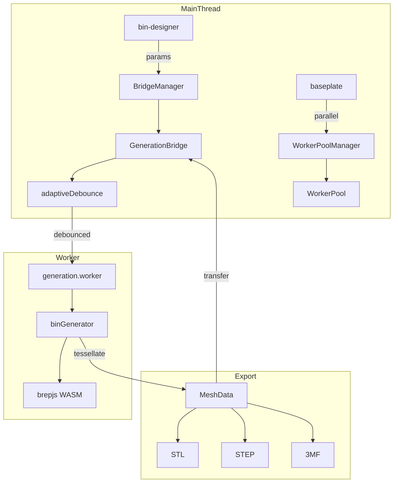

# Generation

brepjs-based 3D geometry engine running in Web Worker.

## Key Files

- `worker/generators/labelTabBuilder.ts` — label tab shelves + gussets. In swappable-label socket mode the shelf thickens and gains a click-in plate pocket + retention ribs per `@/shared/constants/labelPlates`, with a bin-spanning fallback when no compartment fits a standard plate (plan math shared with the UI via `@/shared/utils/labelSocketPlan`). Shelf top comes from `resolveLabelShelfTopMm`: on lipped bins the click-in shelf sinks `LABEL_SOCKET_STACK_RELIEF_MM` below the interior ceiling (capping an explicit `label.height` there) so no plate can lift a stacked bin's foot, which seats only 0.25mm above that plane. Click-in pockets cut to `LABEL_SOCKET_CLICK_POCKET_DEPTH_MM` so a seated plate is recessed, not flush.
  - Engraved tab text shares ONE font size per row/anchor group (`resolveUniformTabTextSize`): under `inkBox` the fitted size depends on the string, so per-tab fitting leaves a row of visibly mismatched labels. Consequence: a compartment's glyph size depends on the strings and tab widths BESIDE it, and the narrowest text-bearing tab governs the row. Scoped per row rather than per bin so a narrow compartment cannot shrink labels on an unrelated row.
- `worker/generators/textBuilder.ts` — turns a placed plan into glyph solids. WHERE the glyphs go is not decided here: `@/shared/utils/typePlan` owns anchoring, size resolution, tracking, case, line breaking and the cap-height datum, and the panel specimen and the ghost overlay read the same plan. Two materialisation paths: a single untracked line is one `sketchText` call, exactly as before the type system, so an unchanged design is bit-identical and pays no new kernel cost; tracking, multiple lines or a drafted profile fall to per-glyph placement. Every pen position goes through `sketchRunAtPen`, because `sketchText` NEGATES `startX` and not `startY` (CLAUDE.md gotcha 23a). Resolves the stencil-font swap for through-cut, and the drafted profile via `extrusionProfile`, amortised by `textSolidCache`
- `worker/generators/labelPlateBuilder.ts` — printable swappable label plates (#2666): interchange-spec body + latch groove + v1-compat channels from `@/shared/constants/labelPlates`, layer-snapped emboss/deboss text sized to the glyph ink box (`verticalFit: 'inkBox'`) rather than the font's ascender..descender band, with ONE size shared across a set built together (`buildLabelPlates`) so a bin's plates read as a set instead of each filling its own band. The v1 channels hollow the plate below `LABEL_PLATE_V1_CAVITY_TOP_MM` with the middle one at x=0, under the text, so `labelPlateV1ChannelsFitText` drops them whenever a debossed glyph would leave less than `LABEL_PLATE_V1_ROOF_MIN_MM` of roof — which at the pinned plate geometry means every debossed plate, since the snapped depth floor is one layer. Text wins, since every socket cut here is v2 and the channels only buy legacy-socket compatibility; exported via `EXPORT_LABEL_PLATES` (disjoint fuseAll → STL/STEP, connectorSample pattern; TEXT-tagged faceGroups ride the STL result for two-color 3MF paint_color via `bin-designer/utils/labelPlateColors.ts`)
- `worker/generators/labelPlateIcons.ts` — hardware icon silhouettes for plates (gflabel-style, ids in `LABEL_PLATE_ICONS`), embossed/debossed like text. Geometry comes from the SVG path data in `@/shared/constants/labelIconPaths` via `svgDrawing.drawingFromSvgPath`, so the picker preview and the printed silhouette read the same strings. Sized by `measureIconBox`/`fitIcon` from each silhouette's OWN bounding box to `TEXT_BAND_MM`, width-capped at `ICON_MAX_WIDTH_MM` — a shared ±5 design frame is only 52–68% inked vertically by the side-view fasteners but 100% by a washer, so frame-relative sizing rendered them at unequal visual weight. The plate layout reads the returned width to place the text, so a wide silhouette shifts the run rather than overlapping it.
  - Traps: boundary-crossing 2D `drawingCut`s and `customCorner` on these outlines corrupted the plate boolean — stick to simple closed outlines + fully-interior holes. **Bores are cut in 3D, after extrusion**, never from the 2D outline: brepjs's 2D boolean silently returns the subject unchanged when the outline is a single closed curve and the cutter is strictly interior with no intersections, which is how the washer shipped as a solid disc (`drawingCut(drawCircle(5), drawCircle(2.6))` measured π·5², not the annulus). Its bounding box is identical and the plate still gains volume, so only the icon solid's own volume catches it — hence the analytic volume assertions in `labelPlateIcons.test.ts`. Do not reintroduce holes as extra subpaths of `outline` either: the SVG importer flattens subpaths into one Blueprint and lets the face builder infer containment, which honors winding for polygon loops but unions arc loops regardless
- `worker/generators/labelFitSample.ts` — label-socket fit-calibration card (#2666): five 1U-socket coupons across a −0.10…+0.10mm fit-offset ladder (cut with `labelTabBuilder`'s `cutLabelSocket`, so the fit transfers 1:1 to bins) + one nominal blank plate; exported via `EXPORT_LABEL_FIT_SAMPLE`
- `worker/generators/cutoutLabelSocketBuilder.ts` — the click-in socket cut into a SHADOW BOARD's fill surface. Delivered as a **single composed negative** (pocket minus ribs), never a pocket cut plus fused ribs: `booleanStage` fuses before it cuts, so ribs handed over as fuse targets are carved back out by the pocket that follows and the plate finds nothing to click behind. One tool per socket, so a throwing boolean costs that socket alone. Built horizontal at the origin and turned as a whole for a 90° socket, so the two orientations cannot describe different geometry.
- `worker/generators/lidGripRelief.ts` — the chamfer / shadow-line / scallop cut at the lid↔bin seam. Cuts UPWARD from `anchorZ` over a centered span per enabled wall; depth and height clamped by `resolveLidGripDepth`/`resolveLidGripHeightPlan` in `types/lid.ts`, shared with the panel so readout and geometry agree. `grip.heightMm` `null` means the mode's own request, and a chamfer ignores it (its 45° section is its depth). `LID_GRIP_TOP_SKIN_MM` is the solid reserved above the cut: the lid prints upside down, so that skin is a layer-line load path, not cosmetic.
- `worker/generators/lidCutoutBuilder.ts` — through-cuts in the lid's plate. Reuses `cutoutBuilder`'s shape builders (`buildUngroupedCutout`/`buildGroupedCutouts`/`buildArrayUngroupedCutouts`) by handing them the lid's own top plane and origin, which is safe because those take their whole frame in their arguments, so the pen tool, pathfinder group ops, insertion clearance and entry chamfer all reach the lid with no second implementation. The HOST decides depth (always the full remaining plate: `exportLid` flips the lid 180° to print, so a partial pocket would face the bed), the board, and both scoop fillets.
- `worker/generators/slideLidPlate.ts` + `slideLidChannel.ts` + `pipeline/stages/slideLidChannelStage.ts` — the sliding lid: a flat plate captive in a half-dovetail channel fused to two opposite inner walls, entered through a third. Both halves come from ONE `resolveSlideLidPlan` call (`@/shared/utils/slideLidPlan`), so plate and track cannot disagree about the bearing surfaces, and everything is built in that plan's CANONICAL frame (travel along +X, `z = 0` at the plate's top plane) then rotated onto the chosen entry wall: one section path and one rotation instead of four hand-written orientations.
- `worker/generators/lidTextBuilder.ts` — engraves/embosses/through-cuts `surfaceText.lidText` into the lid's top face (or the tray floor when the tray recess is active) via `textBuilder`. `LidInputs.text` carries the whole RESOLVED style (design defaults, then shared surface style, then `surfaceText.lidStyle`), not a copy of the fields the builder reads today. `resolveTextHostFace` picks the frame (gotcha 7): plain top and tray floor sit in the perimeter frame, but the lip-only stack floor is grid-anchored, so its fit box and centre come from `cellsX × gridUnitMm` rather than `lidOuterW`/`outerOffset`.
- `worker/generators/scoopRampBuilder.ts` — scoop ramp geometry. Against an outer wall of a lipped bin the ramp is offset inward by `computeLipOffset` so its exit is flush with the lip's inner face; below `wallHeight` a vertical chute at that offset carries the exit up to the lip base. **Trap**: the top ~3.15mm of the wall is the band a seated lid's click rail drops into (`LID_CLICK_RAIL_BAND_BELOW_WALL_TOP`), and a ramp reaching it buries the rail (its arc runs inboard fast, 12.8mm at the rail's lowest point on a 2x2x4 scooped to the top). The offset and chute are not the problem: against a plain bin's 0.64mm snap baseline they cost 0.07mm.
- `worker/generators/wallTextLayout.ts` — a thin worker adapter that hands the shared solver (`@/shared/utils/wallTextPlan`) the worker's own font measurer. The solver picks each wall's clear region (avoiding cutout/handle AABBs + `CUTOUT_BORDER_WIDTH`) and then plans the caption inside it; it lives in `shared/` so the designer's ghost overlay runs the SAME code on the main thread. Read by `wallTextBuilder` (geometry) AND `wallPatternBuilder` (pattern clearing behind the same INK box, not the rect: an anchored caption occupies a corner of its region). Skips polygon/solid bins and slot-occupied walls
- `worker/generators/typeStemGuard.ts` — reports a design whose finest glyph stem falls under what a nozzle resolves, measured off the real outlines at the size actually rendered. Runs outside the cached pipeline, like `labelTextFit`, so it cannot change a triangle of the geometry it reports on. Walls and label tabs only: the binding case is always the smallest rendered size
- `worker/generators/wallTextBuilder.ts` — outer-wall text geometry (#2695): builds glyph solids flat via `textBuilder`, stands them up against each wall (rotate 90° about X, per-side yaw, translate to the outer face). Registered as TWO FeatureBuilders (cut for engrave/through-cut, fuse for emboss) since a builder has one static boolean target. Engrave leaves ≥0.4mm wall behind glyphs; emboss relief is capped at 1.5mm so adjacent grid bins can't collide
- `worker/generators/wallPatternBuilder.ts` — per-wall hex pattern compounds with two-layer caching (uncut base + clipped result) and optional cutout/handle/ramp clipping. Polygon bins consume per-edge descriptors from `wallPatterns.collectPolygonWallSegments`: one descriptor per axis-aligned outer edge, with an `allowClip` flag that binds cutout/handle clipping only to the outermost edge per cardinal (matching `findPolygonEdgeForSide`). Divider ramp/junction zones are unconditionally empty on polygon bins — dividers are filtered out at `featuresStage`.
- `worker/generators/utils/stlMeshFallback.ts` — `exportSolidToStl`: OCCT-primary STL writer with a mesh-based fallback for topologies OCCT's `StlAPI.Write` rejects but `mesh()` triangulates (the `STL_EXPORT_FAILED` class, #1760/#1850). Used by bin/divider/lid exporters; OCCT stays primary so success is byte-identical and 3MF faceGroups stay aligned
- `worker/generators/dividerPatterns.ts` — divider-pattern placement data (#2811): which compartment dividers carry the wall pattern, the band each offers, and the keep-out rectangles where it must stay solid. Pure — keep-outs come from projecting each intruder's world footprint (scoop ramps, label tabs) onto the divider centerline, so a tilted divider needs no special case. The band is **re-fitted to the divider's own height** rather than clipped from the wall band, so a shortened divider keeps whole elements instead of a sliced top row
- `worker/generators/dividerPatternBuilder.ts` — divider pattern geometry. Exposes `resolvePanelFactory`, the shared panel builder both divider paths use (caching, keep-out handling, stamp/kumiko dispatch), so the integrated and removable paths differ only in the rigid transform placing the panel. Every panel is built in the divider's LOCAL frame (u along X, band along Z, thickness along Y) and placed with one rotate+translate, so two dividers of equal span share a cache entry whatever their position or tilt.
  - Stamp patterns honour keep-outs by dropping whole ELEMENTS (no boolean, no half-hex knife edge); the continuous kumiko lattice is cut by keep-out boxes instead. Kumiko divider panels resolve their lattice against the OUTER perimeter (`resolveKumikoPerimeter`) so triangles come out the size the walls carry, then take a u-window of it, which is legal because the lattice is u-periodic.
  - **Cut depth is `thickness + 2`, deliberately not the outer walls' `wallThickness * 4`**: the narrowest legal compartment is only `2 x thickness` wide, so a deeper prism would reach across and perforate the next divider.
- `worker/generators/dividerPiecePatterns.ts` — keep-out planning for the wall pattern on REMOVABLE divider pieces (#2811 follow-up). Pure. A removable piece is free-standing, so its bottom keep-out is the skirt alone (no floor slab to clear), and it carries joinery the bin body doesn't: tab engagement buried in each wall slot, cross-lap notches, and face grooves. Every obstruction is cleared over the FULL band height, not just its own extent — a notch already removes half the height at that column, a receptacle leaves only a 40% web, and a snap score only breaks cleanly if the web behind it is continuous
- `worker/generators/dividerPiecePatternBuilder.ts` — applies those panels to the flat pieces. The only difference from the in-bin path is the frame: pieces print lying down (length X, installed height Y, thickness Z) while the panel factory emits panels standing up (span X, band Z, thickness Y), so the panel is rotated -90° about X. Wired into `dividerBuilder` at each piece-construction site, where the notch/groove data already lives, rather than re-deriving the piece plan
- `worker/generators/floorPatterns.ts` — floor pattern placement (#2816): one WINDOW per socket cell, inset by `floorWindowInset` so a drainage hole exits through the foot's flat underside and never through the baseplate-mating taper, plus the keep-outs for everything that already owns the base (magnet/screw pockets) or stands on the floor (divider footings, scoop ramps). Pure. Windows come from `socketBuilder.filledSocketCells`, so a cell with no foot (empty mask region, sub-threshold fractional fringe, the overhang region) gets no holes; a flat base has no socket and takes one interior-wide window instead
- `worker/generators/floorPatternWindow.ts` — just the window rule (brepjs-free, re-exported to the main bundle via `@/shared/generation/floorPatternMetrics` so the panel's fit note and the print estimate share it rather than mirroring it)
- `worker/generators/floorPatternBuilder.ts` — floor pattern geometry (#2816). Reuses `dividerPatternBuilder`'s `resolvePanelFactory` verbatim and only changes the frame: the factory emits a panel standing up (span X, band Z, thickness Y), the floor needs it lying down, so each panel is rotated -90° about X. Its tools go into `deferredCutTargets` as well as `patternCutTargets` — see the socket note under Pipeline Stages
- `worker/generators/wallPatterns.ts` — hexgrid/slot patterns. Which walls get a descriptor is the intersection of the slot-free gate and the user's per-side selection (`wallPattern.sides`, #2966, resolved via `@/shared/utils/wallPatternSides` — a missing side means ON so pre-#2966 designs still pattern all four). On polygon bins the filter is by cardinal, so every outer edge mapped to a deselected cardinal goes solid
- `worker/generators/baseplateScrews.ts`: mount-down screw holes (#3425). `resolveScrewHoles` snaps a plan's floor targets to real `magnetPositionsForCell` results (pure, so the draft mesh shares it), `buildScrewCutters` builds the BREP cutters, `screwAwareHoleRadius` is what the lightweight pass must be sized with. Placement policy itself lives in `@/shared/generation/screwHolePlan`
- `worker/generators/binDirectMesh.ts` — direct mesh generation for the bin preview (`generateBinDirect`: hollow body + stacking lip + tapered feet) plus `canBinUseDirectMesh`, the allowlist that gates which bins the procedural path may render (procedural, no BREP)
- `worker/generators/directMeshBuilder.ts` — `MeshBuilder` class + `faceNormal`, `tangentVectors`, segment-count constants
- `worker/generators/directMeshWalls.ts` — pocket walls (with optional floor) and outer perimeter walls (`addOuterWalls` takes a `zBot` so the bin body can start at the socket interface)
- `worker/generators/directMeshFaces.ts` — top/bottom slab face = padding ring + per-cell corner gussets; closed bottom for magnet variants
- `worker/generators/shapeCache.ts` — LRU caches for BREP solids. Includes a per-cell-size **cell-socket template** cache: a uniform socket grid lofts one cell once and clones it per position (intrinsic-keyed, placement-invariant), turning a cold build from N lofts into 1 loft + (N−1) clones — the bin-side mirror of the baseplate `pocketTemplateCache`
- `worker/generators/socketMeshCache.ts` — LRU cache for the deferred socket's tessellated mesh (triangles + edge lines), keyed by socket geometry identity + tolerance; reused across edits that don't change the base
- `worker/generators/pipeline/featureCacheKeyDiscipline.test.ts` — enforces the contract every `FeatureBuilder` owes the feature cache: two parameter sets sharing a `cacheKey` must build the same geometry. Records what each build reads behind a Proxy, perturbs it, and fails on any input that leaves the key still. Two guards keep it honest — perturbations settle on the implication rules first (so it never asserts over a state the designer cannot emit), and a candidate must also change a WHOLE BIN generated against a warm cache before it fails (a cutter can differ only in the empty space it sweeps). A param a cached builder reads with no declared perturbation fails too: that is the trigger for reviewing a key when a feature grows an input. Scope is `BIN_FEATURE_BUILDERS`; the shell, socket, pattern-compound, text and baseplate caches key themselves outside the protocol and still need their own tests
- `worker/generators/scenarios/` — test scenario data by category. Each module is run TWICE, by one `binGenerator.scenario.<domain>.test.ts` (generation) and one `binGenerator.export.<domain>.test.ts` (export integrity, via `__kernel-tests__/exportIntegrityRunner.ts`). **The one-file-per-domain split is a CI requirement, not tidiness**: Vitest parallelizes across files but never within one, and `--shard` divides by file path, so a whole-catalog file pins a single worker and its duration becomes the floor for the entire CI run — the export matrix in that form cost 14 minutes and set the critical path on its own. `binGenerator.scenarioCoverage.test.ts` enforces that both files exist for every module

## Pipeline Stages

Composable stages in `pipeline/stages/`, orchestrated by `pipeline/runner.ts`:

1. **Shell** (`shellStage`) — box body + lip (cached by shellKey) is `ctx.solid`; the base socket is built separately. **Preview** keeps the socket in `ctx.deferredSolid` (skips the socket↔body fuse — ~80% of cold-shell time); **export** fuses it into `ctx.solid` for a watertight model.
2. **Features** (`featuresStage`) — compartments, inserts, slots, labels, scoops, wall cutouts, patterns (cut the body only; the socket is never feature-cut)
3. **Boolean** (`booleanStage`) — fuse additive targets pairwise (the kernel's n-way fuse glues cells instead of unioning; a failed target is dropped), cut subtractive via `cutAllBisect` (n-way batch first, recursive bisect on failure). `deferredCutTargets` are additionally cut from `deferredSolid` — the ONLY feature that booleans the base socket, because the floor pattern's holes have to pass through it. Cutting the body alone would leave a blind pocket in the preview and, once the socket is fused for export, in the exported model too. A carved socket drops its `deferredSolidKey` so it can't be served from the socket mesh cache, which is keyed on socket geometry alone and cannot see the divider/scoop keep-outs that shape the carve
4. **Translate** (`translateStage`) — Z-offset for socket-based bins (applied to `solid` **and** `deferredSolid` so they stay aligned)
5. **Slide channel** (`slideLidChannelStage`) — fuses the sliding lid's shelves, retainers and detent bumps onto the bin, then cuts the entry window. After the interior relief for the reason `lidRetentionStage` is: the channel is interface, not contents. Within the stage the bars fuse BEFORE the notch cuts, or a bar reaching into the entry wall re-fills the window
6. **Tessellate** (`tessellateStage`) — dynamic quality mesh + edge extraction; meshes `deferredSolid` separately and concatenates via `mergeShapeMeshes` (visually identical to the fused shell — socket meets the body only at a hidden interface). The socket mesh is cached by geometry identity (`socketMeshCache`, keyed via `deferredSolidKey`) so non-dimension edits skip re-tessellating the base.
7. **Mesh imprint** (`meshImprintStage`) — subtracts imported STL tools (mesh cutouts, `shape: 'mesh'`) from the tessellated mesh via raw manifold-3d. Requires the async `prepareMeshImprints()` pre-pass (worker handlers await it — the pipeline itself is synchronous); `faceGroups` tags ride through the boolean as Manifold runs, tool-carved faces get the cutout's color tag, and normals/edges are rebuilt (crease-aware) afterwards. The pocket keeps the tool's relief BELOW its lowest top-shoulder (`minTopShoulder`) and fills the silhouette flat above it — a removable top-insertion pocket can only mirror the tool's underside + silhouette, so a top-face recess is necessarily flattened (orient the distinctive face down to imprint it). Filling above the shoulder is what keeps every pocket a single connected solid; a `decompose()` keep-largest guard backstops any residual island. GOTCHA: exports for mesh-bearing designs must serialize the imprinted `MeshData` (`buildSTLBufferFromIndexed`), never `exportSolidToStl` — the BREP solid has no pockets. STEP is unavailable for these designs.

## Bridge result cache

`bridge/resultCache.ts` sits in front of the worker on the main thread: a
byte-budgeted LRU of completed `GenerationResult`s keyed by
`paramsFingerprint`, one per request kind (bin / baseplate / item). It answers
the round trip a parametric editor makes constantly — toggle a feature on and
back off, drag a slider home, step a value up then down — without the worker
seeing a message. Keep it keyed on the fingerprint, not on recency: a
single-entry version of this was a debounce guard rather than a cache, because
the return leg had already evicted the result it was about to ask for.

Serving an entry twice is safe because the worker clones every buffer before
transfer and nothing on the main thread transfers them onward. A hit does mean
`lastSolid` no longer describes what was just returned, which was already true
of any hit — `exportBin` re-checks the identity fingerprint (see gotcha 16)
rather than trusting recency.

## Cross-session mesh cache

All the caches above are **in-memory only** — they vanish on reload. `src/shared/generation/meshPersistence.ts` (main thread) additionally persists the final bin-designer preview `MeshData` to IndexedDB, keyed by a hash of `BinParams` + `MESH_CACHE_VERSION` + the active kernel and its `KERNEL_MESH_REVISION`, so reopening a saved custom bin paints last session's exact mesh instantly (as a pre-draft in `useGeneration`) while the worker warms up and regenerates. Preview-only — exports always regenerate the watertight fused shell. **Bump `KERNEL_MESH_REVISION[kernel]` on a kernel upgrade (brepjs/occt-wasm, brepkit-wasm) and `MESH_CACHE_VERSION` on a tessellation or kernel-independent geometry change** (see the geometry-generation skill).

## Worker Protocol

| Message         | Purpose                                             |
| --------------- | --------------------------------------------------- |
| INIT            | Load WASM (~11MB, 2-4s)                             |
| GENERATE        | Tessellation + progress → MESH_RESULT               |
| EXPORT          | STL/STEP export (uses cached solid or regenerate)   |
| EXPORT_DIVIDERS | Export unique divider pieces as STL                 |
| EXPORT_SPLIT    | Cut an oversized bin into bed-sized STL/STEP pieces |
| CANCEL          | Abort current request                               |

Requests tagged with `requestId`; cancelled requests ignored.

**Responses:** INIT_READY, PROGRESS, MESH_RESULT, EXPORT_RESULT, DIVIDERS_EXPORT_RESULT, SPLIT_EXPORT_RESULT, ERROR

## Item Kinds (`worker/items/`)

Non-bin item kinds (`toolRack`, `importedMesh`) generate via `GENERATE_ITEM` /
`EXPORT_ITEM`: `generateItemHandler` dispatches through
`getItemGenerator(item.structure.kind)` (`generatorRegistry.ts`, populated by
`registerGenerators.ts` at worker start).

- **`prepare?` pre-pass**: `ItemGeneratorModule.prepare` is an optional async
  hook awaited by the handler **before** the strictly synchronous
  `runGeneration` — for module loads or asset decodes (same contract as
  `prepareMeshImprints`). A prepare failure responds `ERROR` keyed to the
  request; nothing downstream would, and the bridge would otherwise hang
  until its generation timeout hard-resets the worker.
- **`importedMeshItem.ts`**: the stored GMA1 asset IS the geometry. `prepare`
  decodes it into a small content-keyed cache, `generate` re-frames the
  cached arrays into the preview convention (XY-centered, Z=0 bottom; stored
  frame is bbox-min-at-origin) with empty normals/edges (`useMeshGeometry`
  recomputes both), `export` serializes STL via `buildSTLBufferFromIndexed`
  and throws for STEP (a mesh has no BREP solid). Cache cleared on CLEANUP
  (`clearImportedMeshCache`).
- **GOTCHA — descriptors in the worker**: `registerDescriptors()` never runs
  in the worker bundle (it is a main-thread module). Worker code must import
  descriptors directly (e.g. `importedMeshDescriptor`), never via
  `getItemDescriptor()` — the registry lookup throws at runtime, and a unit
  test that imports `@/shared/items/registerDescriptors` will mask it.

## Manifold Draft Preview (`manifold_preview`, graduated)

A second `GenerationBridge('manifold')` runs the Manifold mesh-CSG kernel at pinned draft quality in its own worker, acquired via `BridgeManager.acquirePreview()` / `releasePreview()` (ref-counted, idle-kept, independent of the exact bridge; init failure is non-fatal). Consumers render a fast coarse draft on the leading edge of an edit, then the exact occt-wasm result supersedes it. `worker/wasmInstantiator.ts:loadManifold()` dynamically imports `manifold-3d` + its WASM (`?url` for the Vite worker) and registers the kernel via brepjs `initFromManifold`. `KernelName` gains `'manifold'`. A draft init failure degrades gracefully to the exact-only path; exports always use the exact kernel.

### Synchronous direct-mesh draft (bin + baseplate)

Ahead of the Manifold draft there is an even faster tier: a **synchronous, brepjs-free** procedural mesh built on the main thread (no worker, no WASM round-trip). The baseplate uses `generateBaseplateDirect`; the bin uses `generateBinDirect` (both re-exported from `@/shared/generation/directMesh`). `useGeneration` paints it on the leading edge of an edit before the worker even starts, then the exact B-rep supersedes it — and when the direct mesh paints, the slower Manifold draft is **suppressed** (via `directShownTokenRef`) so a simple bin swaps once (direct→exact), not twice.

The bin path is gated by `canBinUseDirectMesh`, an **allowlist** returning true only for bins the procedural emitters render faithfully: rectangular footprint, `standard` / `magnet` / `screw` / `magnet_and_screw` base, lip optional. Magnet and screw bases ride the direct path because their only difference from standard is holes on the foot **underside**, which the preview camera never sees, so the draft shows solid feet and the exact mesh fills them on the swap. (The bin's `DoubleSide` material rules out a cancel-disc punch, and faithful underside holes would need polygon-with-holes triangulation for an invisible feature.) `flat` (no socket), `weighted` (internal cavity) and `lid` (a tray bottom, not a socket) genuinely differ and fall back, as does a spacer, whose floor the procedural draft would render solid.

**Gotcha:** any new bin feature changing the camera-visible shape, or a new `base.style`, MUST be added to this gate or its draft silently omits the feature. The caller try/catches `generateBinDirect`, so a missed case degrades to "no instant draft", never a wrong mesh. The export path always uses the exact kernel.

## Patterns System

Pattern calculators in `worker/generators/patterns/` use a registry-based architecture:

- **Honeycomb** — hexagonal grid for wall cutouts (configurable radius, web thickness)
- **Registry** — `PATTERN_REGISTRY` maps pattern names to calculators
- **Grid Utils** — staggered grid layout calculations

Add new patterns by implementing `PatternCalculator` interface and registering in `registry.ts`.

Three calculator strategies exist: `stamp` (repeated shape at staggered centers — honeycomb,
round, diamond, triangle, slots), `motif` (tiled 2D unit cell — builder-supported seam, nothing
shipped), and `wrapped-lattice` (kumiko). Wrapped-lattice patterns are authored in unrolled
perimeter coordinates (`patterns/kumiko/segmentLattice.ts` — pure math, u-periodic triangular
jigumi + per-vertex fillings) and built by `kumikoWrapBuilder.ts` as one continuous lattice
around all four walls: flat spans as slab-minus-strut-prism cuts, corner arcs as annular wedges
minus strut solids — vertical/horizontal revolves, rising diagonals as helix sweeps, falling
diagonals as chord-box chains, because occt-wasm's `makeHelixWire` has no handedness input and
a left-handed helix is unreachable (see `__kernel-tests__/helixHandedness.test.ts`). Exact
kernels only — Manifold drafts render the phase-aligned flat panels with solid corners and the
OCCT result replaces them. The lattice column count is
quantized to an EVEN number so the ±30° diagonals reconnect across the u = 0 seam, and all slab
clipping is periodicity-aware (`clipSegmentToURangePeriodic`). Kumiko composes with
cutouts/handles/text/divider junctions through the same clip machinery as stamp patterns
(`computeWallClipContext` / `computeWallClips` in `wallPatternBuilder.ts`). Polygon (cellMask)
and slotted bins render solid walls for kumiko in this iteration. Per-side selection (#2966) is a
slab filter: a flat needs its own wall selected, a corner needs BOTH its walls, or the arc's struts
would run into solid wall — the lattice itself still spans the whole perimeter, so deselecting a
wall never shifts the columns on the walls that stay patterned.

## Lid subsystem map

Resolution runs on the main thread so the panel and the worker cannot disagree.
`resolveLidInputs` (`worker/generators/lidInputs.ts`) turns params into `LidInputs`,
reading `resolveLidPlateThickness`, `resolveLidCavityExtraMm` and
`retentionSeatPlanes()` for the magnet interface
(`interfaceZ = -(LID_TOP_THICKNESS_BASE + magnetDepth) - cavityExtraMm`). `lidAnchorZ`
places the seated lid; `DEFAULT_LID_CONFIG` and `attachment === 'clickRails'` gate which
builders run. Polygon bins go through `resolvePolygonSideGeometry` and `polygonLipGaps`.
Grip relief reads `gripPlacements` and `grip.binDip`, and `splitRailsAroundGrip` keeps a
rail out of the notch. `lidInteriorReliefStage` runs last (gotcha 22), tracked by
`interiorReliefActive`. Plate arithmetic uses `plateSolidMm` and `maxProfileProtrusion`;
the stack-lip path uses `buildStackLipCutter` and `lidStackGrid.ts`.

Shared plans the main thread and worker both read: `@/shared/utils/lipGapPlan`,
`dividerRailPlan`, `cutoutLabelSocketPlan`, and `@/shared/types/bin`.

## Scenario tests

Each proves a claim no bounding-box or watertight assertion can:

| Test                                              | Proves                                                    |
| ------------------------------------------------- | --------------------------------------------------------- |
| `binGenerator.scenario.taper.test.ts`             | tapered lofts share z-nodes; re-verify on brepjs bumps    |
| `binGenerator.scenario.taperSolidCutouts.test.ts` | solid-bin pockets clear the tapered envelope (ray parity) |
| `lidGenerator.scenario.test.ts`                   | the lid builds and seats for the stock configurations     |
| `lidCutouts.scenario.test.ts`                     | plate through-cuts reach both faces                       |
| `lidMagnetSeating.scenario.test.ts`               | boss and pad land on one `retentionSeatPlanes()` plane    |
| `lidRetentionMagnets.scenario.test.ts`            | pockets keep `LID_MAGNET_CEILING` above the cavity        |
| `lidScoopClearance.scenario.test.ts`              | a scoop ramp does not bury the click rail                 |
| `lidLabelTabClearance.scenario.test.ts`           | rails and label shelves do not interpenetrate             |
| `hingeSwing.scenario`                             | the lid clears the rim through its whole arc              |
| `__kernel-tests__/dividerRake`                    | a raked divider keeps perpendicular thickness             |

## Gotchas

1. **Half-cells decompose separately** — 1.5 width = [1.0, 0.5] cells
2. **Magnet holes only in full cells** — half cells remain solid
3. **Features fail silently** — tiny cells → feature skipped
4. **WASM objects are ephemeral** — brepjs GC invalidates refs unpredictably
5. **Wall pattern border rule** — any feature that cuts through a wall (cutouts, handles, future features) MUST have corresponding border clipping in `wallPatternBuilder.ts`. Without it, hex prisms overlap the cut region, producing jagged edges. Use `CUTOUT_BORDER_WIDTH` (1.5mm) for the expansion. See `wallPatternBuilder.ts` for the cutout, handle and wall-text clipping implementations as reference — wall text is the newest instance, and takes its clip rect from `wallTextLayout`'s `textW`/`textH`/`centerZ` so geometry and clip can't drift. **Since #2811 the rule has two further surfaces**: any feature that lands on a compartment DIVIDER (scoop ramps, label tab shelves and gussets, interior cutouts, another divider crossing it) needs a matching keep-out in `dividerPatterns.ts`, or `wallPattern.dividers` perforates the exact spot that feature bonds to. The same applies to a slotted bin's removable pieces, whose joinery is planned in `dividerPiecePatterns.ts`.
6. **Text auto-fit assumes linear metrics** — `typePlan.ts` measures each run once at size 1 and scales, which is exact only because opentype advances and path coordinates are linear in font size with no hinting on this path. **Re-verify on brepjs bumps**: a build that introduced hinting would mis-size every caption. `textBuilder.ts` (`planTextForHost` / `fitTextSize`) is the worker's entry into that plan.
7. **Overlong text is DROPPED, not shrunk, and the mesh keeps no record** — `buildTextSolid` returns null when a run cannot reach `minFontSize`, and both group-fit passes (`resolveUniformTabTextSize`, `resolveUniformPlateTextSize`) deliberately exclude that run so one long caption can't shrink its neighbours. The part then prints blank with nothing to observe after the fact, which is why `labelTextFit.ts` reports the drop as `MeshData.labelTextOverflow` instead of leaving the UI to infer it. That reporter runs OUTSIDE the cached feature pipeline (like `generateLabelPlates`), so it can never move a triangle — and it measures each caption against its real host: the tab shelf in text mode, the icon-aware plate band in socket mode. **Any new text host must report its own drops too**, or the caption silently vanishes exactly as it used to.

8. **Lid overhang uses two coordinate families** — when a bin has an overhang the lid grows to match, so anything placed on or in the lid must be told WHICH frame its numbers are in. The perimeter frame is anchored to the lid's own outer rect; the grid frame is anchored to `cellsX × gridUnitMm`. Mixing them shifts a feature by the overhang, which is small enough to look like a tolerance problem and large enough to miss. `resolveTextHostFace` is the resolver; see gotcha 7 and `lidTextBuilder` above.
9. **Wall pattern floor skirt** — the bottom keep-out in `wallPatterns.ts` is `wallThickness + BOTTOM_SOLID_SKIRT` (1.5mm), NOT `max(const, wallThickness)`. The `wallThickness` term clears the interior floor slab; the skirt is the solid band the lowest hex row anchors to. Without it the lowest webs print as unanchored fins off the wall-floor seam and snap (#2317). `printEstimates.ts` re-declares these constants inline (module boundary forbids the import) — **keep it in lockstep**, along with its `PATTERN_VOID_FRACTION` open-area table.
10. **Wall key tongue/groove must stay matched** — in `splitConnectorBuilder.ts` the male tongue (`inflate=0`) and the female groove (`inflate=clearance`) are both built by `buildKey` from the _same_ `keyHeight` and `WallKeyGeometry`, so the groove is exactly the tongue grown by the fit clearance. `fitWallKeyToHeight` clamps the protrusion to the available `keyHeight` (so the tongue's 45° self-supporting tip ramp always finishes below the lead-in notch) and skips keys on bins too short to host a ≥2-perimeter, nozzle-scaled protrusion — the clamp is a pure function of `keyHeight`/nozzle, which is why both halves clamp identically and stay matched. **Raising `WALL_KEY_PROTRUSION`/`WALL_KEY_HALF_WIDTH` deepens the groove inward (`pilasterPerpDepth`), growing the reinforcing pilaster onto more wall thicknesses; verify the new size still leaves a positive outer skin and passes `binGenerator.scenario` watertightness.**

11. **Lid floor plate consumes cavity depth** — the plate is built downward from the top face (`Z ∈ [-plateThickness, 0]`), so raising `topThicknessMm` eats usable interior rather than adding height. Anything measuring interior depth on a lidded bin must subtract it; `assembledHeight` does.

12. **Lid/bin magnet seat planes** — the lid's boss and the bin's gusset pad are built by different passes and must land on ONE agreed plane, `lidRetentionInterfaceZ`. The bin pad is not a free-standing post: it welds into the interior walls, so its footprint spans the whole band the lid's skirt drops through, and `LID_MAGNET_LIP_CLEARANCE` does not help (that keeps the lid's BOSS clear of the bin's LIP, a different pair). Magnets meeting at `LID_MAGNET_SEAT_GAP` is not the lid closing. See `geometry-debugging` for the sweep that catches it.

13. **Floor pattern holes must stay off the foot taper** — the socket's tapered flank is what mates with a baseplate, so a drainage hole may only exit through the foot's FLAT underside, which starts `INSET_BOT` (2.95mm) in from the cell edge. `floorWindowInset` holds `FLOOR_PATTERN_BORDER + max(INSET_BOT, wallThickness)` on every edge of every cell, which is also why the pattern reads as one cluster per foot rather than a continuous field. A scenario asserts the foot-underside outline is unchanged with the pattern on and off; any change to the socket profile has to move that inset in lockstep.

14. **Interior corners are arcs, not rectangle corners** — the cavity corner is an arc of `BOX_CORNER_RADIUS - wallThickness`, so anything placed against an interior corner (inserts, dividers meeting a wall, corner pads) must clear the arc, not the notional rectangle corner. A feature sized to the rectangle overlaps the wall by the arc's sagitta, which is sub-millimetre and passes every mesh check.

15. **Wall taper is an `outer − cavity` loft** — `taperedOuter.ts` angles the outer wall inward at the base within the overhang region, building the body as `outer_loft − cavity_loft` rather than `shell()` (unreliable on a non-prismatic solid). Both lofts are **ruled**, so the invariant is not "sample the same profile" but "sample it at the same z-nodes": where one loft has a node the other lacks, an exact value meets a chord, and a concave fillet bulges outside its chord, so the cavity ends up wider than its wall. The floor plane (`wallThickness`) must be in the shared node set; without it the cavity cut through the wall (~1.9mm past a 1.2mm wall at `bandHeight` 30). `assertWatertight` cannot see this (a breached wall is still closed), so the guard is a mesh Euler-characteristic comparison.

    Scope is rectangular bins, hollow and solid. Solid bins are the outer loft with nothing removed; a lowered fill (`cutoutTopOffset`) is a recess cut from it. Their pockets must clip to `buildTaperedInnerEnvelope`, which holds `wallThickness` at every height, and be built with **zero** offsets since `featuresStage` translates tools afterwards. The old `clipToInterior` clipped to a rim-anchored prism, leaving only `wallThickness - flare` at the floor, which is negative for any flare wider than the wall. The Euler guard does NOT transfer to solid bins (an open pocket's side breach is a notch, not a handle); `binGenerator.scenario.taperSolidCutouts.test.ts` uses ray-parity instead. Multi-compartment bins start from `buildTaperedLofts().outer` and clip each compartment to `.cavity`; compartments inside `.narrowestInner` skip the clip, without which a 12x12 grid ran past its timeout (12.5s flat, 29.7s tapered on a 4x4u bin, hence `TAPER_MULTI_COMPARTMENT_BONUS_MS`). It folds into `overhangKey`, so existing body/shell caches stay correct. `buildOverhangFeet` must frame from `overhangBaseSides` rather than the stored rim values, as must anything else placed under the bin.

16. **`lastSolid` is identified by params, not just by quality** — `exportBin` may reuse the cached solid only when it is export-quality AND built from the same params (`isLastSolidReusableFor(paramsFingerprint(params))`). The quality flag alone is safe only while a worker serves one design at a time. A whole-layout export runs many designs through each pooled worker with no preview between, so every design after the first exported its predecessor's geometry under its own filename: a wrong file that is perfectly valid and watertight. **Any new producer of `lastSolid` must pass the fingerprint of what it built.** `paramsFingerprint` lives in `@/shared/generation/paramsFingerprint` so the bridge's dedup cache and the worker's identity check cannot drift.

17. **A missing pool is not the same as a failed pool** — split generation falls back to sequential when `poolRef.current` is null. That fallback is for an acquisition that FAILED, but the pool is acquired in the background and never awaited, so the ref is null for the whole first generation of a session: every split plate took the sequential path exactly once, on the build every user sees first. Invisible in aggregate timings unless split by `is_split` (over 90 days: unsplit 3.4x cold-vs-warm, the honest cache penalty; split 10.1x, the extra ~3x being lost parallelism across a median 6 pieces). `bridge/poolReadiness.ts` waits on the in-flight acquisition, but only when waiting can pay for itself (no usable pool AND more than one distinct piece) and only for 3s. A pool arriving late still sets the ref for the next generation.

18. **A cutout fillet needs material on the far side to blend into** — `buildCutoutProfile` rounds the two bottom corners of a u-shape/funnel at `autoCornerRadius` (15% of span, capped 5mm, so it saturates on any wide bin) unless `walls[side].cornerRadiusBottom` is set. The arc reads as a blend only where wall survives beyond the cut edge; where none does it stands up as a free tapering fin `safeR` tall. At 100% width `computeCutoutCenter` goes degenerate with zero slack both ends (a 5mm spike on an 81mm span). `cornerSlackFor` resolves surviving wall per end and caps each bottom radius by its own side. **Per corner, not per cutout**: alignment/offset can leave one end flush and the other deep in material. Third defect in this family, and none are visible to bounding-box, watertight or triangle-count checks. Probe the profile's horizontal span at floor level (`spanAtZ` in `wallCutoutBuilder.test.ts`). Same path serves interior divider windows.

    **The TOP shoulder rounds the other way (#3533).** `walls[side].cornerRadiusTop` rounds the MATERIAL corner where a cut meets the top of the wall, which the profile expresses as a flare: the cut opens outward as it rises, tangent to the cut's own side below and to the rim above, reaching its full radius exactly at the highest material the cut passes through. That is the LIP's top face on a lipped bin, not the wall's — `CUT_RIM_CLEARANCE` is what makes the two the same distance below the profile's top edge, so both call sites must build `overshoot` from it. Three traps. (a) Drawn as an explicit quarter arc, never `customCorner`: that fillets two DRAWN curves and needs the rim run strictly longer than the radius, so sized exactly it silently declines to fillet (`removeCorner` returns the curves untouched) and sized longer it leaves a horizontal face lying in the material's own top plane for the boolean to graze. (b) The scoop has no straight side to flare from on a lipless bin, so its chord drops by the deeper of the two radii and its sagitta follows — leave the sagitta on `userCutHeight` and the arc runs past the cut floor. (c) The opening AT THE LIP is now wider than the span the user set, which `lipGapPlan` has to measure or a click rail hangs over the flare and grips nothing (CLAUDE.md gotcha 19). All of the clamping lives in `safeCutoutCornerRadii` in `@/shared/utils/wallCutoutPosition` precisely because four layers consume it: the profile, the wall-pattern clip, the ghost outline and the lip-gap plan. Same probe as the bottom fillet — a square shoulder and a rounded one have identical bounding boxes, triangle counts and watertightness (`binGenerator.scenario.wallCutoutCorners.test.ts` states every result as a delta against the same bin with the radius off).

19. **A lid rail and a label shelf occupy the same millimetre, and neither mesh can tell you** — the tab's shelf top lands inside the Z band the click rail sweeps (rail `[33.85, 37.60]` above the cavity floor on a stock 2x3x6 bin, shelf top `35.10`), so a rail on a wall PERPENDICULAR to the tab drives through it once `clickRailCoverage` reaches: 1.25mm of interpenetration at 100%, already at 75% on a 2x2 with a 16mm tab. Both solids stay watertight with plausible triangle counts while the lid cannot seat; only mating the two and probing inside sees it (`lidLabelTabClearance.scenario.test.ts`).

    **Clipping and segmenting are the same operation.** Rails clip their usable span against `railFoulingLabelFootprints`, and `railSegmentsClearOfLabelTabs` subtracts each blocking footprint from the wall's run, so a perpendicular tab eats one end and an along-wall tab eats the middle (full-width leaves nothing and stays friction-fit; narrow leaves a stretch either side). Coverage applies per surviving stretch, so 100% keeps meaning "as much rail as fits". `computeDisabledRails` deliberately does NOT act on the label-tab `sides` (`SIDES_ARE_ADVISORY`), or the gaps are discarded before anything measures them. A wall cutout DOES disable outright, because it removes the lip the rail grips. **Which wall a tab blocks is derived (`LabelTabFootprint.onOuterWall`), never assumed**: hardcoding `back` meant `edges: 'front'` disabled a rail that was never in the way and kept the one that was, and a shelf dropped clear of the band lost its rail for nothing. `computeDisabledRails` still owns `disabledRails` for the cases that genuinely disable a whole wall. All of it reads `@/shared/utils/labelTabPlan`, lifted out of `labelTabBuilder` because the main thread cannot import brepjs, so builder, rails, warnings and the panel's rail-count readout cannot drift. `labelTabPlanDims.test.ts` pins the interior-dimension mirror to `deriveDimensions`.

20. **A through-cut pocket must be told how deep to cut, and plate height must not depend on where a screw landed.** (a) `buildPocketCutter` extended a fixed `COPLANAR_MARGIN` (1mm) below the socket, correct only while through-cutting implied `floorDepth === 0`. A screw pad breaks that coincidence: the slab gets taller while most cells still through-cut, leaving them an unrequested 2.1mm floor, invisible to bounding-box and watertightness checks. `getPocketTemplate` takes `belowSocketMm`; the per-cell decision is `floorsEveryCell || cellHoldsScrew(cell)`, since magnets and `solidFloor` floor every cell while a screw floors only its own.

    (b) **Site is decided by dimensions alone; collisions may only prune.** If a collision could move a screw from margin to floor, plate height would change because a screw moved, and the height pass and geometry pass (which run with different knowledge of connector layout) could disagree. Facts known early and deterministically decide the site; connector collisions may only remove a screw. `buildFullParams` provisions the pad from the DIMENSIONS whenever screws are enabled, never from resolved slots, since pruning can empty a piece's slots and retract a pad the plate was built around. Related: `pieceToBaseplateParams` builds field by field, so `screwHoles` and `screwPadThicknessMm` must be listed explicitly or split pieces generate unfastened and thinner.

21. **The rail band is a keep-out for the whole cavity, not just for shelves** — the same 3.15mm band applies to dividers, tabs and anything else reaching it, and which walls an obstruction takes is a question about its footprint, not its anchor. `dividerRailPlan` mirrors `labelTabPlan`; `railSegmentsClearOfBlocks` composes them. See the `geometry-debugging` skill for the full derivation and the mating-probe method.

22. **`lid.relieveInterior` is the structural version of gotcha 21** — a ring carved from the cavity perimeter as the LAST pipeline stage, so tree order trims a feature added later without its author knowing the lid exists. It must stop at the stacking lip's INNER face, run BEFORE `lidRetentionStage`, and not consult `shouldGenerateLid` (unbounded recursion). The label shelf is the one feature it must not cut. See `geometry-debugging`.

23. **A hinge is a constraint, not a hold, and every part of it is decided by where the axis sits** — `lid.attachment: 'hinge'` fixes ONE edge and says nothing about the other three, hence the separate catch field (`none`/`detent`/`magnets`). The axis sits `LID_HINGE_BARREL_RADIUS_MM + LID_HINGE_FACE_RELIEF_MM` inboard of the wall's OUTER face, at the height of the lid plate's underside. That inset keeps the footprint exactly Gridfinity (assert against the SPEC, not an unhinged control, or a pair that agree and are both oversize passes); that height is the plane at which every lid point inboard of the axis sweeps forward and up. The invariant `hingeLidPlan` states: **a hinged lid keeps material outboard of the axis only inside the barrel envelope**, enforced by one boolean in `applyLidHinge`.

    Five silent failures: (a) exact tangency to the outer face is a boolean hazard, since the cylinder meets the plane along one line and `verticalSolidSpans` pairs crossings by parity, so measure hinges by intersecting SOLIDS. (b) The trim tilt is `stopAngleDeg - 90 + atan2(-axisAboveLipTop, axisInset)`, never `stopAngleDeg - 90`: the face butts the lip-top outer corner (~-28°), so the naive form stops 28° early and leaves 3mm outboard. (c) The stop is that plane plus reach, `stopRadiusMm`; the lobe's leading face is the trim plane. (d) Bores are cut from the ASSEMBLED part after the knuckles fuse, or the lid's floor plate lies across the hole. (e) No interference probe can see a catch engage (a stock rail lid shares 0mm³ with its bin at every lift 0-2mm); measure the rail's existence by volume. A sweep DOES see that a hinged lid binds on its own knuckles (0 to 58mm³ over 2mm) where a friction lid stays flat: the lid is captive, which is what makes it a hinge. `hingeSwing.scenario` is the harness.

24. **A leaning divider is a plane, so the segment descriptor is only true at the rim** — `DividerOverride.rakeDeg` rakes a divider about its OWN top edge. The wall is a section sketched on `YZ` and extruded along the run (the `buildClickRailBar` idiom, gotcha 12), rotated by the plan angle and clipped to the interior box. Angle and lean do NOT compose for free: with both, the foot also drifts ALONG the run, added as an in-plane shear (`applyMatrix`) that leaves the plane normal so thickness holds. The section is a parallelogram with FLAT ends and horizontal half-width `t/2 * L/height`, keeping the perpendicular distance at exactly `thickness` however far it leans; an oblique extrude of the plan rectangle is one call shorter and thins a 1.6mm divider to 1.13mm at 45°, under two perimeters on a 0.4mm nozzle. Neither the thinning nor a wrong axis mapping is visible to volume, bounding-box or watertight checks: `__kernel-tests__/dividerRake` sections at five heights and asserts perpendicular thickness and plan centre.

    A lean cannot take the cut path (a cut pocket is a Z-extrusion), so it forces the additive divider-wall path beside `dividerHeight`; `leanAcross === 0` keeps the original construction so no existing mesh moves. Two silent couplings: a click rail is a bar in a 2.45mm band below the divider top, so the wall sweeps `(dividerTopZ - bandLo) * tan(lean)` across it (2.45mm at 45° against a 1mm `DIVIDER_RAIL_MARGIN`) and `dividerRailBlocks` widens the notch asymmetrically. And `interiorDividerSegments` returns the wall's TOP line: `floorPatterns` keys off `seg.footX/footY`, while `wallCutoutBuilder`, `handleBuilder` and `dividerPatterns` cut into the wall FACE and stand down on `seg.leanDeg !== 0`. The height argument is required, not optional: a default of zero would silently report no drift at all four sites.

## Adaptive Debounce

Fast generations → 50ms delay, slow generations → 300ms delay

## Generation Timeout

`computeGenerationTimeoutMs(params)` scales the per-request watchdog from
`BASE_TIMEOUT_MS`, adding a bonus per cost driver and clamping to
`MAX_TIMEOUT_MS`. The bonuses are named constants in `bridge/generationTimeout.ts`
(`HEX_PATTERN_BONUS_MS`, `HEX_PLUS_CUTOUT_BONUS_MS`, `HEX_FOOTPRINT_BONUS_MS_PER_CELL`,
`KUMIKO_PATTERN_BONUS_MS`, `FLOOR_PATTERN_BONUS_MS`, `TAPER_MULTI_COMPARTMENT_BONUS_MS`,
`HEIGHT_BONUS_MS`, `DETACHABLE_FEET_BONUS_MS`), so read them there rather than
restating values here. `EXPORT_TIMEOUT_MULTIPLIER` widens the budget for a
user-initiated export over a live preview. Baseplates keep the flat
`BASEPLATE_MAX_TIMEOUT_MS` ceiling.

## 3MF Multi-color Compatibility

Multi-color exports target three slicers — BambuStudio, OrcaSlicer, PrusaSlicer — with overlapping but conflicting expectations. The exporter (`export/threemfExporter.ts`) handles them via three coordinated mechanisms; touching any one of them risks tripping a different slicer's validator. Verify with the slicer CLIs before merging.

- **`paint_color` triangle attribute** — the actual per-triangle multi-material encoding. Both OrcaSlicer (`bbs_3mf.cpp` `MMU_SEGMENTATION_ATTR`) and PrusaSlicer (`3mf.cpp:2158`, as a fallback for its own `slic3rpe:mmu_segmentation`) read this. All three slicers explicitly ignore the spec's `pid`/`p1` triangle-color mechanism (`bbs_3mf.cpp:3805-3810`), so the spec-correct `<basematerials>`/`<m:colorgroup>` paths don't work. Slot N maps to `FILAMENT_PAINT_CODES[N+1]` (the slicer's serialized TriangleSelector bit-tree, from OrcaSlicer's `CONST_FILAMENTS` table); slot 0 → `"4"` (filament 1), slot 1 → `"8"`, slot 2 → `"0C"`, etc. Every triangle gets an explicit code so zone-to-AMS-slot mapping doesn't depend on the object's default-extruder setting.
- **`Metadata/project_settings.config` sidecar** — minimal JSON with `filament_colour` populating the slicer's AMS palette automatically so the user opens the file with the bin's zone colors pre-loaded into slots. Also carries `use_relative_e_distances=1` and a `G92 E0` `layer_change_gcode` to satisfy OrcaSlicer's multi-material slice validation (`Print.cpp:1683-1689`). Bambu users will see these as project overrides applied on import.
- **`Application=BambuStudio-02.00.00.00` metadata claim** — BambuStudio gates `project_settings.config` loading on this prefix (`bbs_3mf.cpp:1898-1908`); without it the sidecar is silently skipped and Bambu shows a "not from Bambu Lab" dialog. The exact version `02.00.00.00` was empirically chosen as the only value both BambuStudio 2.6.0 and OrcaSlicer 2.3.1 CLIs accept — `01.x.x.x` hits a hidden Orca rejection threshold; `02.06.x.x+` trips its "file newer than CLI" branch. See the `BAMBU_COMPAT_APPLICATION` JSDoc for the full failure-mode table. Only emitted for multi-color exports — single-color exports have no sidecar to gate on.
