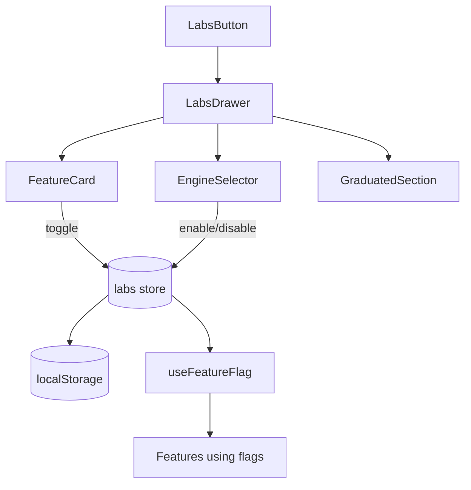

# Labs

Experimental feature flags for opt-in preview features.



## Infrastructure Location

- **Definitions**: `@/core/labs/features.ts`
- **Store**: `@/core/store/labs`
- **Hook**: `@/hooks/useFeatureFlag`

## Components

- **LabsButton** - Opens labs drawer
- **LabsDrawer** - Main drawer UI with feature list
- **FeatureCard** - Individual feature toggle card
- **FeatureStatusBadge** - Status indicator (early access/beta/shipped)
- **GraduatedSection** - Collapsible "Now for everyone" section for shipped features
- **EngineSelector** - Segmented control over the 3D-engine kernel flag (`brepkit_kernel`); replaces `FeatureCard` UI for it

## Current Flags

Internal status enum values → UI badge labels: `experimental` → "Early access", `preview` → "Beta", `graduated` → "Shipped".

| Flag                    | Status (`enum`) | Purpose                                                                   |
| ----------------------- | --------------- | ------------------------------------------------------------------------- |
| `brepkit_kernel`        | `experimental`  | Alternative 3D geometry engine (BrepKit) — driven by `EngineSelector`     |
| `show_generation_perf`  | `experimental`  | Per-stage generation timing overlay in the bin designer                   |
| `item_kinds`            | `experimental`  | Non-bin items (tool racks) that sit on a baseplate                        |
| `community_fits_gap`    | `experimental`  | Select a layout gap and browse community designs that fit it              |
| `sliding_tray`          | `experimental`  | Rail-and-tray sliding insert in the bin designer's Walls section          |
| `merge_bins_to_design`  | `experimental`  | Bento: merge selected layout bins into one divided tray                   |
| `community_showcase`    | `preview`       | Publish and remix bin designs in the community showcase                   |
| `drawer_shapes`         | `graduated`     | Non-rectangular drawer shapes (L-shapes, notches, cut corners)            |
| `bin_designer`          | `graduated`     | Custom bin designer                                                       |
| `baseplate_generator`   | `graduated`     | Custom baseplate generator                                                |
| `handle_holes`          | `graduated`     | Finger-grip cutouts on bin walls                                          |
| `multi_color_export`    | `graduated`     | Multi-color 3MF export (now gated per-design via `featureColors.enabled`) |
| `cloud_sync`            | `graduated`     | Sign-in sync of layouts/designs across devices                            |
| `embedded_text`         | `graduated`     | Engraved text on label tabs and beside cutouts                            |
| `manifold_preview`      | `graduated`     | Draft 3D preview with a faster engine while editing                       |
| `scan_with_phone`       | `graduated`     | Phone-scan a tool outline into a cutout                                   |
| `collaborative_editing` | `graduated`     | Real-time Liveblocks collab                                               |
| `stl_bin_import`        | `graduated`     | Import a Gridfinity bin STL as a view-only design                         |
| `bin_recommender`       | `graduated`     | Suggested bin size from the label, in the bin inspector                   |
| `layout_overhang`       | `graduated`     | Edge bins extend into the drawer-fit margin                               |
| `baseplate_screw_holes` | `graduated`     | Mount-down screw holes through every printed baseplate piece              |

Kernel selection priority in `BridgeManager`/`WorkerPoolManager` is `brepkit > default (occt-wasm)`; `EngineSelector` drives the flag in the UI.

## Usage

```typescript
const isEnabled = useFeatureFlag('collaborative_editing');
```

## Gotchas

1. **Flags persisted in localStorage** - survives refresh
2. **Some flags require page reload** - noted in UI
3. **Feature definitions in core/labs** - not in this feature module
