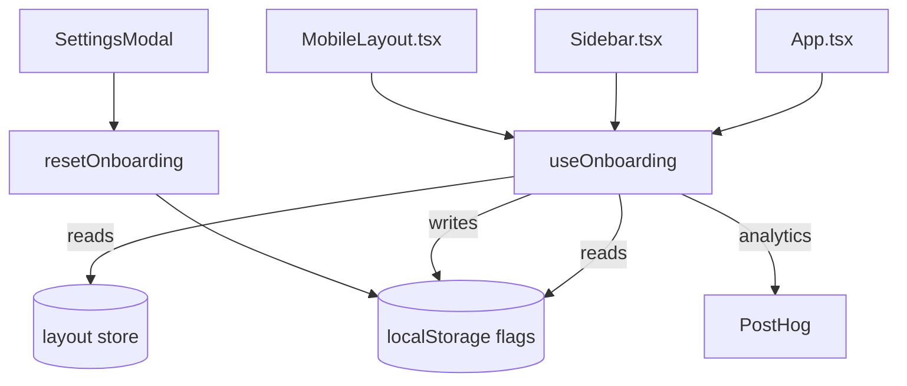

# Onboarding

First-visit user experience orchestration.



## Key Files

- `hooks/useOnboarding.ts` — onboarding state orchestration, flag management

## Features

Progressive two-stage onboarding flow:

1. **Draw tutorial** - animated guide shown on blank canvas until first bin created
2. **Sidebar pulse** - highlights gallery for low-engagement users past the draw tutorial (< 3 bins)

The old global welcome modal was removed in favor of per-tool first-run experiences — the layout planner's draw tutorial here, plus tool-specific orientation on `/designer` and `/baseplate`.

All state managed via `useSyncExternalStore` backed by localStorage, ensuring synchronized state across all hook instances in a single tab.

## localStorage Keys

- `gridfinity-onboarding-draw-tutorial-seen` - draw tutorial dismissal
- `gridfinity-onboarding-sidebar-pulse-dismissed` - pulse animation dismissed

## Public API

```typescript
const {
  shouldShowDrawTutorial, // boolean — show draw tutorial
  shouldPulseGallery, // boolean — animate sidebar gallery button
  markDrawTutorialComplete, // (method: 'first_bin' | 'manual_dismiss') => void
  dismissGalleryPulse, // () => void
} = useOnboarding();
```

Standalone exports:

- `resetOnboarding()` — clears all flags (used in SettingsModal)
- `syncOnboardingFlags()` — re-read flags from localStorage (test utility)

## Auto-Dismissal Logic

- **Draw tutorial** - auto-dismissed when `binCount > 0`
- **Sidebar pulse** - auto-dismissed when `binCount >= 3` (engagement threshold)

## Gotchas

1. **Safe localStorage** - all reads/writes wrapped in try-catch for privacy-mode/incognito
2. **Shared state** - flags are module-level, notifying all hook instances via `useSyncExternalStore`
3. **Analytics tracked** - all completion/dismissal events sent to PostHog with method context
