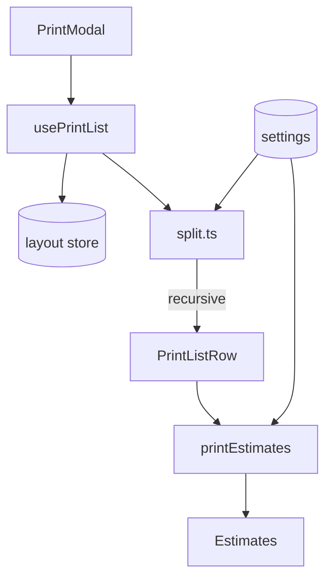

# Print Export

Print list generation with bin splitting and filament estimates.



## Key Files

**Hooks:**

- `hooks/usePrintList.ts` — aggregates bins into print rows, filtering/sorting; also
  surfaces swappable label plate counts per row and in the summary via
  `@/shared/hooks/useLabelPlateCounts` (socket-mode linked designs, #2666)

## Split Algorithm

```
splitBinSize(w, d, maxUnits):
  if (w <= max && d <= max) return pieces
  split larger dimension in half
  recurse
```

## Print Estimates

| Metric       | Formula                          |
| ------------ | -------------------------------- |
| Filament (g) | shell volume × 1.24 g/cm³ + base |
| Time (min)   | proportional to filament weight  |
| Cost         | filament × `filamentCostPerKg`   |

## Settings Dependencies

- `filamentCostPerKg`

## Gotchas

1. **Dividers not counted** - estimate may undercount filament
2. **Staging bins excluded** - only placed bins in print list
3. **Category grouping optional** - toggle in UI
4. **Group key includes `linkedDesignId`** - bins with identical dims/category/label but different linked designs (e.g. an imported-mesh bin next to a parametric bin) are different printed parts and get separate rows. Estimates for imported-mesh rows still use the standard-bin model here (this feature cannot legally import design data); the accurate volume-based number lives in the layout-export manifest (`estimateMeshFilament`).
