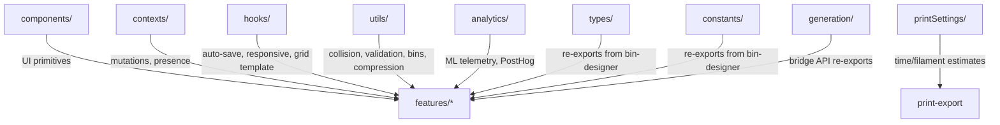

# Shared

Cross-cutting utilities, components, hooks, and contexts reused across features.

## Subdirectories

| Directory        | Purpose                                                                                                                                                                                                                                              |
| ---------------- | ---------------------------------------------------------------------------------------------------------------------------------------------------------------------------------------------------------------------------------------------------- |
| `components/`    | Domain-agnostic UI primitives (no feature coupling)                                                                                                                                                                                                  |
| `contexts/`      | React contexts for mutations and collaborative presence                                                                                                                                                                                              |
| `hooks/`         | Custom hooks for auto-save, responsiveness, grid math, PWA                                                                                                                                                                                           |
| `utils/`         | Pure functions — collision detection, validation, bin filtering, compression, type layout                                                                                                                                                            |
| `analytics/`     | ML telemetry pipeline and PostHog product metrics                                                                                                                                                                                                    |
| `printSettings/` | Print time/filament estimation constants and scaling; `assembledHeight.ts` (how tall a design stands seated on a plate with its lid on) lives here so the layout, inspector and layers panel can read it without importing `bin-designer`            |
| `types/`         | Re-exports `BinParams` types from `bin-designer` to avoid circular deps                                                                                                                                                                              |
| `fonts/`         | The bundled OFL type faces and their licences, plus the family-to-URL map both the worker and the designer load from                                                                                                                                 |
| `constants/`     | Re-exports `DEFAULT_BIN_PARAMS`, `GRIDFINITY` from `bin-designer`; owns label plate geometry (`labelPlates`), the label icon SVG catalog (`labelIconPaths`) and the outer-wall keep-out band (`wallBands`) so the worker and the UI share one source |
| `generation/`    | Re-exports `GenerationBridge`, the direct-mesh drafts, and the brepjs-free pattern metrics (wall element sizes + `stampPatternOpenArea`, and the floor pattern's window rule) for cross-feature use                                                  |
| `spacemouse/`    | 3Dconnexion puck support behind the `spacemouse` labs flag: driver-native `navlib/` transport with a WebHID fallback, the bus that fans one puck out to the active canvas, axis mapping and camera commands                                          |

## Key Components (`components/`)

| Component                  | Purpose                                                                                |
| -------------------------- | -------------------------------------------------------------------------------------- |
| `DeferredNumberInput`      | Number input that commits on blur/Enter (prevents mid-type validation)                 |
| `ItemListShell`            | Generic searchable, sortable, filterable list container (grid/list view)               |
| `ConfirmDialog`            | Modal with focus trap, Escape handling, portal rendering                               |
| `Toast` / `ToastContainer` | Auto-dismiss notifications with pause-on-hover                                         |
| `ContextMenu*`             | Framework for consistent right-click menus                                             |
| `CollapsibleSection`       | Expandable container with arrow indicator                                              |
| `ToolSwitcher`             | Segmented nav across Layout / Bins / Baseplate / Community                             |
| `HeaderSupportLinks`       | Shared top-right cluster; outbound links in its overflow, `compact` folds all of it in |
| `SupporterBadge`           | Accent pill marking a Ko-fi supporter beside an author name; links to `/supporters`    |

## Key Hooks (`hooks/`)

| Hook                  | Purpose                                                                            |
| --------------------- | ---------------------------------------------------------------------------------- |
| `useAutoSave()`       | Debounced save (1s) with idle scheduling, retry, status tracking                   |
| `useResponsive()`     | Breakpoint detection: mobile (<768), tablet (768-899), desktop (≥900)              |
| `useGridTemplate()`   | CSS Grid template computation with half-bin fractional support                     |
| `useCrossTabSync()`   | Sync layout/library across browser tabs via StorageEvent                           |
| `usePWAUpdate()`      | Detect and prompt for service worker updates                                       |
| `usePrefetchChunks()` | Idle-time code chunk preloading (desktop only)                                     |
| `useIntentPrefetch()` | Warm a lazy destination on pointer-enter / pointer-down / focus                    |
| `useSharedWithMe()`   | Fetch and track layouts shared via Liveblocks                                      |
| `useDrawerCeiling()`  | Whether the printed layout clears the measured drawer height; null when unmeasured |

Inline rename lives in the design system: `useInlineEdit` for the headless
behaviour and `InlineEditText` for the styled preset over it, both from
`@/design-system`. It sits there because the design system may not import from
`shared/`, and the preset needs it.

## Key Utilities (`utils/`)

| File                       | Purpose                                                                                                                                                                                                                                                                                                         |
| -------------------------- | --------------------------------------------------------------------------------------------------------------------------------------------------------------------------------------------------------------------------------------------------------------------------------------------------------------- |
| `collision.ts`             | 3D spatial collision: `binsCollideResult()`, `getBlockedZones()`, `getDisplayLayers()`                                                                                                                                                                                                                          |
| `validation.ts`            | Type guards (`isValidBin`), `canPlaceBin()`, `validateImport()`                                                                                                                                                                                                                                                 |
| `bins.ts`                  | Bin filtering: `getGridBins()`, `getStagingBins()`, `getLayerBins()`, `splitBinsByLocation()`                                                                                                                                                                                                                   |
| `fill.ts`                  | Auto-fill algorithms: `fillAllWithSize()`, `fillGaps()`                                                                                                                                                                                                                                                         |
| `binSplitFit.ts`           | `binSplitChunkUnits()` — grid capacity of one build plate with the bin's OVERHANG charged against it. `calcMaxGridUnits` measures the nominal footprint, which a bin can overrun by millimetres without gaining a unit                                                                                          |
| `expandToFit.ts`           | `resolveExpandToFit()` — positions + overhangs that tile a span with no gaps                                                                                                                                                                                                                                    |
| `compression.ts`           | LZ-string compression for layout storage                                                                                                                                                                                                                                                                        |
| `color.ts`                 | `getContrastColor()`, `getBinTextColors()` for bin rendering                                                                                                                                                                                                                                                    |
| `uuid.ts`                  | Layout ID generation and validation                                                                                                                                                                                                                                                                             |
| `wallPatternSides.ts`      | `resolveWallPatternSides()` — which outer walls a pattern covers; absent side means ON                                                                                                                                                                                                                          |
| `drawerCeiling.ts`         | `drawerCeilingFit()` — printed height of every column against the measured drawer. Columns resolve by footprint overlap, not layer z: a bin falls until something stops it                                                                                                                                      |
| `heightUnits.ts`           | Stack arithmetic: `stackPitchMm()`, `stackedTotalMm()`, `solveUnitsUnderCeiling()`. A stacked bin nests `STACK_JUNCTION_MM` (4.75), not `LIP_PROTRUSION_MM` (4.3)                                                                                                                                               |
| `throttle.ts` / `idle.ts`  | RAF throttle, idle scheduling utilities                                                                                                                                                                                                                                                                         |
| `svg/`                     | SVG units, transforms and viewBox framing — shared by every importer so they agree on scale                                                                                                                                                                                                                     |
| `communityReturnPath.ts`   | One-shot OAuth return record (`saveAuthReturnPath`); allowlisted PATHS only, never a URL                                                                                                                                                                                                                        |
| `cutoutArray.ts`           | Cutout repeat placement: `arrayInstances()` → offsets, `expandCutoutArray()` → instances, `arrayFieldBounds()` → per-field caps                                                                                                                                                                                 |
| `cutoutRepeatDetect.ts`    | The inverse: `detectRepeatPattern()` recovers a master + config from hand-placed cutouts, within a 0.5mm fit tolerance                                                                                                                                                                                          |
| `cutoutLabelSocketPlan.ts` | Where a shadow board's swappable-label sockets go: `planCutoutLabelSockets()` holds the anchor fixed and gives up plate WIDTH to a neighbouring cavity, standing a socket down with a reason when none clears                                                                                                   |
| `hingeLidPlan.ts`          | Where a hinged lid's axis sits, which knuckles each part owns, the pin length per run, and why a design gets no hinge. The worker builds BOTH halves of the joint from one call, so the bores cannot end up off-axis; the panel, the export dialog and `checkLidCompatibility` read it without importing brepjs |
| `typePlan.ts`              | Where a caption's glyphs land: case, wrapping, tracking, size resolution, the cap-height datum, optical centring and flush-to-margin. Font access is injected (`TypeMeasurer`), so the worker, the panel specimen and the ghost overlay all run the SAME solver                                                 |
| `wallTextPlan.ts`          | Which clear region of each outer wall hosts its caption (around cutouts and handles), then `typePlan` inside it. Read by the glyph builder, the wall-pattern clip and the ghost overlay                                                                                                                         |
| `textFonts.ts`             | Which faces a design references, so on-demand loading registers them before geometry that would silently render nothing without them                                                                                                                                                                            |

## Contexts (`contexts/`)

- **MutationsContext** — unified interface for layout mutations; `useMutations()` works in both local and collab mode
- **PresenceContext** — collaborative presence (cursor, interaction, selection); no-ops outside collab

## Gotchas

1. **No domain coupling** — shared components must not import from `features/`; use `types/` and `constants/` re-exports for bin-designer types
2. **PostHog import path** — import directly from `@/shared/analytics/posthog`, not from the barrel `index.ts` (naming collisions)
3. **Collision returns Result** — `binsCollideResult()` and friends return `Result<T, E>`, not booleans
4. **getDisplayLayers reverses** — UI display order is the reverse of array order; always use this for rendering
5. **useAutoSave debounce** — 1000ms debounce + 2000ms idle callback; saves skip if no changes detected
6. **MutationsContext fallback** — `useMutations()` returns store mutations directly when no provider is present (safe default)
7. **SpaceMouse needs `makeDefault`** — `<SpaceMouseController />` reads `useThree(s => s.controls)`, so a `<Canvas>` whose `OrbitControls` omits `makeDefault` silently no-ops; pass `modal` inside a `Dialog.Root` (see the three-preview skill)
